# Contour SVG Generator: Fusion/Merge Architecture

## 1. Core concept

The final image is not an edge trace and not a raw neural raster. It is a compiled graphic scene:

```text
many evidence layers → canonical scene graph → deterministic SVG renderer
```

AI models participate as semantic detectors, proposal generators, merge advisors, completion critics and aesthetic judges. The final coordinates and SVG primitives must be produced by deterministic geometry code from the canonical `PrimitiveScene`.

## 2. What line classes are allowed in the final SVG

The final SVG should contain only graphically meaningful object lines:

| Class | Meaning | Typical evidence |
|---|---|---|
| `outer_silhouette` | Recognizable outside contour of the primary object | primary mask, masked background, shell hull, line detectors |
| `plane_boundary` | Main borders between large planes | DeepLSD/MLSD, wall plane, VP groups |
| `roofline` | Roof ridges, eaves, pediments, cornices | MLSD/DeepLSD, roof semantic hints, shell top |
| `structural_edge` | Main vertical/horizontal architectural structure | line graph, facade parser, plane graph |
| `opening_frame` | Windows, doors, arches, large openings | facade parser, edge clusters, rhythm graph |
| `rhythm_line` | Repeating bay/floor/window axes | RhythmGraph, facade features, plane-local coordinates |
| `base_line` | Base, plinth, stairs, ground-support lines | shell bottom, edge/line evidence, facade parser |
| `accent_detail` | Small distinctive details that improve recognizability | Gemini critique, facade elements, local edge clusters |

Forbidden direct final lines:

- foliage, fence, road, paving, wires, people, vehicles;
- color/shadow/material boundaries;
- short noisy edge fragments;
- duplicated parallel lines unless deliberately rendered as a cornice stack;
- raw raster-vectorized Canny/MLSD/ControlNet traces.

## 3. Recommended full pipeline

```mermaid
flowchart LR
  I[Input photo] --> N[Normalize / crop]

  subgraph S1[Evidence preparation]
    N --> G1[Gemini semantic plan\nprimary object, occluders, style hints]
    N --> D1[GroundingDINO / YOLO-World\nopen-vocab boxes]
    D1 --> SAM[SAM2 masks]
    SAM --> MASK[Multi-state masks\nvisible object / occluder / background / unknown]
    N --> FACADE[Facade parser\nCMP/SegFormer/SAAF-like labels]
    N --> LINES[Line evidence\nCanny + MLSD + DeepLSD + HAWP]
    N --> NEURAL[Neural proposals\nControlNet lineart/MLSD/IP-Adapter]
  end

  subgraph S2[Evidence normalization]
    MASK --> EI[EvidenceInventory]
    FACADE --> EI
    LINES --> EI
    G1 --> EI
    NEURAL --> EI
  end

  subgraph S3[Canonical object reconstruction]
    EI --> SHELL[BuildingShell\nouter hull, roof, base, main corner]
    SHELL --> PLANE[PlaneGraph\nfront/side/roof/base planes\nquads + homographies]
    PLANE --> RHYTHM[RhythmGraph\nfloors, bays, window rows, cornice stacks]
    RHYTHM --> FEATURE[FeatureGraph\nwindows, doors, arches, balconies, pilasters\nplane-local + snapped]
    FEATURE --> COMPLETE[CompletionGraph\noccluder-aware interpolation only]
  end

  subgraph S4[AI-assisted fusion/editing]
    EI --> FUSION[Gemini Fusion Editor\nkeep/drop/merge/snap/complete actions]
    SHELL --> FUSION
    PLANE --> FUSION
    RHYTHM --> FUSION
    FEATURE --> FUSION
    COMPLETE --> FUSION
    FUSION --> SCENE[PrimitiveScene\ncanonical renderable graph]
  end

  subgraph S5[Rendering and ranking]
    SCENE --> RENDER[Deterministic SVG renderer\nround caps, round joins, transparent bg]
    RENDER --> CANDS[Candidate families\nminimal / balanced / detailed / heroic crop]
    CANDS --> GATES[Hard gates\nvalid SVG, no raster, no occluder leakage, shell consistency]
    GATES --> SCORE[CV metrics + Gemini postcard judge]
    SCORE --> OUT[best.svg + top_3 + reports]
  end

  EDGEFAIL[Do not use as final:\nraw edge/MLSD/raster vectorization] -. evidence only .-> EI
```



## 4. Merge is the central operation

The key stage is not candidate judgement; it is evidence merge/reconciliation.

### 4.1 Data association

Group different evidence items that describe the same canonical entity.

```text
DeepLSD roof segment + MLSD roof segment + shell top edge + local edge cluster
= canonical roofline primitive
```

### 4.2 Conflict resolution

Choose or synthesize the geometry that best satisfies all constraints:

```text
support from several sources
+ belongs to a facade plane
+ aligns with VP group
+ agrees with rhythm
+ avoids occluder leakage
+ improves graphic readability
```

### 4.3 Plane-local snapping

Convert features/lines to plane-local coordinates, snap them to rows/bays/rhythm, then project them back to image/SVG coordinates.

```text
bbox_xy → bbox_uv → snapped_bbox_uv → render_quad_xy
```

### 4.4 Canonicalization

Convert raw detections to architecture primitives:

```text
semantic bbox “window” → window_rect primitive
semantic bbox “arched window” → arch_window primitive
many parallel lines → cornice_stack primitive
```

### 4.5 Render-policy selection

The same primitive can be rendered differently by candidate family:

```text
minimal: only outer frame
balanced: outer frame + one divider
editorial: frame + simplified inner details
```

## 5. AI versus deterministic code

| Task | Primary owner | Notes |
|---|---|---|
| Detect primary object/occluders | AI/CV | GroundingDINO/SAM2/Gemini |
| Produce semantic hints | AI | Gemini structured JSON |
| Detect line candidates | CV/ML | Canny, MLSD, DeepLSD, HAWP |
| Infer planes/homographies | deterministic geometry | robust fitting + evidence support |
| Infer rhythm | deterministic + optional Gemini review | clustering in plane-local coordinates |
| Merge evidence into canonical primitives | deterministic core + Gemini editor | Gemini suggests actions, Python executes |
| Complete through occlusion | deterministic constraints + AI critic | interpolate, do not extrapolate |
| Render final SVG | deterministic only | no direct neural/raster final |
| Judge postcardness | Gemini + CV metrics | ranking, not coordinate generation |

## 6. Required next architecture shift

The current pipeline must stop treating raw candidates as final-eligible. Edge maps, MLSD maps, DeepLSD overlays, facade bboxes and ControlNet rasters are evidence/proposals only.

Final SVG must come only from:

```text
PrimitiveScene → candidate render policies → SVG
```

Diagnostic stages such as `shell_only`, `plane_scaffold`, and `feature_scaffold` must be marked:

```json
{
  "proposal_only": true,
  "diagnostic": true,
  "final_eligible": false
}
```

## 7. Minimal acceptance criteria for the next implementation stage

1. `EvidenceInventory` contains traceable evidence IDs for masks, lines, facade elements and neural proposals.
2. `BuildingShell` lines have `support_evidence_ids`, not just derived drawing coordinates.
3. `PlaneGraph` uses quadrilateral planes and homography matrices, not bbox splitting.
4. `RhythmGraph` groups rows/bays in plane-local UV coordinates.
5. `FeatureGraph` stores both raw `bbox_xyxy` and snapped `bbox_uv` / `render_quad_xy`.
6. `CompletionGraph` only interpolates through confirmed occluder gaps and within plane/shell boundaries.
7. `PrimitiveScene` is the only source of final SVG primitives.
8. Gemini returns structured actions (`keep`, `drop`, `merge`, `snap`, `complete`, `downgrade_detail`), never final SVG coordinates.
9. Ranking happens after hard gates and only over scene-rendered candidates.
10. Every exported final primitive must be explainable by `support_evidence_ids` and `render_reason`.
