# Визуальные паттерны связанных событий

Скриншоты собраны из уже существующих Playwright/visual-lab artifacts и
оптимизированы без изменения интерфейса. Они являются визуальной
инвентаризацией, а не доказательством production status: provenance и решение
указаны у каждого изображения.

Файлы в `screenshots/` — durable copies этой ветки. Указанные ниже исходные
`artifacts/codex/...` были локальными ignored artifacts и могут отсутствовать в
чистом clone; для них provenance означает зафиксированный путь/контекст, а не
обещание воспроизводимости. Проверочные hashes и размеры committed copies — в
[`screenshots/README.md`](screenshots/README.md).

## Решение по нумерованному Telegram review

Нумерация соответствует треду **«Связанные события — паттерны 01–13»**.

| № | Файл | Решение | Что фиксируем |
| ---: | --- | --- | --- |
| 01 | `event-detail-related-candidate.png` | **нет** | не baseline для occurrence UI; большая card family может жить отдельно только после общей temporal projection |
| 02 | `event-detail-related-mobile.png` | **нет** | full/continuation card не заменяет компактный occurrence selector |
| 03 | `occurrence-desktop-open.png` | **да** | компактная desktop hierarchy рядом с основной датой |
| 04 | `occurrence-desktop-schedule.png` | **да** | factual schedule в `Когда` |
| 05 | `occurrence-mobile-open.png` | **да** | always-visible mobile selector, не disclosure |
| 06–09 | feed/feedback/personal/Popular labs | **не решались этим review** | остаются research evidence, не occurrence baseline |
| 10 | `listing-inline-other-dates-lab.png` | **да** | одна representative card + компактная temporal projection |
| 11 | `personalization-labeling-rules.png` | **нет** | не визуальный baseline связанных дат |
| 12 | `legacy-occurrence-switcher.png` | **нет** | тяжёлый дублирующий standalone module |
| 13 | `rejected-occurrence-dropdown.png` | **нет** | disclosure/dropdown для базового расписания |

Скриншоты 03–05 сняты на fixture `5756`, связанном с открытым
`INC-2026-07-18-dramteatr-same-day-event-glue`. Они принимаются **только как
композиция**, не как доказательство корректной family. В новой lab используются
синтетические взаимные November fixtures; production facts `5754–5757` не
копируются в тесты.

## Известные source refs и доступные rerender routes

| Лаборатория | Ref / route |
| --- | --- |
| Mobile event variants | `origin/feature/static-mobile-ui-variants-20260715`; `/lab/event-mobile/`, `/lab/event-mobile/examples/<variant>/<scenario>/` |
| Desktop related/media | `origin/feature/event-page-desktop-focus-v11-20260714`; `/lab/event-desktop/`, `/lab/event-desktop/examples/related-*` |
| Occurrence candidate | `origin/feature/static-related-occurrence-final-templates@a7f80b67`; fixtures `myuzikl-alye-parusa-kaliningrad-4783`, `zhenitba-kaliningrad-5756` |
| Listing terminal mobile | `origin/integration/listing-surfaces-v26-mobile-sticky-groups-20260719`; `/preview-20260719-date-listings-v26-mobile-sticky-groups/populyarnoe/` |
| Listing terminal desktop Popular | `origin/integration/popular-desktop-v28-20260720`; `/preview-20260720-popular-desktop-v28/populyarnoe/` |
| Exhibition personal prototype | `origin/integration/exhibitions-personal-discovery-prototype-20260719`; `/preview-20260720-exhibitions-personal-v12-465c2bc5/lab/exhibitions-personal/` |

Listing other-dates v19 — local-only artifact renderer
`artifacts/codex/mobile-calendar-city-popular-v15-research-20260720/build-v19.py`;
его нет в этой ветке/чистом clone, отдельной подтверждённой implementation
branch нет.

## 1. `Другие даты`: mobile selector

- Источник:
  `artifacts/codex/related-occurrences-visual-v3-20260718/zhenitba-mobile.png`.
- Ветка-источник механики:
  `origin/feature/static-related-occurrence-final-templates@a7f80b67f6`.
- Сохранить: выбранная дата рядом с CTA, `Другое время`, всегда доступный
  компактный список `Другие даты`, строки date → times.
- Не копировать вслепую: branch diverged; при переносе selector обязан менять
  полный CTA/calendar/source projection, а не только видимый текст даты.

## 2. `Другие даты`: desktop hierarchy

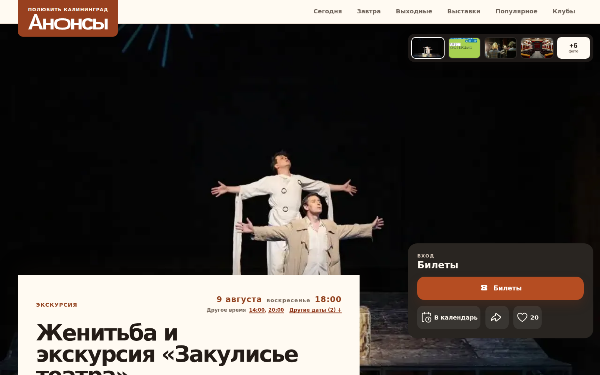

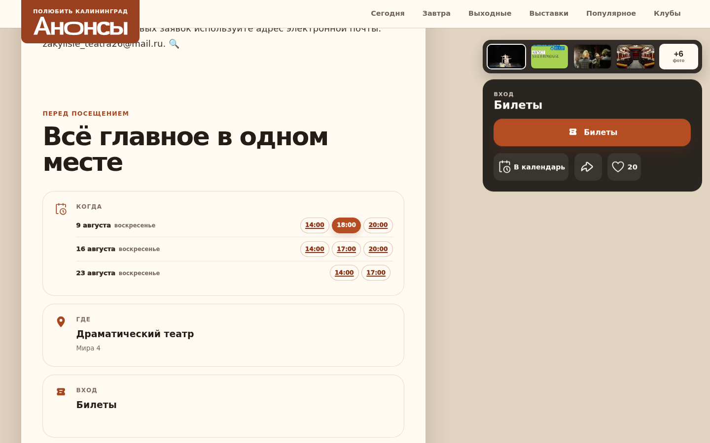

- Тот же экспериментальный branch/tip.
- Источники:
  `artifacts/codex/related-occurrences-visual-v3-20260718/zhenitba-desktop-{fold,kogda}.png`.
- Сохранить: компактные same-day/other-date links встроены в primary date
  hierarchy, а полный schedule повторён в factual `Когда`; это не сетка
  похожих event cards. Sticky action panel остаётся отдельным.
- Gate: плавающий selector не перекрывает title/media и доступен keyboard/touch.

## 3. Большие related cards — не occurrence baseline (№01: нет)

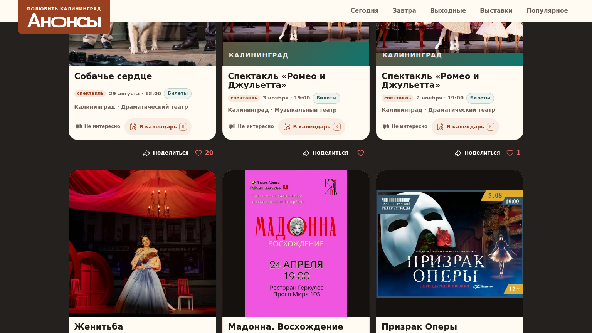

- Источник:
  `artifacts/codex/INC-2026-07-20-static-event-keyboard-visual-regressions/r05/live-related-1536x864.png`.
- UI family уже в `main` и проверена на immutable noindex candidate: тёмная
  continuation zone, три canonical cards в ряд, общий media/body contract,
  service actions вне crawlable title link. Stable root rollout этим
  скриншотом не доказан.
- Card shell может сохранять desktop-native плотность, единую геометрию,
  title-first scan,
  `Не интересно`/calendar/share/like semantics.
- Для связанных дат этот pattern не используется. Если card показывает event из
  family как recommendation/listing item, её date meta обязана приходить из
  общего compact formatter. Strict zone называется `Похожие события`, broad
  tail — отдельно `Ещё события`.

### Mobile card continuation (№02: нет для occurrence)

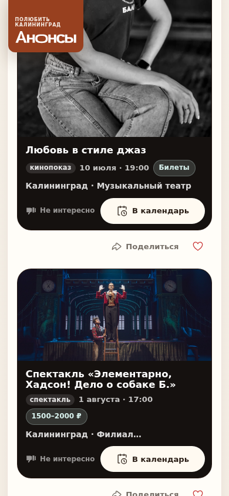

- Источник:
  `artifacts/codex/static-mobile-ui-audit-20260715/editorial-mobile-current-y4200.png`.
- Историческая mobile lab family:
  `origin/feature/static-mobile-ui-variants-20260715@fd8766b1`; canonical card
  behavior позднее вошёл в main другими commits.
- Допустимо сохранить как общий related-card shell: один вертикальный поток,
  крупные touch targets, тот же порядок
  title/meta/place и те же feedback semantics, что на desktop.
- Для `Другие даты` full cards запрещены: принят selector №05.

## 4. Mobile feed laboratory

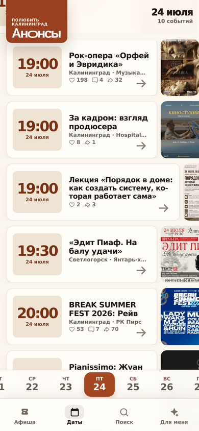

- Источник:
  `artifacts/codex/mobile-feed-prototype-100-v13-research-20260720/public-v13-390-3x.png`.
- Статус: локальная лаборатория, не remote production branch.
- Полезные паттерны: быстрый date/time scan, одна card family, видимые агрегаты,
  persistent date/nav context, отдельная вкладка `Для меня`.
- Не принимать автоматически: асимметричный выход poster за card и сама
  нижняя navigation shell требуют отдельной listing acceptance.

## 5. Mobile negative feedback

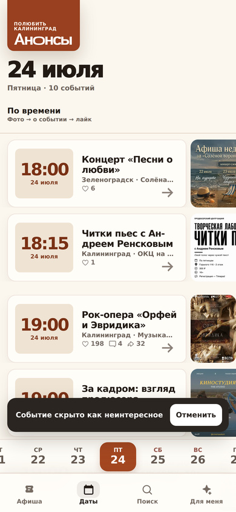

- Источник той же mobile feed лаборатории.
- Точный local-only source:
  `artifacts/codex/mobile-feed-prototype-100-v13-research-20260720/v13-dislike-confirmation-3x.png`;
  durable branch/SHA для renderer не восстановлен.
- Сохранить как interaction rule: результат `Не интересно` объяснён, есть
  `Отменить`, viewport/date context не прыгает.
- Целевой контракт также скрывает occurrence siblings по принятому group policy
  и пишет bounded strong-action telemetry.

## 6. `Для вас`: card-density concept

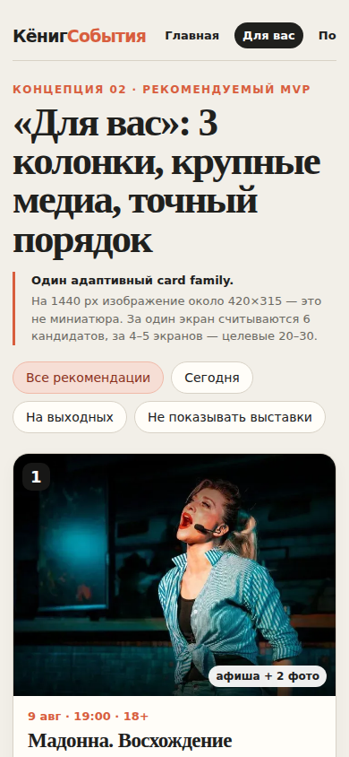

- Источник:
  `artifacts/codex/event-image-product-audit-2026-07-17/codex-prototype/screenshots/foryou-mobile.png`.
- Статус: local-only visual concept, не production; renderer не входит в эту
  consolidation branch.
- Сохранить: крупная media-led mobile scan, явные finite filters, единая card
  family.
- Не переносить literal copy/трёхколоночное обещание на mobile. Label `Для вас`
  допустим только после реального compatible-profile rerank.

## 7. Honest personalization labels (№11: нет как visual baseline)

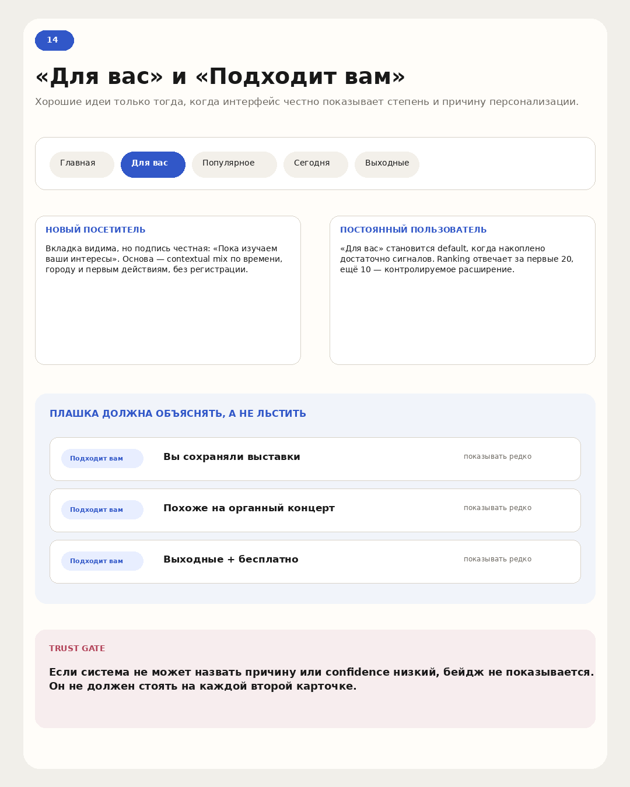

- Источник:
  `artifacts/codex/listing-wireframes-thread-2026-07-17/images-media/14-personalization.png`.
- Статус: local-only concept diagram, отклонён как visual baseline связанных
  событий. Текстовый semantic contract сохраняется независимо: новый visitor получает честное baseline-описание;
  mature profile — `Для вас`; reason badge появляется только при confidence;
  reason не повторяется на каждой второй card.

## 8. Listing/Popular mobile pattern

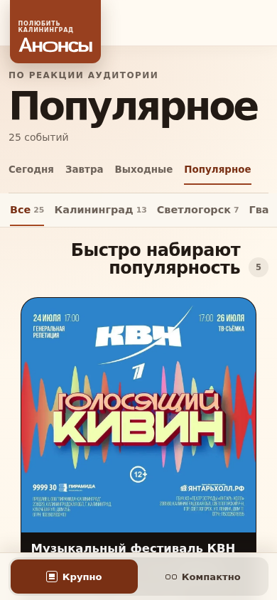

- Источник:
  `artifacts/codex/mobile-calendar-city-popular-v15-research-20260720/live-v26-popular-mobile.png`.
- Соответствующий terminal archive:
  `origin/integration/listing-surfaces-v26-mobile-sticky-groups-20260719@c4f3c4ded4`.
- Статус: branch-only lab. Полезны sticky group context, явная density switch и
  reuse listing card family. Это не semantic-related surface и не должно
  называться `Похожие события`.

## 9. Inline `Ещё даты` в listing (№10: принято)

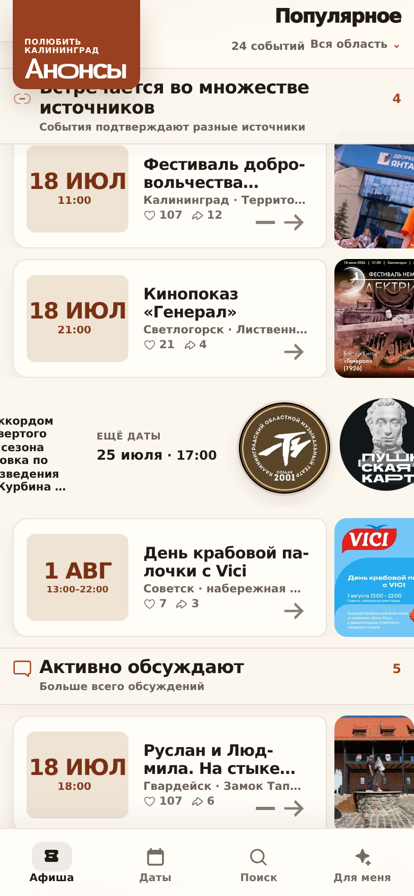

- Источник:
  `artifacts/codex/mobile-calendar-city-popular-v15-research-20260720/v19-popular-orpheus-other-date.png`.
- Статус: визуальная механика принята; исходник остаётся artifact-only
  laboratory без remote implementation branch.
- Source renderer локальный/ignored и не воспроизводится из этой ветки.
- Зафиксировано: entity/ranked surface сворачивает occurrence family в одну
  representative card с короткой temporal projection; date-bounded surface
  сворачивает только несколько времён в пределах даты.
- Ограничение: это не замена event-detail selector; listing projection должен
  использовать тот же family id/eligibility и не суммировать engagement разных
  occurrences.

## 10. Anti-pattern: disclosure/dropdown перед контентом (№13: нет)

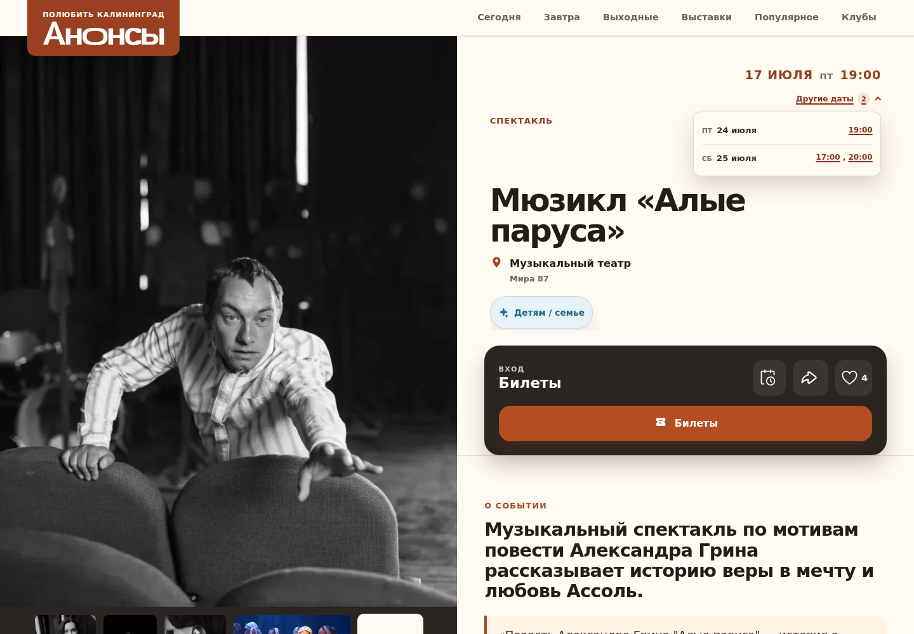

- Источник:
  `artifacts/codex/related-dates-final-template-redo-20260718/alye-parusa-final-desktop-open.png`.
- Статус: rejected intermediate. Не переносить: disclosure создаёт второй
  owner даты, конкурирует с primary hierarchy и заставляет пользователя
  раскрывать базовое расписание.

## 11. Legacy standalone switcher (№12: нет)

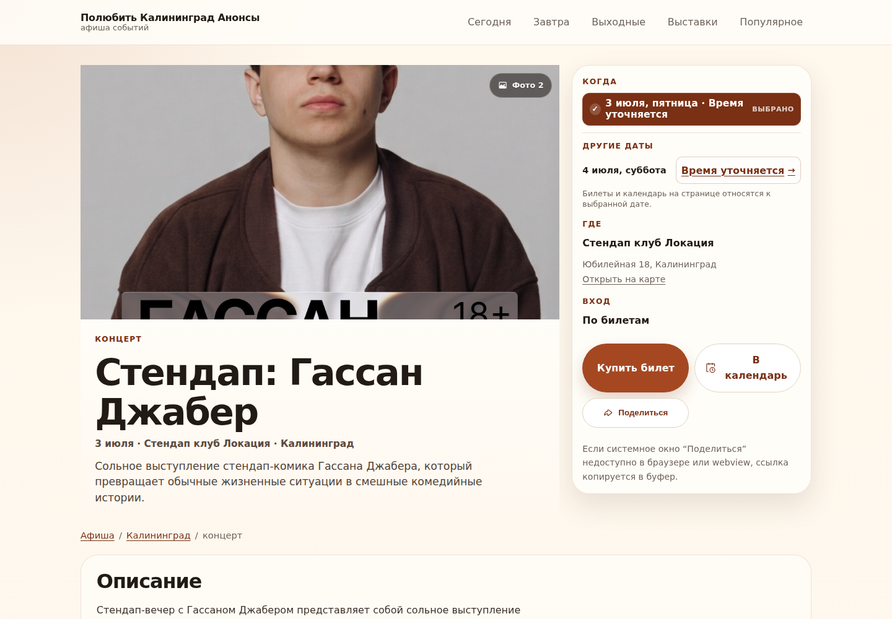

- Источник:
  `artifacts/codex/linked-occurrence-switcher-20260718/desktop-6405.png`.
- Статус: исторический prototype. Сильная сторона — ясная выбранная дата;
  слабая — отдельный тяжёлый модуль, дублирующий factual `Когда` и visually
  похожий на recommendation block.

## Визуальный acceptance checklist

- [ ] `Другие даты` выглядит как selector schedule, а не recommendation cards.
- [ ] `Похожие события` и `Ещё события` визуально/семантически разделены.
- [ ] Mobile и desktop используют один card contract, но разные композиции.
- [ ] OCR/document media не обрезан; ordinary visual photo не letterboxed без
      причины.
- [ ] `Не интересно` и undo не вызывают layout/focus jump.
- [ ] Выбранная occurrence явно отмечена; CTA/calendar соответствуют ей.
- [ ] Personal reason честный и не размножен; без profile нет ложного `Для вас`.
- [ ] Empty/backend failure не оставляет пустой тёмный блок или вечный skeleton.
- [ ] Screenshot сопоставлен с DOM/data/lifecycle gate, а не принят сам по себе.
