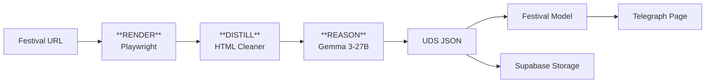

# Universal Festival Parser

## Overview

The Universal Festival Parser enables adding/updating festivals by parsing their official website URLs using a Kaggle notebook with Playwright + Gemma 3-27B LLM.

Preproduction design for grouped, evidence-first processing of
`festival_queue.source_kind=url` and all non-social linked sources:
[`preproduction-web-research.md`](preproduction-web-research.md). It is a
shadow/approval-gated successor lane; the current Universal Festival Parser
remains the baseline until its rollout gates pass.

## Architecture: RDR (Render–Distill–Reason)



### Phases

1. **RENDER** (`render.py`): Playwright fetches and renders the page, saves HTML + screenshot
2. **DISTILL** (`distill.py`): Cleans HTML, extracts main content, removes boilerplate
3. **REASON** (`reason.py`): Gemma 3-27B extracts structured UDS JSON

## Usage

### Via Telegram Bot

1. Send `/fest` command (or tap "➕ Добавить фестиваль")
2. Paste the festival website URL (e.g., `https://zimafestkld.ru/`)
3. Wait for parsing to complete
4. Receive links to:
   - Telegraph page
   - UDS JSON report
   - LLM log (for debugging)

### Via Festival Queue (Smart Update integration)

Universal Festival Parser также вызывается из фестивальной очереди:

- источники **с внешней ссылкой** → Playwright + Gemma через Kaggle;
- источники **из Telegram** обрабатываются **только через Kaggle** (Telethon внутри kernel);
- Playwright используется **только** для сайтов, не для `t.me`.
- в очередь могут попадать посты без слова «фестиваль» (например «День <…>»), если есть программа/расписание — см. `docs/features/festivals/README.md`;
- программа может быть извлечена из текста или OCR афиш; слабосигнальные пункты остаются в `festival.activities_json`.

Smart Update остаётся единственным механизмом создания/обновления событий: все события из программы фестиваля проходят через Smart Update.

### Re-parsing

From festival edit menu (`/fest` → select festival → Edit), use **"🔄 Перепарсить с сайта"** button to re-run the parser and update the festival data.

## Series/Edition Dedup

Парсер должен **обновлять** существующий выпуск, если он уже создан, а не создавать новый:

- серия определяется по нормализованному имени и алиасам (см. `docs/features/festivals/README.md`);
- выпуск определяется по `festival_full` (год/номер/сезон) или по кластеру дат;
- при совпадении серии/выпуска парсер обновляет существующую запись `festival`, а не создаёт новую.

Выпуски одной серии должны быть пролинкованы на страницах друг друга (без отдельной страницы серии).

## Program-only vs Event

Не все пункты программы превращаются в события:

- если есть дата + время + локация и смысловая «сильная» единица — создаём событие через Smart Update;
- если пункт слабосигнальный (развлечения/активности без самостоятельного события) — сохраняем в `festival.activities_json` как program-only.

Критерии см. `docs/features/festivals/README.md`.

## Illustrations

Фестиваль должен иметь обложку и галерею:

- приоритет обложки: 3D‑превью (если появится) → `photo_url` → первая из `photo_urls`;
- обложка используется и на странице фестиваля, и на странице «Фестивали».

## UDS (Universal Data Structure)

Output JSON schema:

```json
{
  "festival": {
    "title_full": "...",
    "title_short": "...",
    "description_short": "...",
    "dates": {"start": "YYYY-MM-DD", "end": "YYYY-MM-DD"},
    "links": {"website": "...", "socials": ["..."]},
    "registration": {"is_free": true, "common_url": "..."},
    "contacts": {"phone": "...", "email": "..."}
  },
  "program": [
    {"title": "...", "type": "...", "date": "...", "time_start": "..."}
  ],
  "venues": [
    {"title": "...", "city": "...", "address": "..."}
  ],
  "images_festival": ["url1", "url2"]
}
```

## LLM Debug Logging

All LLM requests/responses are logged to `llm_log.json`:

```json
{
  "run_id": "20260104T120000Z_abc123",
  "total_interactions": 2,
  "total_prompt_tokens": 5000,
  "total_response_tokens": 2000,
  "interactions": [
    {
      "request_id": "...",
      "phase": "reason",
      "model": "gemma-3-27b",
      "prompt": "...",
      "response": "...",
      "duration_ms": 1500
    }
  ]
}
```

This log is saved to Supabase and linked in the operator chat for analysis.

## Rate Limiting

Gemma 3-27B limits:
- 30 RPM (requests per minute)
- 15K TPM (tokens per minute)
- 14.4K RPD (requests per day)

Token bucket algorithm in `rate_limit.py` handles the minute buckets, and now
fails fast instead of sleeping forever when the estimated request is larger than
the effective TPM budget or the effective daily request budget is exhausted.
Server-side festival queue runs are also capped by `FESTIVAL_QUEUE_MAX_ITEMS_PER_RUN`
(default `10`, hard-clamped to `1..50`) so an old pending backlog cannot be
processed all at once.

Operational guardrails for URL-based Kaggle parsing:

| Variable | Default | Purpose |
|----------|---------|---------|
| `FESTIVAL_PARSER_TIMEOUT_MINUTES` | `30` | Whole Kaggle run wait budget (`5..60`) |
| `FESTIVAL_PARSER_TIMEOUT_MS` | `30000` | Playwright render timeout (`5000..120000`) |
| `FESTIVAL_PARSER_MAX_LLM_CALLS` | `2` | Reason pass plus optional validation pass (`0..2`) |
| `FESTIVAL_PARSER_MAX_ESTIMATED_TOKENS_PER_CALL` | `8000` | Per-call estimated prompt budget, below the effective TPM bucket |
| `FESTIVAL_PARSER_NO_LLM` | `0` | Render/distill only, skip LLM and write metrics/rate usage |
| `FESTIVAL_PARSER_DRY_RUN` | `0` | Same safety stop before LLM for parser smoke checks |
| `FESTIVAL_PARSER_LLM_MODEL` | `gemma-3-27b` | Explicit model override for the legacy parser |

For the VK dynamic-cover MVP (`80 историй о главном` + `Кантата`), prefer the
existing lightweight festival-queue path and deterministic enrichment first.
Do not run the Universal Festival Parser over the full accumulated queue as a
shortcut.

## Security: API Key Management

Google API key for Gemma is secured via two private Kaggle datasets:

| Dataset | Contains |
|---------|----------|
| `gemma-cipher` | `google_api_key.enc` (Fernet-encrypted) |
| `gemma-key` | `fernet.key` |

Decryption happens in-memory only, never written to disk.

## Database Fields

New Festival model fields:

| Field | Type | Description |
|-------|------|-------------|
| `source_url` | str | Original website URL |
| `source_type` | str | "canonical" / "official" / "external" |
| `parser_run_id` | str | Last parser run ID |
| `parser_version` | str | Parser version used |
| `last_parsed_at` | datetime | Timestamp of last parse |
| `uds_storage_path` | str | Path in Supabase bucket |
| `contacts_phone` | str | Phone contact |
| `contacts_email` | str | Email contact |
| `is_annual` | bool | Is this an annual festival? |
| `audience` | str | Target audience |

## Files

```
source_parsing/
├── festival_parser.py    # Main pipeline
├── date_utils.py         # Russian date formatting

kaggle/UniversalFestivalParser/
├── kernel-metadata.json
├── universal_festival_parser.py  # Main script
└── src/
    ├── render.py         # Playwright rendering
    ├── distill.py        # HTML cleaning
    ├── reason.py         # Gemma LLM extraction
    ├── rate_limit.py     # Token bucket
    ├── secrets.py        # API key decryption
    ├── llm_logger.py     # Request/response logging
    ├── uds.py            # Pydantic schema
    └── config.py         # Configuration

tests/
├── test_festival_parser.py
├── test_festival_date_format.py
└── e2e/features/festival_parser.feature  # Gherkin scenarios
```

## Environment Variables

```bash
# Required for Kaggle kernel
KAGGLE_GEMMA_CIPHER_DATASET=username/gemma-cipher
KAGGLE_GEMMA_KEY_DATASET=username/gemma-key

# Supabase storage bucket
SUPABASE_PARSER_BUCKET=festival-parsing

# Queue/parser safety
FESTIVAL_QUEUE_MAX_ITEMS_PER_RUN=10
FESTIVAL_PARSER_TIMEOUT_MINUTES=30
FESTIVAL_PARSER_MAX_LLM_CALLS=2
FESTIVAL_PARSER_MAX_ESTIMATED_TOKENS_PER_CALL=8000
FESTIVAL_PARSER_NO_LLM=0
FESTIVAL_PARSER_DRY_RUN=0
```
