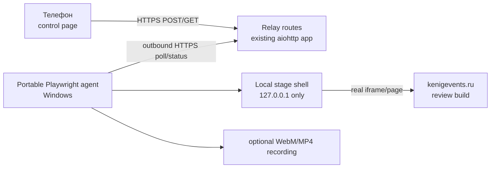

# Автопрезентатор static-сайта

**Статус:** design / implementation-ready, код ещё не написан.

**Решение:** один сценарный Playwright-агент показывает настоящий сайт в аккуратной сцене; телефон только запускает/останавливает заранее известные сценарии через маленький relay в существующем `aiohttp`-приложении.

Это канонический документ по продукту и архитектуре. Исходные пожелания сохранены в [requirements.md](requirements.md). Ранний подробный PoC-промпт сохранён для сравнения в [playwright_autopresenter_prompt.md](playwright_autopresenter_prompt.md), но **не является планом реализации**: он шире необходимого MVP.

## Результат, который нужен

Во время презентации на Windows-ноутбуке открыт полноэкранный Chromium. С телефона ведущий выбирает сценарий, видит готовность агента и примерное оставшееся время, может немедленно остановить показ.

Сценарий умеет чередовать:

- реальный `kenigevents.ru` в мобильном или desktop-представлении;
- естественные scroll, drag/swipe, pointer/tap и настоящий Playwright click;
- короткие подписи рядом с сайтом;
- позже — typing-сцены, QR/картинки, типографскую инфографику и подсказки клавиш.

Автопрезентатор не воспроизводит интерфейс KenigEvents и не делает его «похожую копию». Внутри сцены всегда работает настоящий сайт. Рамка телефона, курсор, тап и подписи — только presentation overlay.

## Граница MVP

### В MVP входит

1. Один живой сценарий `tomorrow-mobile`, запускаемый и прерываемый с телефона.
2. Полноэкранная stage-страница с мобильной рамкой, реальным сайтом внутри и простым боковым caption.
3. Tap/pointer overlay и плавные, но не театрально медленные движения.
4. Последовательность: открыть «Завтра» → показать горизонтальное листание → открыть подходящее событие → вернуться → прокрутить календарь/список → выбрать ближайшую субботу → сделать ещё 1–2 наглядных действия.
5. Удалённое управление через HTTPS; на презентационном ноутбуке нет публичного входящего порта.
6. Локальный headed-прогон того же сценария на Linux и portable ZIP для Windows 10 x64 (`start.cmd`, portable Node.js, зафиксированный Playwright Chromium).
7. Стоп между шагами, fail-fast preflight, понятный статус на телефоне, screenshot и step-log при ошибке.
8. Режим `record`, который прогоняет тот же stage и сохраняет видео как резервный вариант.

### В MVP не входит

- визуальный редактор/конструктор сценариев;
- универсальный YAML/JSON DSL;
- Electron, React, отдельная база, очередь сообщений, Redis, Socket.IO;
- многопользовательские комнаты и роли;
- автоматический поиск «самого интересного» события;
- генерация `.exe`: portable-папка и `start.cmd` надёжнее и быстрее;
- идеальная биомеханика мыши, распознавание экрана или управление системным курсором;
- все декоративные типы сцен сразу.

Если единственный сценарий стабильно работает на Windows, MVP выполнен. Всё остальное добавляется только по реальной потребности презентаций.

### Traceability исходных требований

| Требование | Решение |
|---|---|
| Телефон: сценарии, countdown, stop | control page + allowlist + оценочный remaining time |
| Управление через интернет | оба клиента делают исходящие HTTPS-запросы к relay |
| Mobile/desktop реального сайта | один stage shell, два viewport profile; desktop добавляется в M2 |
| Круг тапа, крупный pointer, human-like motion | deterministic overlay + настоящие Playwright actions |
| Сценарии в файлах | TypeScript-файлы в MVP; versioned schema только после трёх сценариев |
| Первый маршрут «Завтра»/event rail/суббота | `tomorrow-mobile` + обязательный data preflight |
| Typing, QR/image, stats, captions, key hints | scene helpers в M2, не блокируют первый показ |
| Тонкий Windows-клиент | portable Node + pinned Chromium + `start.cmd`, без установки |
| Локальная отладка | тот же headed runner и target contract на Linux |
| Резервная запись | `record` mode использует тот же stage/scenario |
| Правильный localStorage | versioned bootstrap/storage fixture до preflight |
| Не подделывать сайт | real iframe/direct-page; overlays только вокруг/поверх него |

## Архитектура MVP



### 1. Control page и relay

Добавить небольшой изолированный модуль к существующему `aiohttp` app, а не поднимать второй production-сервис.

Минимальные routes:

| Route | Кто | Назначение |
|---|---|---|
| `GET /autopresenter/control/` | телефон | статическая mobile-first control page |
| `POST /autopresenter/api/runs` | телефон | запустить только allowlisted `scenarioId` |
| `POST /autopresenter/api/runs/{id}/stop` | телефон | запросить остановку |
| `GET /autopresenter/api/state` | телефон | статус, текущий шаг, `remainingSeconds` |
| `GET /autopresenter/api/agent/commands` | агент | long-poll следующей команды |
| `POST /autopresenter/api/agent/status` | агент | heartbeat/progress/result |

Для MVP достаточно in-memory state и одного агента. Ожидается одна Fly machine; при масштабировании route временно pin-ится на одну machine. Если это ограничение начинает мешать, состояние переносится в SQLite/Postgres — не раньше.

WebSocket не нужен: control page опрашивает state раз в секунду, агент использует 15–25-секундный long-poll. Для одной кнопки это проще, легче отлаживается через обычный HTTP и нормально переживает reverse proxy.

Состояния: `offline → ready → starting → running → stopping → completed | failed`.

### 2. Portable Playwright agent

Agent — небольшой Node.js/TypeScript-процесс:

- подключается к relay только исходящими HTTPS-запросами;
- держит один Chromium context и одну stage page;
- исполняет только сценарии, зашитые в локальную сборку;
- между каждым action проверяет `AbortSignal`;
- раз в 2 секунды отправляет heartbeat и текущий step;
- при ошибке сохраняет screenshot, короткий JSON-report и оставляет понятный статус;
- в `record` mode включает Playwright video для того же browser content.

Playwright выполняет настоящие `locator.click()`, `hover()`, `mouse.wheel()` и `mouse.move()`. Overlay лишь визуализирует pointer/tap; DOM `element.click()` как замена пользовательского действия запрещён.

### 3. Stage shell

Локальная stage page нужна не для подделки сайта, а для композиции:

- фон и безопасные поля под экран 16:9;
- mobile frame или desktop viewport;
- `iframe` с реальным target URL;
- overlay layer: pointer/tap, caption, progress, key hint;
- later: отдельные slide types `typing`, `image/qr`, `stats`.

Stage assets обслуживаются агентом только на `127.0.0.1` со случайного свободного порта. Это не публичный входящий порт. Если production headers однажды запретят embedding через `frame-ancestors`, agent должен fail-fast на preflight. Допустимый fallback — direct-page mode с overlay injection; незаметно подменять сайт screenshot-копией нельзя.

### 4. Настоящий сайт и browser state

Target URL, review prefix и демонстрационные параметры лежат **только в локальном** `presenter.config.json`; телефон не присылает URL, selector или JavaScript.

Перед сценарием agent:

1. создаёт чистый persistent profile для конкретной репетиции/показа;
2. открывает origin сайта;
3. применяет проверенный storage-state fixture для режима презентации/фокус-группы;
4. перезагружает страницу;
5. проверяет, что нужные UI-контракты видимы.

Нельзя логировать cookies, storage dump, auth/review tokens. Текущий marker фокус-группы имеет собственный versioned contract в `site/src/lib/focus-group-prototype.ts`; автопрезентатор должен вызывать общий helper/bootstrap либо использовать fixture, созданный им, а не держать вторую вручную скопированную схему.

## Первый сценарий

Сценарий пока пишется обычным TypeScript с компактными helper-функциями. Это быстрее и честнее, чем заранее проектировать универсальный DSL.

```ts
export const tomorrowMobile = scenario({
  id: 'tomorrow-mobile',
  title: 'Завтра — мобильный обзор',
  expectedDurationMs: 95_000,
  async run(show) {
    await show.mobileSite({ path: '/zavtra/', caption: 'Все события — по дням' });
    await show.scroll({ y: 520, durationMs: 1400 });
    await show.swipeRail({ direction: 'left', distance: 250 });
    await show.swipeRail({ direction: 'right', distance: 180 });
    await show.tap(show.locator('first-presentable-event'));
    await show.pause(1400);
    await show.back();
    await show.tap(show.locator('nearest-saturday'));
    await show.scroll({ y: 420, durationMs: 1100 });
  },
});
```

Это иллюстрация API, не окончательные selectors и тайминги.

### Selector contract

Приоритет:

1. семантический `data-presenter="..."` на критических элементах сайта;
2. уже существующие стабильные data-атрибуты (`data-mobile-listing-row`, `data-calendar-date`, `data-hero-gallery-*`);
3. accessible role/name;
4. CSS/class selector только как локальный fallback.

В текущем review build 28 июля 2026 года подтверждены HTTP `200`, отсутствие
`X-Frame-Options`/frame-blocking CSP и реальные `data-mobile-listing-row`,
`data-calendar-date`, `.event-link`, gallery data-атрибуты. Это лишь discovery
evidence, а не вечная гарантия: каждый run всё равно начинает header/DOM
preflight. Перед реализацией сценария следует добавить 4–6 нейтральных
`data-presenter` hooks в Astro-компоненты. Они не меняют UI и резко уменьшают
хрупкость сценария.

Динамические данные требуют не «первый элемент любой ценой», а preflight-критерий `first-presentable-event`: видимая future event card с рабочей ссылкой и нужным для сцены rail/gallery. Если такой карточки нет, сценарий останавливается до показа с понятным сообщением. Не надо во время живой презентации импровизировать другой маршрут.

### Human-like motion без перфекционизма

- pointer перемещается cubic ease-in-out за 450–900 ms, с одной небольшой control-point дугой;
- scroll состоит из 2–4 wheel impulses с короткими паузами;
- tap: круг 70–110 ms до click и затухание 250–350 ms;
- перед важным действием пауза 250–500 ms, после — 500–900 ms;
- `reducedMotion` для stage принудительно отключён только в presenter profile;
- фиксированный seed делает репетицию и live show одинаковыми.

Случайный jitter на каждом кадре, сложная физика руки и AI-планирование не нужны.

## Протокол остановки и ошибок

- `runId` создаёт relay; повторный start при `running` получает `409 busy`.
- Stop ставит `cancelRequested=true`; agent узнаёт это heartbeat/poll-ответом.
- Каждый helper атомарен и имеет timeout. Stop применяется после текущего mouse/scroll action, обычно менее чем за 2 секунды.
- После stop stage остаётся на спокойном neutral screen или на текущем сайте — настройка сценария.
- Любой шаг отдаёт `stepId`, `label`, `startedAt`, `expectedRemainingMs`.
- Control countdown — оценка, не обещание: при задержке сайта он замораживается с подписью «ожидаем сайт».
- Ошибка сохраняет `run-report.json`, screenshot и последние 100 строк лога; секреты редактируются.

## Control page

Один экран без настроек:

- `Агент в сети / не в сети`;
- карточки allowlisted сценариев;
- большая кнопка `Запустить`;
- во время показа — название шага, progress bar, `~01:12`, большая красная `Остановить`;
- итог `Готово` или короткая ошибка;
- wake lock best-effort, чтобы телефон не уснул.

Admin token передаётся в URL fragment (`#token=...`) и затем только в `Authorization` header. Agent token хранится в локальном config. Production запуск запрещён с пустыми/default tokens; rate limit — одна start-команда в секунду.

## Proposed file layout

```text
autopresenter/
├── README.md
├── server.py                  # aiohttp routes/state, подключается из create_app()
├── control/
│   ├── index.html
│   ├── control.css
│   └── control.js
└── agent/
    ├── package.json
    ├── package-lock.json
    ├── tsconfig.json
    ├── src/
    │   ├── index.ts
    │   ├── relay-client.ts
    │   ├── stage.ts
    │   ├── motion.ts
    │   ├── scenario.ts
    │   └── scenarios/tomorrow-mobile.ts
    ├── stage/
    │   ├── index.html
    │   ├── stage.css
    │   └── stage.js
    ├── tests/
    └── scripts/build-portable.ps1
```

Не размещать agent runtime внутри Astro `site/`: это отдельный presentation tool, а не код клиентского сайта.

## Реализация по шагам

### M0 — local vertical slice

Оценка: 1 рабочий день.

- stage shell + real review page;
- один scripted headed run на Linux;
- mobile frame, tap/pointer, scroll/swipe, stop по локальной клавише;
- screenshot/report;
- selector preflight.

**Gate:** три одинаковых локальных прогона подряд без ручного вмешательства.

### M1 — управляемый MVP

Оценка: ещё 1–2 рабочих дня.

- relay routes в `aiohttp` и control page;
- remote start/stop/status/countdown;
- portable Windows folder + `self-test.cmd`;
- `record` fallback;
- один реальный rehearsal на Windows 10 x64.

**Gate:** запуск с телефона по интернету, stop < 2 s между шагами, три Windows-прогона подряд, резервное видео открывается и показывает те же overlays.

### M2 — полезный автопрезентатор

Только после успешного MVP:

- desktop site scene;
- `typing`, `image/qr`, `stats`, `caption`, `keyHint` scene helpers;
- 2–4 дополнительных сценария;
- MP4 transcode/checksum и готовый rehearsal checklist;
- стабильные `data-presenter` hooks как часть site regression tests.

### M3 — полноценное решение

«Полноценное» здесь означает рабочий инструмент регулярных показов, а не медиаплатформу:

- versioned declarative schema появляется после стабилизации минимум трёх сценариев;
- reusable timeline (`scene`, `siteAction`, `transition`, `hold`);
- asset preflight/caching для QR и картинок;
- resolution profiles 1920×1080 и 2560×1440;
- deterministic seed, rehearsal/live/record modes;
- packaging manifest с Node/Playwright/Chromium versions и checksum;
- scenario validation, golden screenshots ключевых сцен, nightly smoke по review build;
- bounded relay persistence только для последнего run/status, если рестарты Fly реально мешают;
- ручной emergency controls: pause/resume/next/previous.

Не включать без отдельного требования: cloud video rendering, collaborative editor, произвольные команды с телефона, AI-генерацию сценария в live mode, multi-tenant SaaS.

## Критерии приёмки MVP

- [ ] Телефон показывает `ready`, запускает единственный allowlisted сценарий и останавливает его.
- [ ] Windows-ноутбук принимает только исходящие HTTPS-соединения; local stage слушает только loopback.
- [ ] На экране настоящий review build KenigEvents, а не записанный/поддельный интерфейс.
- [ ] Mobile frame, pointer/tap, scroll и swipe видны на проекторе 1920×1080.
- [ ] Playwright выполняет реальные действия и проверяет результат каждого важного шага.
- [ ] `tomorrow-mobile` проходит три раза подряд локально и три раза подряд на Windows.
- [ ] Недостаток подходящих данных выявляется preflight до начала показа.
- [ ] Stop применяется между шагами не дольше 2 секунд.
- [ ] Ошибка даёт понятный status, screenshot и redacted report.
- [ ] Один и тот же scenario запускается в `live` и `record`; резервное видео проверено до презентации.
- [ ] Portable ZIP запускается после распаковки без `npm install`, admin rights и системного браузера.

## Эксплуатационный чек-лист показа

За день:

1. зафиксировать review build URL и выбранное событие/rail;
2. выполнить preflight и три rehearsal runs;
3. записать fallback video;
4. проверить Windows display scale 100%, resolution 1920×1080, питание и отключённые уведомления;
5. проверить телефон через мобильный интернет, а не только Wi-Fi площадки;
6. сохранить control link и локальную клавишу аварийной остановки.

За 10 минут: `self-test.cmd`, один короткий dry run, открыть fallback video рядом.

## Решения и компромиссы

| Вопрос | Решение сейчас | Когда пересматривать |
|---|---|---|
| Relay transport | HTTP long-poll | только если фактическая задержка/нагрузка мешает |
| Relay storage | память процесса | если рестарты реально срывают показы |
| Scenario format | TypeScript helpers | после 3 стабильных сценариев |
| Windows distribution | portable ZIP + `start.cmd` | `.exe` только если политика площадки требует |
| Website composition | real site in stage iframe | direct-page fallback при `frame-ancestors` |
| Motion | deterministic easing | только после зрительского review |
| Live failure fallback | запись того же runner | всегда готовить перед показом |

## Что проверить внешнему агенту

Нужен review именно требований и решения, не предложение «переписать всё»:

1. Есть ли обязательное пользовательское требование, потерянное между [requirements.md](requirements.md) и этим документом?
2. Реалистична ли связка `aiohttp relay + outbound long-poll + Node Playwright agent` для одного Windows-ноутбука?
3. Работает ли stage-with-real-iframe с Playwright frame locators и какие headers нужно preflight-проверить?
4. Достаточен ли cancellation/error contract для живого показа?
5. Не попало ли в MVP что-то, что можно убрать без потери первого успешного сценария?
6. Какие максимум три риска нужно закрыть кодом или rehearsal, прежде чем расширять scene types?

Ожидаемый формат review: `blockers`, `MVP cuts`, `required doc fixes`, `verdict GO/GO WITH FIXES/NO-GO`. Не требуются общие идеи, не привязанные к этому решению.
