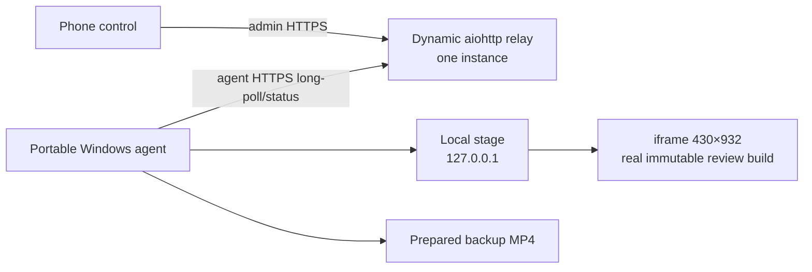

# Автопрезентатор static-сайта

- **Статус:** `m0_implementation`; фактический запуск на целевом ноутбуке ещё не выполнен.
- **Implementation gate:** `m0_win10_compatibility`.
- **Release verdict:** `GO_TO_M0_COMPATIBILITY_SPIKE_ONLY`; публичный показ — `NO-GO` до прохождения M0–M3.

Автопрезентатор — отдельный Playwright-инструмент, который показывает настоящий интерфейс KenigEvents в сценической композиции. Ведущий запускает и останавливает заранее известный сценарий с телефона; Windows-агент выполняет реальные browser actions и заранее умеет воспроизвести проверенное резервное видео.

Это единственный нормативный документ. [requirements.md](requirements.md) хранит исходные пожелания. [playwright_autopresenter_prompt.md](playwright_autopresenter_prompt.md) — только superseded historical reference и не должен исполняться напрямую.

## Решение в одном абзаце

Сначала на целевой Windows 10 доказываем работоспособность точной portable-связки Node + Playwright + Playwright-managed browser: для каждого кандидата отдельно нужны 20/20 полных холодных циклов на локальной loopback-fixture (10 fresh-profile + 10 persistent-profile) и затем 5/5 live smoke на `/zavtra/`. Только после M0 PASS можно строить локальную stage-страницу 1920×1080 с реальным review build в `iframe` 430×932, детерминированный `tomorrow-mobile`, локальный hard stop и запись. Relay, телефонный control UI и финальная portable-сборка относятся к следующим этапам. Публичный gate — тот же ZIP на том же ноутбуке, заранее просмотренный MP4 и полный rehearsal.

## Продуктовая граница

### Первый полезный результат

Один сценарий `tomorrow-mobile`:

1. открывает immutable review build на отдельном Astro route `/zavtra/`;
2. подтверждает page/date/dataset markers;
3. показывает реальный мобильный listing в рамке телефона;
4. прокручивает listing и rail вправо/влево;
5. открывает заранее выбранное событие настоящим `locator.click()`;
6. возвращается, выбирает зафиксированную субботу и делает 1–2 действия;
7. останавливается с телефона или локальным `Esc` не позднее двух секунд;
8. выполняется тем же action graph в `live` и `record` policy.

### Не входит в M0

M0 — только compatibility experiment. До его подтверждённого PASS **запрещено начинать M1, M2 или M3**, в том числе писать:

- iframe presentation stage, декоративный cursor/tap overlay и запись;
- телефонный UI, relay API, long-poll и production authentication;
- финальную portable-сборку и backup-video pipeline;
- desktop-сцены;
- typing, QR/image, инфографика и key hints;
- несколько сценариев и универсальный DSL;
- `.exe`, Electron, React, Socket.IO, Redis, отдельная очередь/БД;
- AI-планирование live-сценария;
- визуальный редактор и multi-tenant service.

Разрешённый инвентарь M0 ограничен двумя hermetic candidate bundles, launcher/self-test, локальной fixture, одним настоящим click-сценарием, сбором system/run evidence, автоматическим cold-cycle runner, отдельным live smoke и сравнительным отчётом. После M3 расширения можно добавлять поверх уже доказанного runner.

## Traceability и решение «Сегодня» / «Завтра»

В раннем superseded PoC фигурировал `today`, но актуальные исходные требования владельца прямо задают страницу «Завтра», rail и субботу. Поэтому нормативный первый сценарий — `tomorrow-mobile`.

Это не client-side filter и не несуществующая страница: `/zavtra/` — отдельный Astro route `site/src/pages/zavtra/index.astro`; `site/src/components/Reference4MobileMenu.astro` и `ListingPageHeader.astro` уже ссылаются на него. Расхождение закрыто явным решением, а не молчаливой заменой требования.

| Исходное требование | Нормативное решение |
|---|---|
| Телефон: кнопка, countdown, stop | M2 control page + подтверждённая state machine |
| Интернет, не локальная сеть | телефон и агент делают исходящие HTTPS-запросы к dynamic relay |
| Mobile/desktop реального сайта | mobile в M1; desktop только после M3 |
| Tap/pointer и human-like motion | deterministic overlay + настоящие Playwright actions |
| Сценарии в файлах | TypeScript action graph; schema только после трёх сценариев |
| «Завтра», event rail, суббота | immutable presentation dataset + exact scenario contract |
| Typing/QR/stats/captions/keys | post-M3 extensions |
| Тонкий Windows-клиент | hermetic ZIP, portable Node, managed browser, `start.cmd` |
| Локальная отладка | Linux smoke полезен, но не заменяет M0 на Windows 10 |
| Резервная запись | заранее созданный и просмотренный MP4 из того же commit/scenario |
| Presentation localStorage | versioned bootstrap/fixture и preflight |
| Не подделывать сайт | real `iframe`; overlays не воспроизводят UI сайта |

## Normative architecture



Repository boundary:

```text
site/                                      real Astro site
tools/autopresenter/                       runtime/release product
tools/autopresenter/tests/                 agent/protocol/package tests
tests/playwright/presenter-site-contract.* stable site hooks and iframe contract
```

Не превращать корень Python-репозитория в npm monorepo. Не класть runtime в `tests/playwright` или Astro build.

## P0. Windows 10 compatibility gate

Актуальная официальная документация Playwright перечисляет Windows 11+ и Windows Server 2019+, но не Windows 10: [system requirements](https://playwright.dev/docs/intro#system-requirements). Начиная с 1.57 headed build перешёл на Chrome for Testing: [Playwright 1.57 release notes](https://playwright.dev/docs/release-notes#version-157). Поэтому до M0 употребляется только термин **Playwright-managed browser binary**; «встроенный Chromium» не является версионно корректным контрактом.

Текущий site toolchain фиксирует Playwright `1.61.1`, однако это не доказательство совместимости автопрезентатора с Windows 10.

### M0 candidate matrix

Первый spike обязан проверить как минимум две hermetic-связки. Начальный набор:

| Candidate | Portable Node | Playwright | Managed browser из package metadata | Роль |
|---|---:|---:|---|---|
| `current-control` | `22.12.0 x64` | `1.61.1` | revision `1228`, browser `149.0.7827.55` | текущая repo-линия, официально не поддерживает Win10 |
| `pre-cft-compat` | `22.12.0 x64` | `1.54.2` | revision `1181`, browser `139.0.7258.5` | compatibility candidate до перехода 1.57 |

Эти значения — вход spike, не выбранный production stack. Browser revision взят из `playwright-core` package metadata; M0 обязан повторно записать фактический executable/hash в артефакт. Если оба кандидата не проходят, следующая версия выбирается только после targeted research по официальным release/package records, а не случайным downgrade.

### Exact candidate manifest

Единственный machine-readable источник параметров кандидатов — `tools/autopresenter/m0/candidates/*.json`; README не дублирует изменяемые checksums. До сборки каждый manifest обязан содержать без placeholder:

- `candidateId`, target `os: Windows 10` и `arch: x64`;
- exact Node version, имя ZIP и SHA-256;
- exact package `playwright` version и SHA-256 соответствующего `package-lock.json`;
- browser product, revision/build, относительный путь executable и его SHA-256;
- `headless: false`, exact launch arguments, `browserChannel: null`;
- относительный `PLAYWRIGHT_BROWSERS_PATH` внутри candidate bundle;
- два profile mode: `fresh` и `persistent`.

Manifest и `package-lock.json` входят в candidate ZIP и в evidence. Несовпадение version/revision/path/hash, абсолютный executable path, пустой hash или browser channel делает candidate непригодным к запуску, а не включает fallback.

### M0 test contract

Зачёт выполняется **на целевом Windows 10 x64 ноутбуке**, под той же обычной учётной записью, которая будет использоваться на показе, без admin rights и без установленного Node/Chrome/Playwright. Локальный Linux/CI smoke может проверять код и схемы, но не может выдать M0 PASS.

#### A. Compatibility: строго 20/20

Для **каждого** кандидата выполняются 20 последовательных полных холодных циклов:

- runs `001–010`: новый чистый profile directory для каждого цикла;
- runs `011–020`: один persistent profile, переиспользуемый между циклами.

Один цикл означает:

1. старт нового portable `node.exe` process;
2. старт нового headed browser process только из candidate portable-папки;
3. создание fresh profile или открытие предусмотренного persistent profile;
4. запуск временного HTTP-сервера только на `127.0.0.1` и открытие deterministic fixture;
5. настоящий strict `locator.click()` по `[data-presenter-id="nav-tomorrow"]`;
6. проверку `[data-presenter-id="tomorrow-ready"]`;
7. закрытие BrowserContext;
8. завершение browser process;
9. завершение Node process;
10. bounded-проверку отсутствия оставшихся дочерних процессов.

Только после записанного результата и process-cleanup начинается следующий цикл. Двадцать `goto()`/`click()` в одном Node/browser не считаются 20 запусками.

#### B. Live-site smoke: отдельно 5/5

Только после compatibility 20/20 тот же candidate выполняет 5 отдельных холодных запусков на exact immutable `/zavtra/` URL с реальным strict locator и marker assertion. Live smoke имеет собственную метрику и run records: сетевой/production сбой не переписывает compatibility result, но кандидат не получает общий PASS без 5/5.

`self-test.cmd` отдельно работает полностью offline на loopback fixture. Candidate также проверяется из путей:

   - `C:\Autopresenter\`;
   - `C:\Folder with spaces\Autopresenter\`;
   - `C:\Демонстрация\Автопрезентатор\`.

#### Fail-closed browser boundary

M0 немедленно завершается FAIL, если managed browser отсутствует или обнаружена попытка:

- использовать `channel`, системный Edge/Chrome или иной executable вне candidate;
- обратиться к `%LOCALAPPDATA%\ms-playwright` или browser cache машины сборки;
- скачать browser/runtime/package во время target run;
- выполнить `npx playwright install` на целевом ноутбуке;
- оставить после цикла candidate Node/browser child process.

#### PASS/FAIL и выбор

Кандидат получает PASS только при **20/20 compatibility + 5/5 live**, успешном offline self-test, валидных manifest/hash, настоящем `locator.click()`, zero-install/zero-admin, нулевых browser downloads/system-browser fallbacks и нулевых orphan processes. `19/20`, `4/5`, ручное удаление locked profile, единичный crash, запуск только из dev shell/от администратора или необходимость установить системный компонент — FAIL.

Если прошли оба кандидата, выбирается более новый только при равной стабильности и без дополнительных системных требований. Если прошёл один — его exact versions/checksums замораживаются. Если не прошёл ни один — итог `PLAYWRIGHT_ON_TARGET_WIN10_NO_GO`, M1 не начинается. Даже успешный результат доказывает совместимость только с зафиксированными build/user/laptop, а не общую поддержку Windows 10.

## P0. Stage contract

MVP выбирает **iframe architecture**, а не оставляет выбор исполнителю.

### Geometry

- browser: headed kiosk/fullscreen, logical stage `1920×1080`, device scale `1`;
- local stage: `http://127.0.0.1:<ephemeral>/stage/`, bind строго loopback;
- phone iframe: CSS viewport `430×932`, position `x=210`, `y=74`;
- device frame: максимум `470×980`, без `transform: scale()` в основном профиле;
- caption zone: `x=740..1730`, safe margins минимум 64 px;
- stage background/phone bezel/caption — overlay; HTML сайта не клонируется.

При другом реальном разрешении preflight завершает run ошибкой. Профиль 2560×1440 появляется только post-M3.

### Interaction

- iframe загружает точный immutable review URL;
- Playwright работает через `FrameLocator`;
- tap/pointer overlay инъецируется внутрь iframe, имеет `pointer-events:none`;
- после каждой frame navigation overlay создаётся заново;
- реальное действие выполняется strict `locator.click()`/mouse API;
- popup/new tab в MVP запрещён: неожиданный `page` event завершает step ошибкой;
- iframe header preflight проверяет отсутствие `X-Frame-Options` и blocking `frame-ancestors`;
- direct-page mode — диагностический fallback, но не принятый public-stage layout.

28 июля 2026 текущий review URL отвечал `200`, без frame-blocking headers. Это discovery evidence; проверка повторяется перед каждым rehearsal/run.

## P0. Deterministic scenario and data contract

«Завтра» вычисляется только в `Europe/Kaliningrad`. Для сцены используется настоящий immutable noindex Astro build, но зафиксированный dataset — это контролируемые данные, а не подделка UI.

```yaml
id: tomorrow-mobile
start_url: https://kenigevents.ru/_review/<immutable-build>/zavtra/
timezone: Europe/Kaliningrad
presentation_date: 2026-07-28
listing_date: 2026-07-29
viewport: { width: 430, height: 932 }
expected_build_id: <build-id>
event_id: <reviewed-event-id>
saturday_date: 2026-08-01
minimum_visible_cards: 3
empty_state_allowed: false
```

Exact dates/IDs заполняются для конкретного показа и входят в scenario hash. Нельзя во время live run выбирать «первую интересную карточку».

До M1 сайт получает нейтральные presentation hooks:

- `data-presenter-id="page-tomorrow"` — ровно один page root;
- `data-presenter-build-id` и `data-presenter-listing-date`;
- существующий `data-event-id="<id>"` для exact card;
- существующий `data-calendar-date="YYYY-MM-DD"` для exact Saturday;
- stable rail/gallery hook с уникальным container contract.

`tests/playwright/presenter-site-contract.spec.ts` проверяет uniqueness, iframe loading, route, dataset markers и success targets. `getByText(...).first()` запрещён. Multiple matches — preflight error.

Action graph общий для live/record; policies различаются только clock, pauses, cursor speed, artifact handling и error policy. Seed, scenario data и action order одинаковы.

## P0. Command protocol

Long-poll остаётся, но является versioned at-most-once protocol.

### Dynamic service boundary

- control HTML может отдаваться тем же `aiohttp` runtime;
- API живёт только в dynamic process, не в Astro/Object Storage;
- production paths: `/autopresenter/control/` и `/api/presenter/` за HTTPS reverse proxy;
- ровно один relay instance, scale-to-zero выключен, deploy во время показа запрещён;
- `/api/presenter/*`: `Cache-Control: no-store`, healthcheck и проверенный TLS;
- если нужен scale > 1, до него state переносится в общее хранилище.

### Command envelope

```json
{
  "protocolVersion": 1,
  "sequence": 42,
  "commandId": "018f-example",
  "sessionId": "presentation-2026-07-30",
  "runId": "run-018f-example",
  "agentId": "presenter-win10-main",
  "type": "run",
  "scenarioId": "tomorrow-mobile",
  "issuedAt": "2026-07-30T15:28:10Z",
  "expiresAt": "2026-07-30T15:28:30Z"
}
```

Для `stop` обязательны те же IDs/sequence/TTL и целевой `runId`; `scenarioId` отсутствует.

Endpoints:

| Method/path | Auth | Contract |
|---|---|---|
| `POST /api/presenter/sessions/{sessionId}/commands` | admin | создать allowlisted `run`/`stop` |
| `GET /api/presenter/agent/poll?sessionId=…&agentId=…&after=…&wait=20` | agent | long-poll следующей sequence |
| `POST /api/presenter/runs/{runId}/status` | agent | monotonic state/step/heartbeat |
| `GET /api/presenter/sessions/{sessionId}/state` | admin | control state/countdown |
| `GET /api/presenter/health` | public/minimal | readiness без секретов |

Normative properties:

- server выдаёт возрастающий `sequence`;
- `commandId` выполняется не более одного раза;
- TTL истёк — команда подтверждается как `expired`, но не запускается;
- одна session имеет максимум один active run;
- `stop` приоритетнее pending `run`;
- duplicate click возвращает существующий command/run, не создаёт новый;
- agent атомарно сохраняет `lastSequence` и последние command IDs в `data/agent-state.json`;
- restart/reconnect не воспроизводит старый command;
- новый agent instance заменяет старый только по matching `agentId` и fresh lease;
- long-poll завершается не позже 20 s + bounded server overhead;
- relay restart инвалидирует текущую in-memory session; ведущий создаёт новую session, старые TTL-команды не оживают.

State machine:

```text
offline → ready → accepted → running → stopping → stopped
                                     ↘ completed
                                     ↘ failed
```

Control page не показывает `stopped` до agent acknowledgement.

## P0. Cancellation contract

Agent имеет два независимых async-контура:

1. `commandPollingLoop` работает всё время, включая active scenario;
2. `scenarioRunner` выполняет ровно один run.

Stop sequence:

1. poll loop принимает `stop`, переводит run в `stopping`, ставит `AbortController.abort()`;
2. cooperative helpers проверяют signal между micro-actions и interruptible pauses;
3. текущему Playwright action даётся максимум 500 ms на завершение;
4. затем runner закрывает Page/BrowserContext, прерывая locator/navigation wait;
5. если закрытие не завершилось, до 1.8 s завершается managed browser process;
6. agent подтверждает `stopped` не позднее 2 s и асинхронно создаёт чистый stage;
7. невозможность восстановить stage даёт `failed_recovery`, но не меняет подтверждённый stop.

Все step timeouts bounded; `networkidle` не используется. Телефон показывает последовательно `Остановка отправлена → Останавливается → Остановлено агентом`.

Local emergency controls работают без relay:

- `Esc` — hard stop;
- `R` — recreate stage;
- `F` — fullscreen;
- `Space` / `Right Arrow` — продолжить/следующая разрешённая сцена в rehearsal mode.

M2 acceptance измеряет p95 и worst-case Stop; каждый из 20 тестов должен уложиться в 2 s, включая зависший locator fixture.

## P0. Portable release contract

```text
Autopresenter-Win10-x64/
├── start.cmd
├── self-test.cmd
├── config.json
├── VERSIONS.json
├── RELEASE-MANIFEST.json
├── SHA256SUMS.txt
├── backup/
│   ├── backup-tomorrow-mobile-1920x1080.mp4
│   └── backup-manifest.json
├── runtime/
│   └── node.exe
├── app/
│   ├── package.json
│   ├── package-lock.json
│   ├── dist/
│   └── node_modules/
├── browsers/
│   └── playwright-managed-browser/
├── data/
│   └── browser-profile/
└── logs/
```

- `VERSIONS.json`: exact Node, Playwright, package integrity, browser name/version/revision/executable SHA-256, target Windows build.
- `RELEASE-MANIFEST.json`: repo commit, scenario/data hash, build time, M0 report hash, included files.
- `SHA256SUMS.txt`: каждый release file.
- `backup-manifest.json`: source commit/scenario hash, resolution, duration, human review timestamp.

`self-test.cmd` не обращается к target site и проверяет:

- Windows x64/build и запуск portable Node;
- exact manifest/browser revision/hash;
- headed launch и `about:blank`;
- запись/удаление probe-файла в `data/` и `logs/`;
- clean browser shutdown;
- отсутствие зависимости от установленного Node/Chrome;
- корректные коды выхода и redacted log.

На ноутбук переносится **тот же проверенный ZIP**, без повторной сборки. Backup MP4 создаётся заранее тем же commit/scenario, просматривается человеком, лежит локально и открывается горячей клавишей без сети.

## Security minimum

- разные `admin token` и `agent token`;
- телефон не знает agent token, агент не знает admin token;
- pairing/admin secret допускается только во fragment URL и затем уходит в Authorization header;
- телефон передаёт только `run|stop` и allowlisted `scenarioId`/run reference;
- URL, selector, JavaScript, filesystem path и Chromium args с телефона запрещены;
- target URL/data находятся в локальном signed/checksummed config;
- cookies, localStorage, tokens, HTML и auth objects не логируются;
- empty/default tokens запрещают запуск dynamic relay.

## M0–M3 delivery plan

### M0 — Windows 10 compatibility

Без телефона, relay, iframe-stage, записи и финальных overlays:

- два exact candidate ZIP через границу Playwright 1.57;
- 20 полных local-fixture cold cycles на кандидата: 10 fresh + 10 persistent;
- после 20/20 — отдельные 5/5 cold live-site smoke;
- strict click, offline self-test, path matrix, manifest/hash/process checks;
- полный раздельный evidence package.

**Gate:** выбранная exact combo проходит весь M0 test contract на целевом Windows 10 ноутбуке. Реализация M1–M3 не является допустимым способом «продолжить», если target execution отсутствует или завершился FAIL.

### M1 — Stage и deterministic scenario

- iframe stage contract 1920×1080 / 430×932;
- stable site hooks и site contract test;
- fixed Kaliningrad presentation dataset;
- `tomorrow-mobile`, pointer/tap/scroll/swipe;
- local hotkeys, cooperative + hard stop;
- live/record policies и local backup draft.

**Gate:** 20 локальных Windows-прогонов, reset после каждого, strict assertions, stop ≤ 2 s.

### M2 — Remote control

- one-instance `aiohttp` relay;
- admin/agent auth;
- protocol IDs/sequence/TTL/lease/idempotency;
- phone state/countdown/confirmed stop;
- reconnect, duplicate, expiry и internet-loss tests;
- телефон и ноутбук в разных сетях.

**Gate:** 20 remote runs без повторов; stale command не оживает; stop ≤ 2 s.

### M3 — Exact release и rehearsal

- финальный hermetic ZIP/manifests/checksums;
- self-test/path matrix;
- final reviewed offline MP4;
- тот же ноутбук, Windows user, 1920×1080, scale 100%, большой экран;
- sleep/notifications disabled, no deploy/scale-to-zero;
- full rehearsal и emergency hotkeys.

**Gate:** `GO_FOR_PUBLIC_DEMO` выдаётся только после подписанного checklist с SHA-256 точного ZIP и MP4.

### После M3 — полноценное расширение

Последовательно добавлять desktop, typing, QR/image, stats, captions, key hints, дополнительные resolution profiles и только затем versioned declarative schema. Полноценное решение остаётся presentation tool, а не универсальной медиаплатформой.

## Public-demo acceptance suite

- [ ] Чистый Windows 10 x64, обычный пользователь, без installed Node/Chrome/Playwright.
- [ ] Exact candidate manifests совпадают с package locks и executable hashes.
- [ ] Exact M0 combo и 20/20 полных cold compatibility runs: 10 fresh + 10 persistent.
- [ ] Отдельные 5/5 cold live-site smoke runs.
- [ ] Ни одного browser download, system-browser fallback или orphan process.
- [ ] Запуск из трёх path variants, включая пробелы и кириллицу.
- [ ] Real `locator.click()` виден в trace; DOM `element.click()` отсутствует.
- [ ] Site contract доказывает unique stable targets и exact dataset/date.
- [ ] 20/20 deterministic scenario runs с reset.
- [ ] Duplicate start выполняется один раз.
- [ ] Stop подтверждён агентом ≤ 2 s, включая hung locator.
- [ ] Internet loss/reconnect не воспроизводит stale command.
- [ ] Manual browser close даёт ошибку и успешный `R` recovery.
- [ ] Agent restart не повторяет последнюю command.
- [ ] Телефон/ноутбук проверены в разных сетях.
- [ ] Точный ZIP проверен на ноутбуке/экране площадки.
- [ ] Offline MP4 просмотрен, checksum совпадает, запуск без relay проверен.

## Артефакты и evidence

Run evidence складывается в `artifacts/codex/autopresenter/<m0-run-id>/` и не коммитится. Обязательная структура:

```text
M0-REPORT.md
M0-REPORT.json
VERSIONS.json
RELEASE-MANIFEST.json
SHA256SUMS.txt
SYSTEM-INFO.json
runs/
  current-control/
    compatibility/run-001.json ... run-020.json
    live/run-001.json ... run-005.json
  pre-cft-compat/
    compatibility/run-001.json ... run-020.json
    live/run-001.json ... run-005.json
screenshots/
traces-on-failure/
logs/
```

Каждая run record фиксирует candidate/run/profile/target, timestamps и exit codes, relative browser executable, настоящий locator/action, success marker, download/system-browser flags, process-cleanup snapshot и итог. `SYSTEM-INFO.json` фиксирует Windows edition/build/winver, x64, laptop model, RAM, GPU/driver, display/resolution/scaling/devicePixelRatio, locale, account/admin mode, portable path и доступное без elevation состояние Defender/AppLocker/WDAC; секреты и персональные файлы не собираются. Лог обязателен для каждого запуска, screenshot — для контрольной выборки и каждой ошибки, trace и process snapshot — для каждой ошибки.

В Git входят только минимальные fixtures, contracts, schema/manifests templates и итоговый обезличенный compatibility summary. `M0-REPORT` обязан явно разделять local compatibility и live-site smoke и не может ставить `pass`, пока нет полного target-laptop evidence package.

## Decision summary

| Вопрос | Решение |
|---|---|
| Текущий статус | M0 implementation; target execution pending; только M0 разрешён |
| Windows 10 | unsupported current platform; exact compatibility spike обязателен |
| M0 acceptance | каждый candidate: 20/20 local cold cycles (10 fresh + 10 persistent), затем 5/5 live |
| Первый сценарий | `tomorrow-mobile`; `/zavtra/` — отдельный Astro route |
| Stage | iframe 430×932 внутри 1920×1080; direct-page не public layout |
| Transport | HTTP long-poll с versioned at-most-once protocol |
| Stop | parallel polling + cooperative cancel + hard browser teardown ≤ 2 s |
| Relay | dynamic `aiohttp`, one instance, not Astro/Object Storage |
| Data | immutable build, Europe/Kaliningrad, exact event/date/build markers |
| Distribution | exact portable ZIP + manifests/checksums/self-test |
| Backup | заранее созданный и просмотренный offline MP4 |
| Extras | desktop/typing/QR/stats только после M3 |
