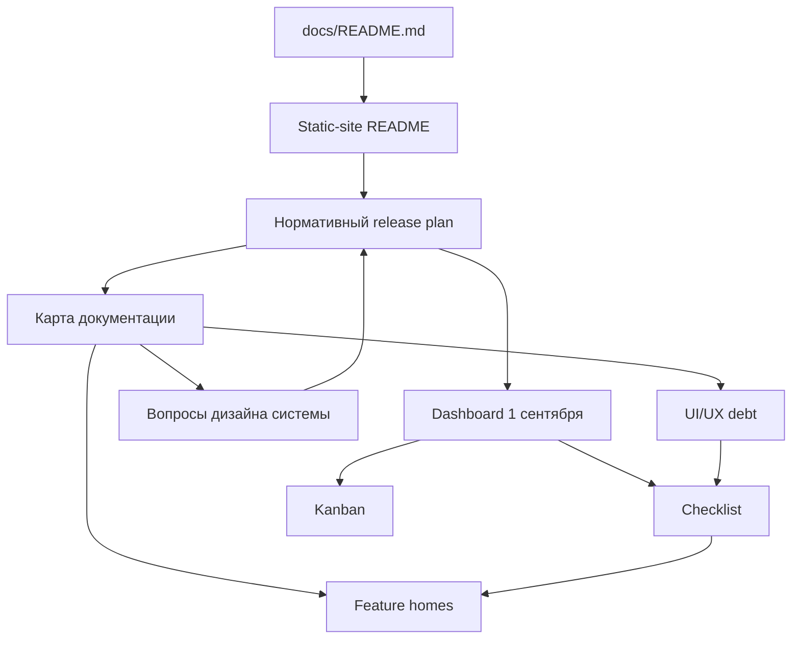

# Карта документации статического сайта и запуска

> **Статус:** активный маршрутизатор документации.  
> **Срез аудита:** 4 августа 2026 года.  
> **Область:** статический сайт, фокус-группа и публичный запуск 1 сентября 2026 года.

## 1. У документации три центра с разными обязанностями

Одного «главного Markdown-файла» недостаточно: нормативная модель, текущий статус
и маршрутизация меняются с разной скоростью. Каноническая иерархия следующая.

1. **[`release-plan.md`](release-plan.md) — нормативный центр программы.**  
   Здесь находятся состав релиза, последовательность фаз, обязательные gates,
   GO/NO-GO и rollback. Feature-документы не должны создавать параллельный план
   запуска.
2. **[Dashboard запуска 1 сентября](../../release/2026-09-01/README.md) —
   оперативный центр.**  
   Он показывает, что сделано, что заблокировано, где требуется решение и какое
   evidence получено на актуальном target.
3. **Этот документ — навигационный центр.**  
   Он отвечает на вопросы «где каноника темы», «какой документ только evidence
   или handoff», «что осталось лишь в открытой ветке» и «какое решение конфликтует
   с другой веткой».

Дополнительные сквозные регистры:

- [`system-design-questions.md`](system-design-questions.md) — вопросы, которые
  должны быть закрыты решением до зависимой реализации;
- [`ui-ux-debt.md`](ui-ux-debt.md) — последовательная очередь UI/UX-недоработок;
- [`test-scenarios.md`](test-scenarios.md) и
  [`release-autotest-gates.md`](release-autotest-gates.md) — сценарии и требуемый
  уровень доказательства.



## 2. Что показал аудит связности

Автоматический срез ветки PR #324 нашёл:

- `765` Markdown-файлов вне generated/build-каталогов;
- `1 971` распознанную локальную ссылку между документами;
- `365` файлов без входящих ссылок;
- `438` файлов, недостижимых из набора текущих документационных хабов;
- `299` Markdown-изменений в открытых PR, то есть значимый объём требований пока
  существует вне `main`.

Эти числа **не означают, что все 438 файлов надо удалить**: среди них есть
исторические incident records, исследования, отчёты и README наборов данных.
Они означают другое: текущая сеть не позволяет автоматически отличить
канонический контракт от архива, черновика, handoff и забытого документа.

Подтверждённые проблемы:

1. [`smart-update-prod-audit.md`](../../operations/smart-update-prod-audit.md)
   существует в `main` и записан в `docs/routes.yml`, но до этого среза не имел
   входящей Markdown-ссылки из программы релиза.
2. Пакет стандартного онбординга существует в `main`, но его README не был
   достижим из документационных хабов.
3. Общие январские вопросы EVE находятся в
   [`eve-arch-questions.md`](../../architecture/eve-arch-questions.md), однако это
   узкий исторический список про LLM/Kaggle, а не действующий регистр решений
   всего статического сайта.
4. Hero-talk, редакционный стиль, волонтёры, V8-клавиатура и часть prelaunch-
   документации существуют только в открытых PR.
5. По фокус-группе одновременно существуют несколько «центров», а новая owner-
   correction в PR #323 противоречит anonymous-first модели PR #250 и текущим
   строкам раннего dashboard.
6. По профилю и хранению данных расходятся текущая Supabase-primary архитектура
   и целевая YDB/dual-plane модель PR #328. Это открытый архитектурный вопрос,
   а не готовое решение.
7. Текущий `presentation-release-checklist.md` содержит регистр presentation UI
   debt, но он исторически привязан к R14 и содержит только одну явную debt-row;
   он не заменяет общий UI/UX-регистр запуска.

## 3. Статусы документов

| Метка | Значение |
|---|---|
| `CANONICAL_MAIN` | Нормативный документ находится в `main` и маршрутизирован |
| `CURRENT_MAIN` | Актуальный полезный документ в `main`, но не единственная каноника темы |
| `OPEN_PR` | Документ существует только или существенно новее в открытом PR |
| `OWNER_DECISION` | Есть несколько допустимых вариантов; требуется решение владельца |
| `CONFLICT` | Два документа задают несовместимое поведение |
| `HANDOFF` | Исполняемая задача агенту; не источник продуктовой истины |
| `HISTORICAL` | Evidence/исследование/старый план; не текущий контракт |
| `GAP` | Отдельная каноника отсутствует или требует переноса на свежий `main` |

## 4. Маршрутизация тем со скриншота

| Тема | Канонический дом или текущий источник | Состояние сети | Следующее действие |
|---|---|---|---|
| Чек-лист и kanban | [Dashboard 1 сентября](../../release/2026-09-01/README.md), [детальный checklist](../../release/2026-09-01/CHECKLIST.md), [kanban](../../release/2026-09-01/KANBAN.md) | `OPEN_PR` #324 до merge | После принятия сделать dashboard обязательным status-centre всех рабочих веток |
| Контроль доработок сайта | [Release plan](release-plan.md), dashboard; implementation handoff в [PR #323](https://github.com/onedayonemasterpiece/events-bot-new/pull/323) | `HANDOFF`, не каноника | Каждое принятое изменение переносить в feature home, checklist и один из сквозных регистров |
| Аудит Smart Update | [`smart-update-prod-audit.md`](../../operations/smart-update-prod-audit.md), [`smart-event-update/README.md`](../smart-event-update/README.md), incident StaticSiteBuilder | `CURRENT_MAIN`, ранее плохо связан | Ссылать production-аудит напрямую из release plan и dashboard; вердикт только по terminal live evidence |
| Роли и экологичность СУБД | [`personalization-data-ownership.md`](../../architecture/personalization-data-ownership.md); целевая коррекция — [PR #328](https://github.com/onedayonemasterpiece/events-bot-new/pull/328) | `CONFLICT` | Закрыть `SYS-Q-003`; затем обновить одну архитектурную канонику и пометить альтернативу superseded |
| Клавиатурная навигация | [`keyboard-event-navigation-prototype.md`](keyboard-event-navigation-prototype.md); V8 — [PR #330](https://github.com/onedayonemasterpiece/events-bot-new/pull/330) | V7 `CURRENT_MAIN`, V8 `OPEN_PR` | После evidence/owner gate перенести V8 в канонический документ, не держать две равноправные версии |
| Гипотеза о волонтёрах | [PR #331](https://github.com/onedayonemasterpiece/events-bot-new/pull/331) (`volunteer-recruitment/`) | `OPEN_PR` | После принятия добавить feature home в `docs/routes.yml`, release plan и user-story registry |
| Медальоны | [`event-token-medallions.md`](event-token-medallions.md), [usage audit](../../reports/static-medallion-usage-audit-2026-07-23.md) | `CURRENT_MAIN`; полный visual QA остался в старых PR | Перенести актуальный medallion QA-contract на свежий `main` либо явно отклонить его |
| Заглушка 1 сентября — техно-вариант 1 | `prelaunch.md` в [PR #296](https://github.com/onedayonemasterpiece/events-bot-new/pull/296) | `OPEN_PR` | Считать продуктовым кандидатом, но не каноникой до owner visual gate |
| Заглушка 1 сентября — техно-вариант 2 | `launch-tile-mosaic-placeholder.md` в [PR #313](https://github.com/onedayonemasterpiece/events-bot-new/pull/313) | `OPEN_PR`, stacked experiment | Сравнить с #296 на одном frozen evidence pack; не сливать параллельные root-contracts |
| Заглушка 1 сентября — стекло / физические плитки | `tile-mosaic-material-generator.md` в [PR #318](https://github.com/onedayonemasterpiece/events-bot-new/pull/318) | `OPEN_PR`, lab | Хранить как генератор/evidence; выбранный результат должен ссылаться на один prelaunch contract |
| Стратегия онбординга | [`static-site-onboarding/README.md`](../static-site-onboarding/README.md), strategy options, alignment; расширение — [PR #288](https://github.com/onedayonemasterpiece/events-bot-new/pull/288) | `CURRENT_MAIN`, ранее orphan-like | Добавить в feature index/release map; после принятия оставить один versioned canonical strategy |
| Редакционный стиль сайта | workbench в [PR #286](https://github.com/onedayonemasterpiece/events-bot-new/pull/286) | `OPEN_PR` | После завершения корпуса создать editorial standard v1 в `main`; research reports оставить evidence |
| OTP и авторизация | [`site-user-identity/README.md`](../site-user-identity/README.md), [`static-site-auth-session-fixture.md`](../../testing/static-site-auth-session-fixture.md), [`external-focus-email-otp.md`](../../testing/external-focus-email-otp.md) | `CANONICAL_MAIN` с новыми follow-up PR | Сводить product identity, delivery и test evidence через release gates, а не через один OTP-документ |
| Тестирование надёжности соединения | [`yandex-dependency-resilience.md`](../../operations/yandex-dependency-resilience.md), fault profiles и release-autotest gates | `CANONICAL_MAIN`; часть hosted gates открыта | Добавить capability-specific UX debt и terminal receipts в dashboard |
| Контроль лимитов LLM | [`llm-gateway/README.md`](../llm-gateway/README.md), limiter incidents | `CANONICAL_MAIN`; incidents слабо индексированы | Инциденты маршрутизировать через incident index и release risk, не делать их отдельной каноникой |
| Hero-talk | текущее alignment в standard onboarding; полный package — [PR #291](https://github.com/onedayonemasterpiece/events-bot-new/pull/291) | `OPEN_PR` + current companion | Принять границу Hero-talk/onboarding/artifacts в `SYS-Q-005`, затем довезти package до `main` |
| Умный поиск | [`smart-vector-search/README.md`](smart-vector-search/README.md), [`authorized-event-search.md`](../unsigned-personalization/authorized-event-search.md); live E2E — [PR #284](https://github.com/onedayonemasterpiece/events-bot-new/pull/284) | `CANONICAL_MAIN`, production recovery открыт | Не создавать новую search-спеку; обновлять status/evidence в canonical README и dashboard |
| Персонализация | [`personalizaion/README.md`](personalizaion/README.md), target/implementation/traceability; дополнения — [PR #270](https://github.com/onedayonemasterpiece/events-bot-new/pull/270) и [PR #328](https://github.com/onedayonemasterpiece/events-bot-new/pull/328) | `CURRENT_MAIN` + архитектурный `CONFLICT` | Сначала закрыть ownership/localization и identity-linking questions, затем консолидировать package |
| SEO и GEO | требования распределены по release plan, static output и structured-data gates; отдельный файл остался в старых PR #26/#65 | `GAP` | Перенести актуальный SEO/GEO release contract на свежий `main` либо оформить осознанное supersede |
| Гастрособытия | [`gastronomy-collection.md`](gastronomy-collection.md); data-prep — [PR #314](https://github.com/onedayonemasterpiece/events-bot-new/pull/314) | product contract `CANONICAL_MAIN`, implementation `OPEN_PR` | Не публиковать до owner-reviewed membership и route/UI gates |
| Фокус-группа | [`focus-group.md`](focus-group.md), [`focus-group-release/README.md`](focus-group-release/README.md), prototype package; latest owner correction — [PR #323](https://github.com/onedayonemasterpiece/events-bot-new/pull/323) | `CONFLICT` | Зафиксировать auth-gated feedback в одной канонике; PR #250/anonymous-first формулировки пометить superseded |
| Подборки | [`podborki.md`](podborki.md), [`podborki-to-be.md`](podborki-to-be.md), quality plan/runbook; editorial package — [PR #252](https://github.com/onedayonemasterpiece/events-bot-new/pull/252) | `CANONICAL_MAIN` + отдельный `OPEN_PR` | Создать единый machine-readable registry и различать utility/semantic/editorial collections |
| Статистика | [`analytics/README.md`](analytics/README.md) | `CANONICAL_MAIN` | Feature-документы добавляют только свои события/метрики и ссылаются на общий словарь |
| Пользовательские истории | [`docs/backlog/user-stories.md`](../../backlog/user-stories.md) | `GAP`: общий старый backlog, не реестр запуска статического сайта | Создать release-linked static-site user-story registry и focus-group story registry; связывать с checklist, UX debt, тестами и production incidents |

## 5. Фокус-группа: явная фиксация текущего конфликта

На 4 августа последняя owner-correction, отражённая в PR #323, задаёт поток:

```text
invite / QR
→ обычный сайт и локальная персонализация доступны без входа
→ feedback-блок виден, но score / NPS / text / screenshot disabled
→ явный email/Яндекс CTA
→ после подтверждённой identity feedback становится доступен
→ возврат в исходный блок без потери контекста
```

Она запрещает silent anonymous Supabase Auth и anonymous server feedback. Поэтому
anonymous-first формулировки в PR #250 и раннем dashboard нельзя считать
действующей продуктовой истиной. До переноса owner-correction в канонические
файлы тема помечена `CONFLICT`, а не `DONE`.

## 6. Правила, которые предотвращают новые «острова»

1. Принятое решение считается каноническим только после попадания в `main`.
2. PR body, agent prompt, `.codex` report и chat handoff — evidence/исполнение,
   но не единственный источник требования.
3. У каждой темы ровно один product/architecture home. Test plan, runbook,
   research и status могут быть companions, но обязаны ссылаться на home.
4. Каждый новый feature home добавляется в `docs/routes.yml`, соответствующий
   feature index, эту карту и при необходимости release plan.
5. Каждый launch-blocking вопрос получает `SYS-Q-*`; реализация не заполняет
   неопределённость молча.
6. Каждая найденная UI/UX-проблема получает `UIUX-*`; замечание в чате или
   screenshot без записи в регистр не считается сохранённым.
7. Исторический документ получает явную метку `HISTORICAL`/`SUPERSEDED` и ссылку
   на текущую канонику; текст не копируется в ещё один «актуальный» файл.
8. Dashboard хранит **статус**, feature home — **контракт**, release plan —
   **последовательность и gates**, эта карта — **маршрут**.
9. При каждом обновлении dashboard проверяются открытые PR с Markdown-изменениями:
   новый нормативный текст не должен оставаться side-branch-only без disposition.

## 7. Порядок ближайшей консолидации

1. Перенести owner-corrected focus model из PR #323 в канонические focus docs и
   исправить dashboard.
2. Закрыть вопрос SOR/локализации профиля между current main и PR #328.
3. Выбрать один prelaunch product candidate; остальные оставить lab/evidence.
4. Довезти onboarding, Hero-talk, editorial style, volunteers и V8 keyboard до
   `main` либо записать явный defer/supersede.
5. Создать статический реестр пользовательских историй и связать его с QA,
   incidents и checklist.
6. Перенести SEO/GEO и medallion visual QA из старых веток на свежий `main` или
   закрыть как устаревшие.
7. Добавить постоянную CI-проверку обязательных хабов, route entries и локальных
   ссылок после стабилизации этой карты.
