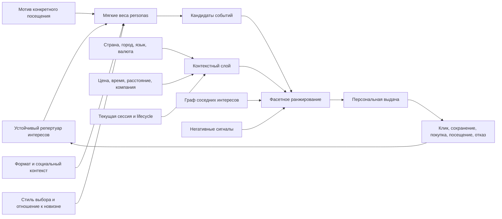
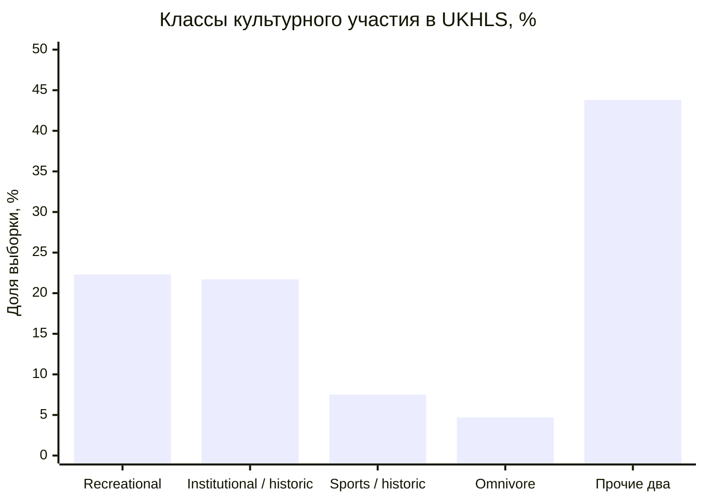
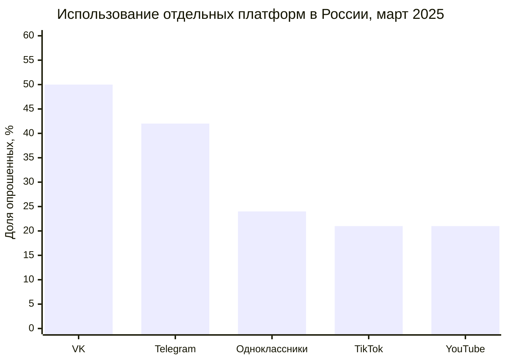
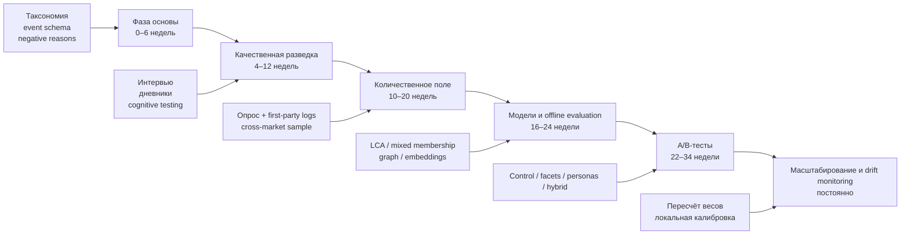

# Golden personas для глобальной и русскоязычной аудитории сервиса анонсов

## Резюме для руководителя

**Главный вывод:** сервису анонсов не следует выбирать между таксономией интересов и personas. Наиболее обоснована **гибридная модель**, в которой пользователь представлен одновременно:

1. независимыми фасетами интересов, мотиваций, форматов и ограничений;
2. несколькими поведенческими Golden personas с вероятностными весами;
3. графом переходов между интересами;
4. текущим контекстом сессии;
5. языково-рыночным слоем;
6. отдельно моделируемой стадией принятия решения.

Под Golden persona в этом отчёте понимается не художественный портрет «типичного пользователя», а **проверяемый латентный паттерн поведения**, для которого существуют наблюдаемые признаки, вероятностный score, отличающаяся продуктовая стратегия и измеримый эффект. Сам термин не закреплён как единый академический конструкт. Классическая критика personas показывает, что правдоподобные биографии нередко невозможно проверить или опровергнуть; data-grounded подходы повышают воспроизводимость, но не устраняют необходимость количественной валидации. citeturn4search1turn4search2turn4search0turn4search4

Литература обнаруживает достаточно устойчивые **измерения различий**, но не универсальный набор сегментов с одинаковыми долями во всех странах:

| Устойчивое измерение | Что оно предсказывает | Уверенность |
|---|---|---:|
| Широта культурного репертуара | Склонность к cross-domain-рекомендациям и новизне | Высокая, но определение «всеядности» зависит от метода |
| Мотивация посещения | Escape, socialization, learning, family time, excitement, статус | Высокая внутри событий; перенос между форматами ограничен |
| Социальный контекст | Соло, пара, друзья, семья, профессиональная группа | Высокая продуктовая значимость |
| Интенсивность опыта | Камерность против толпы, спокойствие против возбуждения | Средняя–высокая |
| Стиль решения | Спонтанное открытие против сравнения и контроля риска | Средняя; требует first-party проверки |
| Новизна против знакомого | Exploration, доверие к неизвестным именам, FOMO | Средняя–высокая |
| Ограничения | Цена, время, расстояние, компания, транспорт, язык | Критически важны: отсутствие посещения не равно отсутствию интереса |
| Язык по контексту | Язык поиска, обсуждения, проверки и покупки может различаться | Высокая для транснациональных аудиторий |

Национальные исследования культурного участия регулярно находят классы от мало вовлечённых до широких «омниворов», однако размеры классов заметно меняются вместе с перечнем активностей, способом измерения, страной и периодом. Мотивационные исследования фестивалей, напротив, выделяют «семейных», «социальных», «эскапистов» и «энтузиастов», но их структуры часто специфичны для конкретного события. Эти результаты не противоречат друг другу: первый подход описывает **устойчивый репертуар**, второй — **задачу конкретного посещения**. citeturn0search2turn1search0turn1search3turn5search0turn5search6turn5search9

Для глобального слоя рекомендуется начинать с шести мягких архетипов: **исследователь-омнивор, доказательный планировщик, социальный координатор, искатель интенсивности, восстанавливающийся созерцатель и нишевый куратор**. Их доли в потенциальной аудитории **не определены опубликованными данными** и должны быть оценены на собственной выборке.

Для русскоязычной аудитории не нужна отдельная «русская психология». Нужен **параллельный контекстный слой**, различающий Россию, постсоветские билингвальные рынки, недавнюю эмиграцию и укоренённую диаспору. Русский язык используют примерно 258 млн человек, но это число не является оценкой адресуемой аудитории сервиса, а владение языком не определяет страну, платформы, доверие, способ оплаты или политические взгляды. citeturn7search0turn7search14

Исследование русскоязычных жителей Германии показало, что все участники пользовались транснациональными медиарепертуарами, а различия определялись не только языком, но также целями, убеждениями и ситуацией. Официальные данные Эстонии одновременно показывают массовое русско-эстонское двуязычие и существенные межпоколенческие различия. Поэтому продукт должен хранить отдельно **страну, город, язык интерфейса, язык запроса, язык контента, валюту и язык транзакции**, не выводя идентичность из одного признака. citeturn0search0turn0search1turn7search1

Приложенные материалы правильно сходятся на гибридной архитектуре, фасетной разметке и мягком членстве. Однако это аналитические синтезы, а не независимые первичные исследования, поэтому предложенные ими названия и веса personas следует считать системой гипотез для проверки. fileciteturn0file0 fileciteturn0file1 Исходный исследовательский бриф также требует отделять D3-поведение от D2-опросов и D1-косвенных медиапредпочтений; это разграничение сохранено далее. fileciteturn0file2

## Понятие и обзор литературы

Наиболее надёжная литература по теме Golden personas находится не под одним названием, а на пересечении исследований personas, латентной сегментации, культурного участия, leisure constraints, мотиваций посетителей и multi-interest recommendation.

| Исследовательское направление | Основные данные и результаты | Значение для сервиса анонсов | Ограничения |
|---|---|---|---|
| Критика классических personas | Chapman и Milham показали проблемы проверяемости, оценки размера и валидности художественно созданных персон. citeturn4search1turn4search2 | Persona должна иметь измеримое membership rule и сравниваться с baseline | Критика направлена прежде всего на традиционные UX-personas, а не на современные вероятностные модели |
| Data-grounded personas | Phenomenographic-подход Huynh и соавторов строит personas из различий в целях и способах понимания; демонстрация включала 23 интервью и шесть полученных профилей. citeturn4search0 | Качественная фаза полезна для интерпретации латентных классов и формулировки мотивов | Небольшая контекстная выборка; face validity не заменяет predictive validity |
| Культурное участие и LCA | В UK Understanding Society на 41 397 полных наблюдениях были выделены шесть классов участия в культуре, наследии и спорте; широкий omnivore-класс оказался небольшим. citeturn0search2 | Обосновывает вероятностные классы и ось «широта репертуара» | Годовое self-report, бинарные признаки, институционально заданный перечень активностей |
| Другие национальные LCA | Фламандские и американские исследования также находили классы высокой, смешанной и низкой вовлечённости; возраст и образование влияли на частоту и сочетание форм. citeturn1search0turn1search2turn1search3turn1search5 | Поддерживают переносимость самой оси вовлечённости | Не гарантируют одинаковые названия или доли классов |
| Визуальные искусства | Английское исследование выделило omnivores, paucivores и inactives. citeturn1search6 | Полезно для различения широты и интенсивности | Только один культурный домен |
| Спор о культурной всеядности | Анализ цифровых следов датского Facebook поставил под сомнение традиционную интерпретацию: результат менялся в зависимости от измерения объёма и состава репертуара. citeturn1search4 | «Omnivore» нельзя определять просто количеством разных кликов | Цифровые лайки не эквивалентны посещениям |
| Диагностичность отдельных активностей | Итальянский анализ 281 403 наблюдений за 2014–2022 годы показал, что разные культурные активности неодинаково различают уровень вовлечённости: музеи и выставки были особенно дискриминирующими, а кино — менее диагностичным. citeturn1search10 | Событийные признаки должны иметь разные информационные веса | Национальный опрос не даёт персонального intent в текущей сессии |
| Фестивальные мотивации | Crompton и McKay выделяли культурное исследование, новизну, восстановление равновесия и несколько видов социализации; структура мотивов менялась между событиями. citeturn5search6 | Мотивация должна быть отдельным фасетом, а не выводиться только из жанра | Старое исследование и событийно-зависимые шкалы |
| Benefit segmentation фестиваля | Li, Huang и Cai: n=280, 33 мотивационных пункта, факторный анализ и кластеризация; получены пять сегментов, включая семейных, социальных, эскапистов и энтузиастов. citeturn5search0turn5search4 | Даёт операциональные мотивы, сообщения и сценарии | Convenience sample одного фестиваля |
| Международная вариативность мотивов | На южноафриканском arts festival многолетняя выборка n=1 005 дала два фактора и три сегмента — arts, ambivalent и hedonic. citeturn5search9 | Подтверждает ценность мотиваций, но опровергает универсальность конкретного списка кластеров | Один фестивальный бренд и культурный контекст |
| Идентичности музейного посетителя | Falk описывает explorer, facilitator, professional/hobbyist, experience seeker и recharger; одна персона может активироваться ситуативно. citeturn5search1turn5search5 | Сильное основание для mixed membership и session intent | Музейный контекст; исходная типология не является общерыночной LCA |
| Психологическая приверженность | Lee и Kyle получили три сегмента фестивальных посетителей с различиями в поведении и приверженности. citeturn5search7 | Устойчивость интереса следует отделять от разового посещения | Специфика выбранного фестиваля |
| Multi-interest recommendation | MIND моделирует одного пользователя несколькими interest vectors и был проверен на больших данных Tmall; ComiRec также показал преимущества сочетания точности и разнообразия на Amazon и Taobao. citeturn1academia12turn1academia13 | Техническое обоснование мягких personas и параллельной генерации кандидатов | E-commerce-домены не доказывают автоматическую переносимость на офлайн-события |
| Ограничения multi-interest моделей | Re4 показывает, что без специальных ограничений interest-векторы могут схлопываться и становиться слабо различимыми. citeturn1academia15 | Нужны diversity regularization, мониторинг и интерпретируемость | Алгоритмическая работа, не исследование культурных сегментов |
| Интерес против социального соответствия | DICE разделяет предпочтение и conformity/popularity signals. citeturn1academia14 | Клик по популярному событию нельзя автоматически считать устойчивым вкусом | Причинные допущения модели требуют локальной проверки |
| Цифровая инфраструктура | В 2025 году интернетом пользовались около 6 млрд человек, 74% населения мира, при больших различиях между доходными и региональными группами. citeturn3search1turn3search17turn3search3 | Один и тот же мотив требует разных каналов, устройств и checkout-процессов | Макростатистика не определяет personas |
| Онлайн-покупка событий | В ЕС в 2024 году 25% интернет-пользователей покупали билеты на события онлайн. citeturn3search0 | Подтверждает значимость digital event journey | Большие различия между странами и типами событий |
| Доверие и манипулятивный UX | Опрос OECD более чем 35 тыс. потребителей в 20 странах показал почти повсеместное столкновение с dark commercial patterns. citeturn3search9 | Полная цена и прозрачные условия особенно важны для планировщиков | Не является событийной сегментацией |
| Россия: городской и региональный интернет | Mediascope сообщал за февраль 2025 года месячный охват 83% в населённых пунктах менее 100 тыс. жителей против 88% в более крупных; охват сервисов билетов, поездок и e-commerce в малых городах рос. citeturn2search0 | Региональный профиль надо определять ограничениями и географией, а не «низкой цифровостью» | Панель относится только к России |
| Россия: платформы | Репрезентативный опрос Левада-Центра n=1 615 в марте 2025 года зафиксировал существенные возрастные и потребительские различия в использовании VK, Telegram, «Одноклассников», TikTok и YouTube. citeturn2search1 | Канал должен выбираться по наблюдаемому поведению и рынку | Нельзя переносить на диаспору |
| Русскоязычная транснациональная аудитория | 42 интервью в Германии выявили три информационных репертуара и показали роль целей и ситуации наряду с языком. citeturn0search0turn0search1 | Нужны cross-language journey и локальная проверка информации | Качественная новостная выборка, не данные покупок событий |
| Билингвизм и поколения | Официальная перепись Эстонии и исследование 107 русскоязычных семейных диад в Латвии показывают неоднородность языковых практик и межпоколенческие различия. citeturn7search1turn0search3turn0search4 | Язык discovery, семейного обсуждения и транзакции может различаться | Прибалтийские результаты нельзя автоматически переносить в Израиль, Германию или США |

Таким образом, литература поддерживает не «восемь вечных человеческих типов», а комбинацию четырёх уровней:

Приложенный отчёт о моделировании интересов предлагает сходную структуру: фасетную таксономию, граф переходов и многовекторное представление пользователя. Его полезно использовать как проектный data dictionary, но опубликованные в нём конкретные cross-domain-рёбра, например «джаз → современное искусство», нельзя переносить в production с заданными численными весами без воспроизведения на first-party данных. fileciteturn0file0

## Критическое сравнение ключевых исследований

Для детального сравнения выбраны два исследования, представляющие наиболее важное методологическое противоречие: общенациональная сегментация культурного репертуара и мотивационная сегментация посетителей отдельного события.

| Критерий | UK Understanding Society: Bourdieusian LCA | Li, Huang & Cai: rural festival benefit segmentation |
|---|---|---|
| Исследовательский объект | Участие в культуре, наследии и спорте за предшествующий период | Мотивы присутствующих посетителей одного сельского фестиваля |
| Страна и контекст | Великобритания, общая популяционная панель | Индиана, США, конкретный фестиваль |
| Выборка | 41 397 complete cases | 280 взрослых посетителей |
| Сбор данных | Национальный self-report survey | Личные опросы на месте; convenience sample |
| Индикаторы | Бинарные факты участия в наборе институциональных и досуговых активностей | 33 мотивационных утверждения, perceptions, revisit intention |
| Анализ | Tetrachoric factor analysis, latent class analysis, multinомиальные модели | Exploratory factor analysis, двухшаговая кластеризация, сравнение сегментов |
| Результат | Шесть вероятностных классов; omnivore-класс 4,7%, recreational 22,3%, institutional/historic 21,7%, sports/historic 7,5% | Шесть мотивационных факторов и пять hard clusters; loyal festival goers — 35,5% |
| Что определяет сегмент | Совместный паттерн фактического или заявленного участия | Причина посещения именно этого события |
| Роль демографии | Социальный, экономический и культурный капитал связан с принадлежностью к классам | Демография использована для описания и различения кластеров, но мотивации являются основой |
| Сильная сторона | Большая выборка, broad population coverage, вероятностная модель | Высокая продуктовая действуемость: сообщения, семейный сценарий, revisit |
| Главная угроза валидности | Institutional bias, self-report, бинарность, complete-case selection, слабая чувствительность к ситуации | Selection bias: только уже пришедшие; один фестиваль; hard clustering; низкая внешняя валидность |
| Что не измерено | Текущий intent, компания, конкретная цена, путь принятия решения | Непосетители, широкий культурный репертуар, долговременная стабильность |
| Прямота для сервиса анонсов | D2/Q3: близкое доказательство структуры участия | D2/Q2: близкое доказательство мотивации посетителей |
| Переносимость | Хороша для гипотез о breadth и engagement, но не для прямых глобальных долей | Хороша для проектирования мотивов, но не для универсального числа personas |

Источники и параметры исследований: citeturn0search2turn5search0turn5search4

Распределение нескольких опубликованных классов UKHLS выглядит следующим образом. Два остальных класса объединены на графике в одну категорию; это визуализация одной британской выборки, а не оценка мирового рынка.

citeturn0search2

### Различия в определениях

В британском исследовании сегмент отвечает на вопрос: **«Как выглядит годовой культурно-досуговый репертуар человека?»** В фестивальном исследовании сегмент отвечает на другой вопрос: **«Зачем человек пришёл на конкретное событие?»** Один и тот же пользователь может быть долгосрочным культурным омнивором, но прийти на семейный фестиваль исключительно как facilitator. Поэтому использование мотивационного сегмента вместо устойчивого профиля или наоборот создаёт ложное противоречие.

Falk прямо рассматривает visitor identities как ситуативные и допускает наличие нескольких идентичностей у одного человека. Международные фестивальные исследования также получают разные факторные структуры, что подтверждает зависимость мотивов от eventscape и культурного контекста. citeturn5search1turn5search5turn5search6turn5search9

### Различия в выборках и смещения

UKHLS лучше представляет население, включая неактивных и малоактивных людей, но complete-case-анализ может систематически исключать респондентов с пропусками. Бинарный ответ «участвовал за 12 месяцев» одинаково кодирует одно посещение и еженедельную активность, а институциональный перечень культуры лучше отражает mainstream British participation, чем мигрантские, языковые или неформальные практики. Авторы сами отмечают ограничения операционализации культурного капитала и состава активностей. citeturn0search2

Фестивальная выборка измеряет мотивы близко к реальному посещению, однако включает только людей, которые уже преодолели цену, географию, транспорт и другие барьеры. Она не позволяет понять, почему потенциально заинтересованные пользователи не пришли. Большая доля повторных и лояльных посетителей может отражать особенности бренда конкретного фестиваля, а не универсальную Golden persona. citeturn5search0turn5search4

### Валидность и воспроизводимость

Британская LCA имеет более сильную статистическую и внешнюю валидность, но её классы слишком широки для выбора сообщения или CTA. Фестивальная кластеризация даёт более понятные маркетинговые действия, но hard clusters создают искусственную определённость: человек, ориентированный на семью, может одновременно искать новизну и социализацию. Современные multi-interest модели и методология mixed membership лучше соответствуют этой структуре, хотя требуют защиты от схлопывания латентных интересов. citeturn1academia12turn1academia13turn1academia15

### Согласованное решение

Непротиворечивая модель должна разделять:

| Уровень | Что моделируется | Пример | Горизонт |
|---|---|---|---|
| Репертуар | Широта и устойчивые домены | Омнивор, узкий специалист | Месяцы–годы |
| Мотивация | Зачем нужно событие | Learning, family time, escape | Дни–месяцы |
| Формат | Каким должен быть опыт | Камерный, массовый, интерактивный | Недели–месяцы |
| Decision style | Как принимается решение | Спонтанно, с доказательствами, совместно | Недели–месяцы |
| Lifecycle | Что человек делает сейчас | Discovery, comparison, purchase | Минуты–дни |
| Ограничения | Что реально осуществимо | Цена, транспорт, компания, язык | Минуты–дни |
| Market overlay | В какой инфраструктуре происходит путь | Страна, город, валюта, платформы | Месяцы–годы |

Persona является **интерпретируемой комбинацией первых четырёх уровней**, но не заменяет остальные.

## Глобальная и русскоязычная сегментация

Предлагаемые ниже сегменты являются **начальной операционной таксономией**, синтезированной из литературы. Это не опубликованные мировые доли. Размер каждого сегмента, доверительные интервалы и стабильность пока **не указаны** и должны быть оценены отдельным LCA или mixed-membership исследованием.

### Глобальные поведенческие personas

| Persona | Определяющие переменные | Типичные событийные предпочтения | Риск ошибочной рекомендации | Evidence status |
|---|---|---|---|---|
| **Исследователь-омнивор** | Широкий репертуар, высокая новизна, learning/aesthetic motives, tolerates cross-domain exploration | Новые жанры, фестивали разных доменов, лекции, contemporary arts, независимое кино, необычные коллаборации | Принять широкий вкус за отсутствие стандартов качества | Высокая для оси широты, средняя для конкретного набора интересов. citeturn0search2turn1search0turn1search3turn1search4 |
| **Доказательный планировщик** | Сравнивает, контролирует риск, требует полной цены, условий, отзывов и логистики | События с понятным расписанием, местами, возвратом и доказательствами качества | Спутать осторожность с низким интересом; злоупотребить urgency | Средняя; продуктовый синтез из decision style и trust research. citeturn3search9 |
| **Социальный координатор** | Решение зависит от семьи, друзей или партнёра; организует совместный опыт | Семейные программы, городские праздники, мюзиклы, гастрономия, групповые активности | Рекомендовать только массовые форматы: social motive возможен и на камерных событиях | Высокая для мотивации, средняя для cross-domain профиля. citeturn5search0turn5search6turn5search1 |
| **Искатель интенсивности** | Excitement, novelty, arousal, FOMO, спонтанность | Массовые концерты, спорт, nightlife, open air, иммерсивные и соревновательные форматы | Выводить любовь к конкретному жанру из одного эмоционального события | Средняя–высокая внутри фестивальных и experiential contexts. citeturn5search0turn5search6turn5search9 |
| **Восстанавливающийся созерцатель** | Escape, recharging, низкая сенсорная нагрузка, автономность | Камерные концерты, сады, спокойные выставки, арт-прогулки, медленные форматы | Считать его неактивным пользователем из-за невысокой частоты кликов | Средняя; подтверждается мотивационными и музейными исследованиями. citeturn5search1turn5search5turn5search6 |
| **Нишевый куратор** | Глубина темы, expertise, качество, авторство, низкая терпимость к generic recommendations | Профессиональные митапы, специализированные фестивали, редкие жанры, авторские циклы | Слишком быстро расширять интересы на массовые соседние категории | Средняя; strong conceptual basis, доля и границы требуют first-party проверки. citeturn5search1turn1academia12turn1academia13 |

Эти personas не должны быть взаимоисключающими. Пример профиля:

> Исследователь-омнивор — 38%; доказательный планировщик — 27%; социальный координатор — 18%; восстанавливающийся созерцатель — 11%; необъяснённая вариативность — 6%.

Категория необъяснённой вариативности нужна, чтобы система не распределяла 100% уверенности между плохо подходящими профилями. Это рекомендуемый принцип, а не опубликованная норма.

### Русскоязычный слой: не отдельные вкусы, а контексты использования

Русскоязычную аудиторию рекомендуется определять как пользователей, применяющих русский хотя бы на одном этапе journey. Самооценка родного языка, язык интерфейса и язык реального поиска могут не совпадать. Исследования Германии, Финляндии, Латвии и официальные данные Эстонии показывают сочетание локальных и транснациональных сетей, а не единую «русскоязычную медиасреду». citeturn0search0turn0search1turn0search3turn7search1

| Контекстный overlay | Наблюдаемые сигналы | Вероятная специфика journey | Каналы для тестирования | Ключевой UX |
|---|---|---|---|---|
| **Городской омниканальный пользователь России** | Россия, крупный город, переключение между приложением, поиском, VK/Telegram; высокая плотность доступных событий | Discovery распределён между лентами, авторами, поиском и сервисами; проблема — шум и дубли | Telegram, VK, поиск и карты Яндекса, приложения, creators | Геолента, карта, календарь, дедупликация, быстрые фильтры |
| **Региональный прагматик России** | Небольшой или средний город, высокая чувствительность к расстоянию, времени, полной стоимости и транспорту | Может быть столь же digital-active, но располагает меньшим inventory и более жёсткими constraints | VK, местные Telegram-каналы, карты, локальные медиа и партнёрства | Реальная геодоступность, total cost, транспорт, соседние города |
| **Постсоветский билингвальный локалист** | Русский и государственный язык используются на разных этапах; частые language switches | Поиск может начинаться по-русски, проверка и покупка — на локальном языке | Локальный search/maps, локальные медиа, русскоязычные сообщества | Двуязычный индекс, локальные топонимы, валюта, local SEO и support |
| **Транснациональный русскоязычный пользователь** | Недавняя смена города или страны, discovery через русскоязычные сети, cross-check в местных источниках | Нужны социальная ориентация и доверие к незнакомой инфраструктуре | Telegram/community groups как discovery-гипотеза; Google/локальный поиск, официальные сайты и reviews для evaluation | Настройка города, bilingual journey, локальные правила, проверенные источники |
| **Укоренённая диаспорная семья** | Язык различается между поколениями; решение и оплата могут выполняться разными членами семьи | Русский участвует в обсуждении или cultural continuity, местный язык — в транзакции | Местные mainstream-каналы, семейные community media, email, мессенджеры | Переключение языка без потери состояния, age/family filters, понятная поддержка |

Для России имеются сравнительно свежие количественные данные о каналах. Они не описывают русскоязычных пользователей за пределами России.

Опрос включал 1 615 респондентов и фиксировал заметные различия по возрасту и потребительскому положению. Следовательно, даже внутри России нельзя назначать канал только по persona или языку. citeturn2search1

Российские данные также не подтверждают представление о небольших городах как преимущественно офлайн-аудитории: разница в месячном интернет-охвате между населёнными пунктами менее 100 тыс. жителей и более крупными городами в данных Mediascope составляла пять процентных пунктов. Различие для сервиса событий скорее заключается в supply, транспорте и полной стоимости посещения. citeturn2search0

ВЦИОМ фиксировал заметное участие россиян в музеях, выставках и театре, а также различия по образованию, потребительскому положению и размеру населённого пункта. Эти данные полезны как market background, но агрегированные доли посещения не доказывают существование особой «консервативной русскоязычной persona» и тем более не распространяются на диаспору. citeturn6search0

### Матрица языка по стадиям

| Контекст | Discovery | Evaluation | Group discussion | Transaction | Support |
|---|---|---|---|---|---|
| Россия | Русский | Русский | Русский | Русский | Русский |
| Постсоветский билингвальный рынок | Русский или локальный | Часто оба | Русский или смешанный | Часто локальный | Оба |
| Недавняя эмиграция | Часто русский community layer | Локальный или английский + cross-check | Часто русский | Локальный/английский | Желательно bilingual |
| Укоренённая диаспора | Зависит от поколения | Преимущественно локальный | Смешанный | Локальный | Локальный, русский как дополнительный |

Матрица является **гипотезой дизайна**, основанной на качественных исследованиях и официальных языковых данных. Репрезентативных транснациональных данных о покупке билетов русскоязычными пользователями не найдено. citeturn0search0turn0search1turn0search3turn7search1

## Рекомендация для сервиса анонсов

### Архитектура профиля

Финальный score события рекомендуется рассчитывать не из одной метки persona, а из нескольких компонентов:

\[
Score(u,e,t)=
\alpha \sum_k w_{u,k}\,Sim(Persona_k,e)
+\beta\,FacetMatch(u,e)
+\gamma\,GraphAffinity(u,e)
+\delta\,SessionIntent(u,t,e)
+\eta\,MarketFit(u,e)
-\lambda\,ConstraintRisk(u,t,e)
-\mu\,NegativeSignals(u,e)
\]

Где \(w_{u,k}\) — вероятностные веса personas, а MarketFit учитывает город, язык, валюту, доступные платежи и локальную инфраструктуру. Формула задаёт архитектуру; коэффициенты должны обучаться на incremental outcomes.

Современные multi-interest recommender systems подтверждают пользу нескольких представлений интересов, но также показывают риск недостаточной различимости этих векторов. Поэтому пользователю следует хранить не только embeddings, но и интерпретируемые facet scores, confidence и дату обновления. citeturn1academia12turn1academia13turn1academia15

### Переменные сегментации

| Слой | Поля | Использование |
|---|---|---|
| Интересы | Domain, topic, genre, artist, venue, community | Долгосрочное candidate generation |
| Мотивации | Learning, aesthetics, socialization, family, escape, excitement, status | Personas и объяснение |
| Формат | Массовый/камерный, active/passive, indoor/outdoor, formal/informal, duration | Отбор соседних событий |
| Novelty | Известные имена, новые имена, экспериментальность | Controlled exploration |
| Социальный контекст | Solo, couple, friends, family, professional | Group features и messaging |
| Decision style | Быстро, сравнивает, советуется, откладывает | Порядок информации и CTA |
| Trust | Отзывы, эксперт, знакомые, бренд, гарантия, официальные данные | Evidence blocks |
| Ограничения | Цена, total trip cost, расстояние, расписание, транспорт, доступность | Hard или near-hard filtering |
| Lifecycle | Discovery, shortlist, coordination, checkout, post-event | Session model |
| Language-by-context | Query, interface, content, transaction, support | Локализация без стереотипов |
| Негативные сигналы | Не интересно, слишком дорого, далеко, неудобное время, не люблю формат | Suppression конкретного ребра |
| Uncertainty | Confidence, unexplained probability, sparse-data flag | Безопасная ширина exploration |

Демографию следует добавлять после поведенческой сегментации как описательный и контрольный слой. Возраст или доход могут коррелировать с участием, но не должны автоматически определять мотив и интерес: культурные зависимости часто частично отражают образование, капитал, городскую доступность и состав предложения. citeturn0search2turn1search0turn1search10

### Разметка события

Каждое событие должно получать значения как минимум по следующим фасетам:

| Фасет | Пример значений |
|---|---|
| Предметная область | Музыка, театр, кино, выставка, образование, спорт, гастрономия |
| Тема и жанр | Джаз, архитектура, хоррор, технологии, локальная история |
| Мотивационный потенциал | Learning, social bonding, escape, excitement, family time |
| Атмосфера | Камерная, праздничная, интенсивная, созерцательная, формальная |
| Вовлечённость | Наблюдение, дискуссия, мастер-класс, соревнование, иммерсивность |
| Социальный сценарий | Solo-friendly, date-friendly, friends, family, professional |
| Новизна | Канонический бренд, знакомое имя, emerging, experimental |
| Практические параметры | Полная цена, длительность, время, транспорт, accessibility |
| Языковые параметры | Язык события, субтитры, язык ведущего, доступная поддержка |
| Качество данных | Источник, дата проверки, completeness, вероятность отмены |

Мотивационный потенциал события не следует выводить только из жанра. Один джазовый концерт может быть камерным recharging experience, другой — массовой социальной вечеринкой, третий — образовательной лекцией-концертом.

### Cold start

Вместо длинного перечня жанров рекомендуется 6–8 адаптивных вопросов. Пользователь должен иметь возможность выбрать несколько ответов и пропустить вопрос.

| Вопрос | Скрытая переменная | Пример влияния |
|---|---|---|
| «Какой результат вы чаще ищете от выхода из дома?» | Motivation | Новое знание усиливает Explorer; отдых — Recharger; общение — Social |
| «С кем вы обычно принимаете решение?» | Social context | Семья/друзья усиливают Coordinator |
| «Что привлекательнее: проверенное имя или неожиданное открытие?» | Novelty tolerance | Exploration против familiarity |
| «Какая атмосфера комфортнее?» | Arousal/format | Камерная против массовой и интенсивной |
| «Как вы обычно выбираете?» | Decision style | Быстро, сравнивает, советуется |
| «Что чаще всего мешает пойти?» | Constraint | Цена, время, расстояние, отсутствие компании |
| «Насколько далеко вы готовы ехать?» | Geographic feasibility | Радиус и transport-aware ranking |
| «На каком языке удобнее искать, читать детали и получать поддержку?» | Language-by-context | Независимые языковые настройки |

Вопросы о мотивации и социальном контексте опираются на фестивальную и музейную литературу, однако их формулировки должны пройти когнитивное тестирование в каждой локали. citeturn5search0turn5search1turn5search6turn5search9

### Сообщения, каналы и UX

| Persona или overlay | Обещание | Доказательство | CTA | UX-механика | Основные KPI |
|---|---|---|---|---|---|
| Исследователь-омнивор | «Откройте то, чего ещё не пробовали» | Причина рекомендации и cross-domain связь | «Показать новое» | Exploration shelf, объяснимость, diversity control | Novelty acceptance, cross-domain save, diversity |
| Доказательный планировщик | «Все условия до принятия решения» | Полная цена, карта, возврат, verified reviews | «Сравнить» | Comparison, total cost, FAQ, no fake urgency | Qualified conversion, abandonment, refund |
| Социальный координатор | «Согласуйте событие с компанией» | Свободные даты, групповые условия | «Позвать друзей» | Shared shortlist, poll, group calendar, split payment | Share-to-conversion, invite acceptance |
| Искатель интенсивности | «Самые яркие события недели» | Видео-превью, масштаб, live indicators | «Успеть» | Fast mobile flow, calendar urgency без манипуляций | Save-to-purchase, mobile conversion |
| Восстанавливающийся созерцатель | «Спокойные события без перегрузки» | Уровень шума, crowd, seating, duration | «Найти тихое» | Sensory filters, solo-friendly mode | Satisfaction, repeat, low-hide rate |
| Нишевый куратор | «Отобрано по теме и качеству» | Автор, программа, источник отбора | «Открыть подборку» | Deep taxonomy, follow curator/venue/topic | High-value conversion, repeat, low false expansion |
| Региональный прагматик | «Реальные варианты рядом и в вашем бюджете» | Полная поездка: билет, транспорт, время | «Найти доступное» | Travel-time ranking, neighbouring-city mode | Geo relevance, affordable conversion |
| Билингвальный локалист | «Удобный язык, локальные условия» | Местная валюта, адреса, поддержка | «Выбрать язык» | Bilingual search, transliteration, local names | Search success, language-switch completion |
| Транснациональный пользователь | «Понятные события в новом городе» | Локальные официальные данные + community context | «Настроить город» | Relocation onboarding, bilingual support | Cross-language conversion, retained newcomer |
| Диаспорная семья | «Подходит всей семье — независимо от языка» | Возраст, доступность, языки программы | «Собрать семейный план» | Household profiles, language per member | Household conversion, repeat family use |

Для России каналы VK, Telegram и российские поисково-картографические сервисы имеют эмпирическое основание как кандидаты на тест. Для диаспор канал Telegram, community media или русскоязычный creator следует считать гипотезой discovery, а не обязательным признаком: исследование Германии показывает, что пользователи комбинируют русские, местные и международные источники в зависимости от задачи. citeturn2search0turn2search1turn0search0turn0search1

### Обновление профиля

Сигналы должны иметь неодинаковую силу и затухание:

| Сигнал | Рекомендуемая интерпретация | Начальная сила |
|---|---|---:|
| Короткий просмотр | Слабое любопытство или случайный exposure | Очень низкая |
| Длительный просмотр | Интерес к содержанию или сравнению | Низкая–средняя |
| Повторный поиск темы | Устойчивый intent | Средняя |
| Сохранение | Намерение средней силы | Средняя–высокая |
| Добавление в календарь | Высокий temporal intent | Высокая |
| Share | Social coordination или identity signal | Высокая для social persona |
| Переход к покупке | Намерение, ограниченное checkout | Высокая |
| Покупка | Сильный сигнал выбора, но не обязательно посещения | Очень высокая |
| Подтверждённое посещение | Наиболее сильный позитивный сигнал | Очень высокая |
| «Не интересно» | Локальное подавление жанра, формата или источника | Высокая отрицательная |
| «Слишком дорого» | Ограничение, не негативный интерес | Не снижать жанр |
| «Далеко» | Географическое ограничение | Не снижать жанр |
| «Не с кем пойти» | Social constraint | Усилить group mechanics, не подавлять событие |

Численные коэффициенты и периоды полураспада в приложенных материалах следует рассматривать только как стартовые параметры для обучения, а не как доказанные универсальные значения. fileciteturn0file1

## Эксперименты, KPI и дорожная карта

### Экспериментальная схема

Главный тест должен сравнивать не два, а пять уровней персонализации:

| Вариант | Механизм | Что проверяет |
|---|---|---|
| Control | Популярность по городу + простые категории | Минимально сложный baseline |
| Facets | Жанр + формат + мотивация + constraints | Ценность независимых признаков |
| Hard persona | Одна доминирующая persona | Риск чрезмерного упрощения |
| Soft personas | Взвешенная смесь нескольких personas | Ценность mixed membership |
| Hybrid | Facets + soft personas + graph + session + market overlay | Полную рекомендуемую архитектуру |

Ожидание превосходства Hybrid является обоснованной гипотезой, но не должно приниматься без эксперимента. Результаты MIND и ComiRec показывают преимущества multiple-interest representations в крупных коммерческих системах, а Re4 предупреждает, что дополнительные векторы сами по себе не гарантируют разнообразия. citeturn1academia12turn1academia13turn1academia15

### Приоритетные A/B-тесты

| Приоритет | Тест | Control | Treatment | Главная метрика | Guardrail |
|---:|---|---|---|---|---|
| P0 | Архитектура рекомендаций | Category/popularity | Hybrid | Qualified action per session | Hide rate, latency |
| P0 | Полная стоимость | Цена билета | Цена + сборы + транспортная оценка | Checkout completion | Revenue per user |
| P0 | Негативная обратная связь | Общее «не интересно» | Причина: жанр/цена/далеко/время | False expansion rate | Feed coverage |
| P1 | Soft против hard persona | Доминирующий профиль | Weighted mix | NDCG, conversion | Calibration |
| P1 | Group planning | Обычная share-ссылка | Shared shortlist + date poll | Share-to-conversion | Privacy complaints |
| P1 | Bilingual search | Один индекс | Русский + локальный + транслитерация | Search success | Zero-result rate |
| P1 | Объяснение | «Рекомендуем вам» | «Потому что…» с facet reason | Save/CTR lift | Trust rating |
| P2 | Exploration rate | 0% соседних интересов | 5%, 10%, 20% | Serendipitous conversion | Hide/unsubscribe |
| P2 | Session intent | Только долгосрочный профиль | Temporary session vector | Same-session conversion | Long-term diversity |
| P2 | Relocation onboarding | Общий onboarding | Город, языки, transport radius | Activation after relocation | Completion rate |
| P2 | Tone of voice | Единый русский текст | Локально протестированные «вы/ты», прямота CTA | Conversion | Complaint rate |

A/B-тесты необходимо стратифицировать минимум по стране, городу, языку интерфейса, языку поиска, new/returning status и плотности inventory. Иначе общий lift может скрыть ухудшение на небольшом диаспорном или региональном рынке.

### KPI

| Уровень | Основные метрики |
|---|---|
| Ranking | Precision@K, Recall@K, NDCG@K, MAP |
| Probabilistic quality | Log loss, Brier score, Expected Calibration Error |
| Discovery | Coverage, novelty, intra-list diversity, serendipity |
| Ошибки расширения | Доля cross-domain рекомендаций, получивших hide/not interested |
| Product | Save rate, calendar add, share, qualified engagement, conversion |
| Lifecycle | Repeat purchase, repeat attendance, retention, reactivation |
| Constraints | Price rejection, distance rejection, schedule rejection |
| Group journey | Invite acceptance, group completion, share-to-purchase |
| Localization | Bilingual search success, language-switch completion, zero-result rate |
| Checkout | Completion, payment failure, refund, support contact |
| Segment health | Class size, posterior entropy, bootstrap stability, drift |
| Safety | Worst-group lift, country/language calibration gap, complaint rate |
| Business | Incremental revenue, CAC, LTV, inventory utilization |

Особо важна **false expansion rate**: доля рекомендаций из нового домена, которые пользователь явно отклонил. Обычный CTR может повышаться за счёт любопытства, не приводя к сохранению, покупке или посещению.

### Дорожная карта

Сроки ниже являются проектной оценкой при наличии продуктовой аналитики и инженерной команды, а не отраслевым нормативом.

| Фаза | Основные действия | Выход | Критерий перехода |
|---|---|---|---|
| Основа | Единая event taxonomy, идентификаторы пользователя и события, причины отказа, consent | Data dictionary и tracking plan | ≥90% ключевого inventory имеет обязательные фасеты |
| Качественная разведка | 60–100 интервью глобально и 80–150 в русскоязычных контекстах; дневники и usability | Словарь мотивов, constraints и локальной лексики | Тематическое насыщение по ключевым рынкам |
| Количественное поле | Глобальная и русскоязычная выборки строятся раздельно; связывание с поведением только при согласии | Feature matrix | Достаточный размер малых предполагаемых классов |
| Моделирование | Factor reduction, LCA/mixed membership, NMF, graph communities, baseline | Кандидаты personas и scoring | Bootstrap stability и различимость |
| Offline evaluation | Temporal holdout, calibration, top-K metrics, false expansion | Model card | Улучшение против category baseline |
| Online experiment | Пять вариантов архитектуры и отдельные UX-тесты | Incremental impact | Lift без существенного ухудшения рынков |
| Эксплуатация | Drift, пересчёт, suppression, аудит локализации | Dynamic profiles | Стабильность и контролируемый worst-group effect |

Ориентиры по качественным выборкам следует адаптировать к неоднородности. Исследование Guest, Bunce и Johnson обнаруживало насыщение основных тем примерно после двенадцати интервью в сравнительно однородной группе, но межстрановая и многоязычная аудитория требует значительно большего поля. Приведённые выше размеры являются плановыми допущениями, а не универсальным статистическим правилом. citeturn4search0

Для количественного этапа минимально приемлемым ориентиром будет несколько тысяч наблюдений в каждом из двух больших контуров — глобальном и русскоязычном, — но итоговый объём определяется размером наименьшего ожидаемого класса, числом индикаторов и требуемой межрыночной проверкой. Нельзя заранее требовать одинакового числа классов для России, Центральной Азии, Балтии и дальней диаспоры.

## Ограничения и приоритетные источники

### Ключевые пробелы данных

| Пробел | Последствие | Как закрыть |
|---|---|---|
| Нет академически закреплённого определения Golden persona | Нельзя найти один «канонический» список | Операционализировать термин через membership, KPI и валидацию |
| Нет репрезентативной глобальной сегментации русскоязычных покупателей событий | Доли предложенных overlays не известны | Отдельный multi-country survey + first-party behavior |
| Большая часть диаспорных работ исследует новости, идентичность или миграцию, а не билеты | Канальные выводы остаются косвенными | Дневники event discovery и transaction funnel |
| Данных о России больше, чем о русскоязычных пользователях других стран | Риск русоцентричного переноса | Квоты по стране проживания и language-by-context |
| Фестивальные сегменты event-specific | Нельзя считать пять мотивов универсальными personas | Проверять measurement invariance между типами событий |
| Национальные культурные опросы используют self-report | Намерение и фактическое посещение смешиваются | Интеграция с RSVP, purchase и attendance logs |
| E-commerce multi-interest модели не являются event studies | Алгоритмический перенос не гарантирован | Сравнение на собственном temporal holdout |
| Не опубликованы глобальные размеры шести рекомендуемых personas | Нельзя планировать бюджет по их долям | LCA/mixed-membership scoring и доверительные интервалы |
| Канальная среда и доступность платформ быстро меняются | Статические channel personas устаревают | Ежеквартальный market overlay audit |
| Supply ограничивает видимые интересы | Отсутствие кликов может означать отсутствие предложения | Exposure-aware и counterfactual evaluation |

### Явные допущения

**Отрасль:** сервис агрегирует прежде всего офлайн- и гибридные события. Для чисто цифрового контента веса constraints будут другими.

**География запуска:** не указана. Поэтому global personas не привязаны к конкретным долям стран, а русскоязычные overlays включают Россию, постсоветские билингвальные рынки и дальнюю диаспору.

**First-party данные:** их объём, наличие подтверждённых посещений и покупок не указаны. Дорожная карта предполагает, что можно собирать просмотры, сохранения, поиск, share, checkout и negative feedback.

**Размер personas:** не указан и не может быть честно выведен из опубликованных исследований, поскольку они измеряют разные населения и признаки.

**Каналы диаспоры:** приоритеты Telegram, community media, local search и bilingual SEO являются гипотезами для теста, а не репрезентативными долями.

**Политические признаки:** не используются и не должны выводиться из русского языка, Telegram, источника перехода или страны происхождения.

### Приоритетный список источников

| Приоритет | Источник | Почему важен |
|---|---|---|
| Критический | Chapman & Milham, *The Personas’ New Clothes* citeturn4search1turn4search2 | Фальсифицируемость, валидность и риск художественных personas |
| Критический | Huynh et al., *Building personas from phenomenography* citeturn4search0 | Воспроизводимая качественная процедура построения personas |
| Критический | UK Understanding Society Bourdieusian LCA citeturn0search2 | Большая популяционная LCA культурного участия |
| Критический | Li, Huang & Cai, festival benefit segmentation citeturn5search0turn5search4 | Мотивационные сегменты и их продуктовая действуемость |
| Критический | Crompton & McKay, festival motivations citeturn5search6 | Базовая структура мотивов и их событийная зависимость |
| Высокий | Falk, identity-related museum motivations citeturn5search1turn5search5 | Ситуативность и множественные visitor identities |
| Высокий | Flanders и US latent-class studies citeturn1search0turn1search3 | Межстрановая поддержка оси breadth/engagement |
| Высокий | Danish digital-trace omnivorousness study citeturn1search4 | Критика зависимости omnivore-вывода от метода |
| Высокий | Italy IRT cultural engagement study citeturn1search10 | Разная диагностичность культурных активностей |
| Критический технический | MIND citeturn1academia12 | Несколько interest vectors вместо одного усреднённого |
| Критический технический | ComiRec citeturn1academia13 | Управление точностью и разнообразием |
| Высокий технический | Re4 citeturn1academia15 | Риск схлопывания multi-interest representations |
| Высокий технический | DICE citeturn1academia14 | Разделение интереса и conformity/popularity |
| Критический русскоязычный | Ryzhova, Russian speakers in Germany citeturn0search0turn0search1 | Язык не определяет единый информационный репертуар |
| Высокий русскоязычный | Estonia census language data citeturn7search1 | Масштаб и неоднородность билингвизма |
| Высокий русскоязычный | Russian-speaking family dyads in Latvia citeturn0search3turn0search4 | Межпоколенческие языковые и acculturation differences |
| Высокий российский | Mediascope, small towns and rural internet use citeturn2search0 | Опровергает упрощённую модель «регион = offline» |
| Высокий российский | Левада-Центр, платформы и интернет, март 2025 citeturn2search1 | Репрезентативный российский channel baseline |
| Поддерживающий | ВЦИОМ, культурный досуг citeturn6search0 | Российский контекст культурного участия |
| Официальный глобальный | ITU Facts and Figures citeturn3search1turn3search3 | Глобальные различия цифрового доступа |
| Официальный глобальный | Eurostat online cultural purchasing citeturn3search0 | Онлайн-покупка билетов в ЕС |
| Официальный trust | OECD digital consumer survey citeturn3search9 | Прозрачность, dark patterns и доверие |
| Проектный синтез | Исследование интересов к событиям fileciteturn0file0 | Фасеты, граф интересов и multi-interest architecture |
| Проектный синтез | Global/Russian-language Golden personas report fileciteturn0file1 | Контекстные русскоязычные overlays и implementation framework |
| Исследовательская спецификация | Бриф по evidence-based таксономии fileciteturn0file2 | Критерии D/Q, требования к локальной проверке и приложениям |

**Однозначная рекомендация:** использовать **гибридную модель — фасетный профиль + граф интересов + мягкие многозначные Golden personas + текущий контекст + русскоязычный market/language overlay**. Фиксированные personas недостаточно валидны; только граф не различает мотивы и ограничения; только фасеты не улавливают латентные комбинации; одна доминирующая persona теряет ситуативность. Golden personas должны служить интерпретируемым интерфейсом управления стратегиями, а не единственным описанием пользователя.
