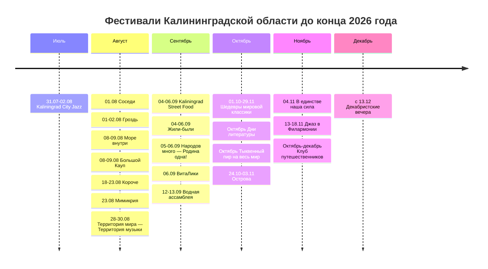

# Фестивали Калининградской области до конца 2026 года

## Executive summary

По состоянию на **21 июля 2026 года** в Калининградской области уже **официально анонсированы** как минимум крупные и средние фестивали конца июля, августа, сентября, конца октября и ноября: от международных музыкальных брендов вроде **Kaliningrad City Jazz**, **«Территория мира — Территория музыки»** и **«Джаз в Филармонии»** до кинофестиваля **«Короче»**, гастрономических событий **Kaliningrad Street Food** и локальных фестивалей вроде **«Соседи»** и **«Водная ассамблея»**. Отдельный осенний блок составляют музейно‑семейные и литературные события: **«Острова»**, **«Шедевры мировой классики»**, **«Дни литературы»**. citeturn19search5turn13search2turn30view0turn35view0turn26view0turn34view0turn40view0turn14search1turn42search3

Главная практическая разница между фестивалями — в уровне цифровой проработки. У флагманских событий обычно есть отдельный сайт, официальные VK/Telegram и понятные контакты; у части муниципальных фестивалей осени они пока фигурируют лишь в **официальном календаре региона** без отдельной страницы, без опубликованной стоимости и иногда без точной даты. Это особенно заметно по событиям октября–декабря: **«Дни литературы»**, **«Тыквенный пир на весь мир»**, **«Клуб путешественников»**, **«В единстве наша сила»** и **«Декабристские вечера»** имеют либо неполный пакет реквизитов, либо пока не получили полноценного 2026‑анонса на отдельной странице. citeturn11view0turn11view1turn11view2turn14search2turn44view0turn46search0turn47search3

Если смотреть именно на **верифицированность данных**, лучший уровень подтверждения сейчас у следующих событий: **Kaliningrad City Jazz** (31 июля — 2 августа), **«Соседи»** (1 августа), **«Море внутри»** (8–9 августа), **«Большой Кауп»** (8–9 августа), **«Короче»** (18–23 августа), **«Территория мира — Территория музыки»** (28–30 августа), **Городской пикник Kaliningrad Street Food** (4–6 сентября), **«Водная ассамблея»** (12–13 сентября), **«Острова»** (24 октября — 3 ноября), **«Джаз в Филармонии»** (13–18 ноября). По ним найдены официальные страницы с датами и базовой организационной информацией. citeturn20view0turn26view0turn28view0turn24view0turn22view0turn30view0turn32view0turn34view0turn40view0turn35view0

## Как читать этот отчёт

Ниже фестивали разделены на две группы. В первой — события с **отдельными официальными страницами или сайтами**, где можно проверить даты, площадки и контакты. Во второй — события, которые на 21 июля 2026 года присутствуют в **официальном календаре региона** или на сайтах официальных учреждений, но с неполным набором данных. Статусы трактованы так: **«официально анонсирован»** — есть отдельный анонс/официальная карточка с датами; **«предварительно анонсирован»** — событие есть в официальном календаре или в проектных/институциональных материалах, но часть реквизитов не раскрыта; **«не подтверждён»** — есть лишь общая проектная страница без отдельного 2026‑анонса или без актуальной программы. citeturn20view0turn26view0turn28view0turn24view0turn22view0turn30view0turn32view0turn34view0turn40view0turn35view0turn11view0turn11view1turn11view2turn14search2

Во всех случаях я отдавал приоритет официальным источникам — сайтам самих фестивалей, культурных учреждений, музеев, библиотек, туристическому порталу региона и муниципальным ресурсам. Там, где официальная страница давала не весь набор сведений, я это **прямо отметил как «не указаны» или «не найдены»**, а не заполнял пробелы догадками. citeturn24view0turn26view0turn28view0turn30view0turn34view0turn40view0turn44view0

## Сводная таблица

| Название | Даты | Город | Площадка | Сайт | Соцсети | Статус | Источники |
|---|---|---|---|---|---|---|---|
| Kaliningrad City Jazz | 31.07–02.08.2026 | Калининград | Центральный парк культуры и отдыха | `jazzfestival.ru` | VK `vk.com/jazzfestivalru`; Telegram `t.me/jazzfestivalru`; Mastodon — нет | официально анонсирован | citeturn20view0turn21view0turn21view1 |
| Праздник «Соседи» | 01.08.2026 | Краснолесье | Виштынецкий эколого‑исторический музей, ул. Школьная, 5А | `wystynez.ru` | VK `vk.com/public63127132`; Telegram — нет; Mastodon — нет | официально анонсирован | citeturn26view0 |
| Балтийский эногастрономический фестиваль «Гроздь» | 01–02.08.2026 | Светлогорск | Территория театра эстрады «Янтарь‑Холл» | не найден отдельный сайт | VK — не найдены; Telegram — не найдены; Mastodon — нет | официально анонсирован | citeturn16search17 |
| Фестиваль современного искусства «Море внутри» | 08–09.08.2026 | Светлогорск | ул. Динамо, спуск к солнечным часам, Морской бульвар | отдельный сайт не найден; официальный ресурс указан как VK `vk.com/sea_inside39` | VK `vk.com/sea_inside39`; Telegram `t.me/sea_inside39`; Mastodon — нет | официально анонсирован | citeturn28view0turn29view0turn29view1 |
| Фестиваль викингов «Большой Кауп» | 08–09.08.2026 | Зеленоградский район | Поселение викингов «Кауп», п. Романово | `kaup39.ru` | VK `vk.com/kaupfest`; Telegram — не найден; Mastodon — нет | официально анонсирован | citeturn24view0 |
| Российский фестиваль короткометражного и дебютного кино «Короче» | 18–23.08.2026 | Калининград | ЦПКиО; кинотеатры Калининграда; в календаре также указаны Драмтеатр и «Заря» | `korochekino.ru` | VK `vk.com/korochefestival`; Telegram `t.me/korochefest`; Mastodon — нет | официально анонсирован | citeturn22view0turn23view0turn23view1turn13search4 |
| Фестиваль «Мимикрия» | 23.08.2026 | Калининград | Калининградский зоопарк | не указаны | VK — не найдены; Telegram — не найдены; Mastodon — нет | официально анонсирован | citeturn11view3 |
| «Территория мира — Территория музыки» | 28–30.08.2026 | Калининград | Собор на острове Канта, ул. И. Канта, 1 | `sobor39.ru` | VK `vk.com/sobor39`; Telegram `t.me/sobor39`; Mastodon — нет | официально анонсирован | citeturn30view0turn31search0 |
| Городской пикник Kaliningrad Street Food | 04–06.09.2026 | Калининград | Королевский парк | `streetfoodfestival.ru` | VK `vk.com/streetfoodweekend`; Telegram `t.me/streetfoodrussia`; Mastodon — нет | официально анонсирован | citeturn32view0turn33view0turn33view1 |
| XI Открытый фестиваль любительских театров «Жили‑были» | 04–06.09.2026 | Советск | Центр культуры и досуга «Парус» | не найдены | VK — не найдены; Telegram — не найдены; Mastodon — нет | официально анонсирован | citeturn9view0turn18search0 |
| Фестиваль «Народов много — Родина одна!» | 05–06.09.2026 | Зеленоградский район | парк Сосновка | не найдены | VK — не найдены; Telegram — не найдены; Mastodon — нет | официально анонсирован | citeturn9view0 |
| Всероссийский фестиваль бардовской песни и поэзии «ВитаЛики» | 06.09.2026 | Зеленоградск | площадь «Роза ветров» | не найдены | VK — не найдены; Telegram — не найдены; Mastodon — нет | официально анонсирован | citeturn9view0 |
| Морской фестиваль «Водная ассамблея» | 12–13.09.2026 | Калининград | Музей Мирового океана, наб. Петра Великого, 1 | `world-ocean.ru` | VK `vk.com/mwocean`; Telegram — не найден; Mastodon — нет | официально анонсирован | citeturn34view0 |
| Фестиваль «Шедевры мировой классики в Кафедральном соборе» | 01.10–29.11.2026 | Калининград | Собор на острове Канта, ул. И. Канта, 1 | `sobor39.ru` | VK `vk.com/sobor39`; Telegram `t.me/sobor39`; Mastodon — нет | официально анонсирован | citeturn17search4turn14search1turn31search0 |
| Дни литературы в Калининградской области | октябрь 2026; точные даты не указаны | по всей области | библиотеки Калининградской области | `lib39.ru` | VK `vk.com/konb39`; Telegram `t.me/kaliningradlibrary`; Mastodon — нет | предварительно анонсирован | citeturn11view0turn44view0turn45view0turn45view1 |
| Фестиваль «Тыквенный пир на весь мир» | октябрь 2026; точные даты не указаны | Черняховский район | пос. Каменское | не найден отдельный сайт | VK — не найдены; Telegram — не найдены; Mastodon — нет | предварительно анонсирован | citeturn11view1turn47search10 |
| Музейно‑семейный фестиваль «Острова» | 24.10–03.11.2026 | Калининград | музеи‑участники Калининграда | `detivmuzee.ru` | VK `vk.com/festival_ostrova`; Telegram — не найден; Mastodon — нет | официально анонсирован | citeturn40view0turn41search13 |
| Фестиваль национальных культур РФ «В единстве наша сила» | 04.11.2026 | Гурьевск | Центр культуры и досуга | сайт площадки/организатора: `ckd-gur.ru` | VK — не найдены; Telegram — не найдены; Mastodon — нет | официально анонсирован | citeturn11view1turn47search3turn47search6 |
| Международный фестиваль «Джаз в Филармонии» | 13–18.11.2026 | Калининград | Калининградская областная филармония им. Е. Ф. Светланова, ул. Б. Хмельницкого, 61А | `filarmonia39.ru` | VK `vk.com/filarmonia39`; Telegram `t.me/filarmonia_39`; Mastodon — нет | официально анонсирован | citeturn35view0turn39view0turn39view1turn17search15 |
| Фестиваль «Клуб путешественников» | октябрь–декабрь 2026; точные даты не указаны | Светлогорск | Морской выставочный центр, ул. Ленина, 11 | `world-ocean.ru` | VK — не найдены; Telegram — не найдены; Mastodon — нет | предварительно анонсирован | citeturn11view1turn46search0turn46search12 |
| «Декабристские вечера» | декабрь 2026; в проектной странице указана традиция 13.12–13.01 | Калининград | Собор на острове Канта | `sobor39.ru` | VK `vk.com/sobor39`; Telegram `t.me/sobor39`; Mastodon — нет | предварительно анонсирован | citeturn14search2turn31search0 |

## Подтверждённые фестивали с наиболее полными данными

**Kaliningrad City Jazz.** XIX международный музыкальный фестиваль пройдёт **31 июля — 2 августа 2026 года** в **Центральном парке культуры и отдыха Калининграда**. Официальный сайт — `jazzfestival.ru`, VK — `vk.com/jazzfestivalru`, Telegram — `t.me/jazzfestivalru`, Mastodon — нет. Для справок опубликованы **+7 (4012) 95‑66‑77** и `kaliningradcityjazz@mail.ru`. Формат — международный джазовый open air; на сайте открыта продажа билетов и абонементов, но цена в открытом текстовом слое страницы не показана, поэтому корректнее фиксировать: **билеты в продаже, публичная стоимость не указана**. Публичная страница не называет отдельное юрлицо‑организатора, но фестиваль ведёт собственный официальный сайт и коммуникационный контур. Статус — **официально анонсирован**. citeturn20view0turn21view0turn21view1

**Праздник «Соседи».** Событие состоится **1 августа 2026 года** в **посёлке Краснолесье**, основная точка — **Виштынецкий эколого‑исторический музей, ул. Школьная, 5А**. Официальный сайт — `wystynez.ru`, VK — `vk.com/public63127132`, Telegram — нет, Mastodon — нет. Организаторы перечислены очень подробно: **КРОУ «Виштынецкий эколого‑исторический музей»** совместно с **Краснолесенским домом культуры**, проектом **«Вкусы Виштынецкой возвышенности»**, **Краснолесенской сельской библиотекой** при партнёрской поддержке администрации Нестеровского округа. Для справок указаны **+7‑906‑212‑68‑23** и `wystynez@bk.ru`. Формат — локальный фестиваль гостеприимства с ремесленными мастерскими, ярмаркой, лекциями, прогулками и концертной программой. Вход — **бесплатный**. Статус — **официально анонсирован**. citeturn26view0

**Фестиваль современного искусства «Море внутри».** Фестиваль пройдёт **8–9 августа 2026 года** в **Светлогорске** на площадке **ул. Динамо, спуск к солнечным часам, Морской бульвар**. Отдельного сайта не найдено: в карточке события как официальный ресурс указан **VK** — `vk.com/sea_inside39`; Telegram — `t.me/sea_inside39`; Mastodon — нет. Формат — multi‑arts open air: инсталляции, скульптура, фото, кино, музыка, поэзия, театр, лекции и детские/семейные активности. На официальной странице указано, что фестиваль проходит **при поддержке администрации Светлогорского городского округа**, но конкретный оператор/юрлицо‑организатор и отдельные контакты для справок в доступном анонсе **не указаны**. Вход — **бесплатный**. Статус — **официально анонсирован**. citeturn28view0turn29view0turn29view1

**Фестиваль викингов «Большой Кауп».** Даты — **8–9 августа 2026 года**; площадка — **поселение викингов «Кауп», Зеленоградский район, пос. Романово**. Официальный сайт — `kaup39.ru`, VK — `vk.com/kaupfest`, Telegram — не найден, Mastodon — нет. Контакты опубликованы: **+7 (4012) 37‑99‑26**, **+7 (906) 237‑99‑26**, `kaup.viking@yandex.ru`. Формат — историческая реконструкция и семейный фестиваль раннего Средневековья: битвы, ремесленные мастерские, игры, конное шоу, драккар, концерт, огненное шоу, интерактивные зоны. В открытом тексте карточки **не раскрыта цена входного билета**, но есть кнопка покупки; отдельно указана стоимость трансфера **600 ₽ туда‑обратно**. Статус — **официально анонсирован**. citeturn24view0

**Фестиваль «Короче».** Официальный сайт фестиваля короткометражного и дебютного кино сообщает даты **18–23 августа 2026 года**, город — **Калининград**; на туристическом портале в качестве площадок названы **Центральный парк культуры и отдыха, Калининградский областной драматический театр и кинотеатр «Заря»**. Официальный сайт — `korochekino.ru`, VK — `vk.com/korochefestival`, Telegram — `t.me/korochefest`, Mastodon — нет. Опубликованы контакты: `participants@korochekino.com`, `debut@korochekino.com`, `press@dkultury.ru`, `info@korochekino.com`, телефон **+7 (926) 078‑31‑51**. Формат — конкурсный смотр короткометражного и дебютного кино; в 2026 году фестиваль позиционируется как **международный**. На 21 июля 2026 года единая цена входа в доступных официальных материалах **не указана**. Статус — **официально анонсирован**. citeturn22view0turn23view0turn23view1turn15search13turn13search4

**«Территория мира — Территория музыки».** Крупнейший open air академической музыки в регионе назначен на **28, 29 и 30 августа 2026 года**; площадка — **Собор на острове Канта, ул. И. Канта, 1, Калининград**. Официальный сайт — `sobor39.ru`, VK — `vk.com/sobor39`, Telegram — `t.me/sobor39`, Mastodon — нет. Контакты: **+7 (4012) 63‑17‑05**, `info@sobor39.ru`. Формат — большой фестиваль классической музыки под открытым небом; опубликована программа по дням. Из цен официально доступны **от 2500 ₽ за концерт**, а также абонементы, часть которых стоит **6000 ₽** за три дня. В официальном тексте указано, что фестиваль проходит **при поддержке Министерства культуры РФ и Правительства Калининградской области**, а информация дана пресс‑службой **Острова Канта**. Статус — **официально анонсирован**. citeturn30view0turn31search0

**Городской пикник Kaliningrad Street Food.** На официальном сайте указаны даты **4–6 сентября 2026 года**, площадка — **Королевский парк, Калининград**. Сайт — `streetfoodfestival.ru`, VK — `vk.com/streetfoodweekend`, Telegram — `t.me/streetfoodrussia`, Mastodon — нет. Контакты: **+7 (4012) 505‑188**, `info@streetfoodfestival.ru`, адрес команды **Калининград, Рокоссовского 16/18**. Формат — крупнейшая в России выставка‑фестиваль уличной еды: фуд‑проекты, ремесленная ярмарка, концерты, мастер‑классы, премия Russian Street Food Awards. Организатором прямо выступает **«Уличная еда России / Street Food Russia»**. В открытом текстовом слое сайта цена входа **не указана**, поэтому её корректно отмечать как **не опубликована на публичной странице**. Статус — **официально анонсирован**. citeturn32view0turn33view0turn33view1

**Морской фестиваль «Водная ассамблея».** Пройдёт **12–13 сентября 2026 года** в **Музее Мирового океана**, адрес — **наб. Петра Великого, 1, Калининград**. Официальный сайт — `world-ocean.ru`, VK — `vk.com/mwocean`, Telegram — не найден, Mastodon — нет. Опубликованы контакты: **+7 (4012) 53‑17‑44**, **+7 (4012) 34‑02‑44**, `museum@world-ocean.ru`. Организатор назван прямо: **Музей Мирового океана**. Формат — морской городской фестиваль с регатой «Миля Витязя», парадом исторических судов, театром на воде, флайборд‑шоу, концертами, квестами, гастрозоной и ярмаркой. Вход — **бесплатный**. Статус — **официально анонсирован**. citeturn34view0

**Музейно‑семейный фестиваль «Острова».** Даты — **24 октября — 3 ноября 2026 года**, город — **Калининград**, режим — по расписанию музеев‑участников. Официальный сайт — `detivmuzee.ru`, VK — `vk.com/festival_ostrova`, Telegram — не найден, Mastodon — нет. На официальной карточке указан телефон **+7 (4012) 33‑50‑90**. Формат — семейный festival pass по музеям Калининграда с квестами, заданиями, мастер‑классами и программами музеев‑участников; в поисковом фрагменте официального сайта говорится о **10 музеях**. Организатор как единое юрлицо на карточке не назван; корректнее описывать его как **проект музеев‑участников города**. Публичная карточка не показывает единую цену участия; указано лишь, что детали и покупка — на сайте фестиваля. Статус — **официально анонсирован**. citeturn40view0turn41search0turn41search13

**«Шедевры мировой классики в Кафедральном соборе».** По официальной афише туристического портала фестиваль заявлен на **1 октября — 29 ноября 2026 года** в **Соборе на острове Канта**; проектная страница собора подтверждает, что это старейший фестиваль площадки и публикует начало программы в октябре. Рабочий официальный сайт — `sobor39.ru`, VK — `vk.com/sobor39`, Telegram — `t.me/sobor39`, Mastodon — нет. Для справок у организующей институции доступны контакты собора: **+7 (4012) 63‑17‑05**, `info@sobor39.ru`. Формат — академический фестиваль с концертами и специальными программами. Единая цена фестиваля в доступных материалах **не указана**; продажа ведётся по отдельным концертам. Статус — **официально анонсирован**. citeturn17search4turn14search1turn31search0

**Международный фестиваль «Джаз в Филармонии».** Пройдёт **13–18 ноября 2026 года** в **Калининградской областной филармонии им. Е. Ф. Светланова**, адрес — **ул. Б. Хмельницкого, 61А**. Официальный сайт — `filarmonia39.ru`, VK — `vk.com/filarmonia39`, Telegram — `t.me/filarmonia_39`, Mastodon — нет. Контакты: **+7 (4012) 64‑78‑90**, `info@filarmonia39.ru`. Формат — международный джазовый фестиваль с акцентом на crossover и «перекрёсток жанров» между академической и джазовой сценой. Организатор прямо назван: **Калининградская областная филармония**, при поддержке регионального министерства культуры и туризма. На туристической афише опубликован ориентир цены **от 500 ₽**. Статус — **официально анонсирован**. citeturn35view0turn39view0turn39view1turn17search15

## Фестивали, которые есть в официальных календарях, но пока с неполными реквизитами

По официальному региональному календарю в сентябре также заявлены **XI Открытый фестиваль любительских театров «Жили‑были»** в Советске (**4–6 сентября**, ЦКД «Парус»), фестиваль **«Народов много — Родина одна!»** в парке Сосновка (**5–6 сентября**) и бардовский фестиваль **«ВитаЛики»** в Зеленоградске (**6 сентября**, площадь «Роза ветров»). Для этих трёх событий на 21 июля 2026 года в доступных официальных материалах не нашлось отдельной страницы с контактами, сайтами, соцсетями и стоимостью; поэтому корректнее считать их **официально присутствующими в региональной афише**, но с ограниченной детализацией. citeturn9view0turn18search0

На октябрь в том же официальном календаре внесены **«Дни литературы в Калининградской области»**, **«Тыквенный пир на весь мир»** и **фестиваль «Клуб путешественников»**. Для **«Дней литературы»** подтверждён сам проект и официальный оператор в лице **Калининградской областной научной библиотеки**; у проекта есть официальный сайт `lib39.ru`, VK `vk.com/konb39` и Telegram `t.me/kaliningradlibrary`, но **точные даты октябрьского цикла 2026 года** в найденных официальных материалах пока не опубликованы, поэтому статус лучше обозначить как **предварительно анонсирован**. Для **«Тыквенного пира на весь мир»** официальный календарь даёт только месяц и площадку (**пос. Каменское, Черняховский район**), а документы муниципального уровня подтверждают, что фестиваль заложен в планы и проектные решения 2026 года, но без точного дня и публичной программы. Для **«Клуба путешественников»** официальный календарь называет интервал **октябрь–декабрь** и площадку **Морской выставочный центр в Светлогорске**, тогда как на сайте Музея Мирового океана сейчас лучше всего видны месячные выпуски лектория; это тоже тянет на статус **предварительно анонсирован**, а не на полностью раскрытый сезонный анонс. citeturn11view0turn11view1turn11view2turn44view0turn45view0turn45view1turn47search10turn46search0turn46search12

На начало ноября официальный региональный календарь фиксирует **Фестиваль национальных культур РФ «В единстве наша сила»** — **4 ноября 2026 года** в **Центре культуры и досуга Гурьевска**. Отдельного свежего 2026‑анонса на сайте площадки в цитируемом массиве не найдено, но сам календарь подтверждает событие, а сайт ЦКД показывает, что фестиваль регулярно проводится этой институцией. Поэтому статус здесь разумно ставить **«официально анонсирован»**, но с оговоркой, что сайт, контакты и соцсети именно фестиваля, а не площадки, **не найдены**. citeturn47search3turn47search6

Отдельно стоит **«Декабристские вечера»**. У проекта есть официальная страница на сайте собора, где сказано, что фестиваль **традиционно проходит с 13 декабря по 13 января**; при этом отдельной 2026‑программы или свежего полного анонса на момент проверки я не нашёл. Поэтому в практическом смысле это событие лучше считать **предварительно анонсированным**: сам проект не вызывает сомнений, но программа и билетная сетка декабря 2026 года ещё не опубликованы в виде отдельной полной афиши. citeturn14search2turn31search1

## Временная линия до конца года

Ниже — компактная временная раскладка основных и наиболее верифицированных фестивалей, найденных в официальных источниках. Даты и интервалы основаны на карточках событий и официальном календаре региона. citeturn20view0turn26view0turn28view0turn24view0turn22view0turn30view0turn32view0turn34view0turn40view0turn35view0turn17search4turn42search3turn14search2

## Выводы

Если вам нужен максимально надёжный список для поездки или личного календаря, то на конец июля 2026 года я бы выделил два «яруса» событий. Первый — **полностью подтверждённые и хорошо документированные**: **Kaliningrad City Jazz**, **«Соседи»**, **«Море внутри»**, **«Большой Кауп»**, **«Короче»**, **«Территория мира — Территория музыки»**, **Kaliningrad Street Food**, **«Водная ассамблея»**, **«Острова»**, **«Шедевры мировой классики»**, **«Джаз в Филармонии»**. По ним уже есть официальные карточки с датами и хотя бы базовой организационной рамкой. Второй — **осенние и предзимние фестивали из официального календаря**, по которым событие уже видно, но ещё не опубликован полный «паспорт фестиваля»: **«Дни литературы»**, **«Тыквенный пир на весь мир»**, **«Клуб путешественников»**, **«В единстве наша сила»**, **«Декабристские вечера»**. citeturn20view0turn26view0turn28view0turn24view0turn22view0turn30view0turn32view0turn34view0turn40view0turn17search4turn35view0turn42search3turn47search10turn46search0turn47search3turn14search2

Аналитически это выглядит так: **календарный пик фестивальной активности приходится на конец июля — середину сентября**, причём ядро событий сосредоточено в **Калининграде, Светлогорске, Зеленоградске, Краснолесье и прибрежных/туристических локациях**. Осень смещает акцент с open air и гастрономии в сторону **музейных, литературных и академических музыкальных форматов**. Для пользователя это означает простую вещь: если планировать поездку на «атмосферные» фестивали, лучшее окно — **август и первая половина сентября**; если интереснее музеи, семейные программы и академическая музыка — **конец октября и ноябрь** выглядят сильнее. citeturn20view0turn26view0turn28view0turn24view0turn22view0turn30view0turn32view0turn34view0turn40view0turn35view0turn11view0turn11view1turn17search4

Самые заметные пробелы в данных на 21 июля 2026 года — это **точные октябрьские даты**, **единые цены на часть событий** и **отдельные официальные соцсети/контакты у муниципальных фестивалей**. Я специально оставил эти поля как **«не указаны»** или **«не найдены»**, потому что в проверенных официальных источниках они пока не раскрыты. citeturn11view0turn11view1turn11view2turn44view0turn46search0turn47search3turn14search2
