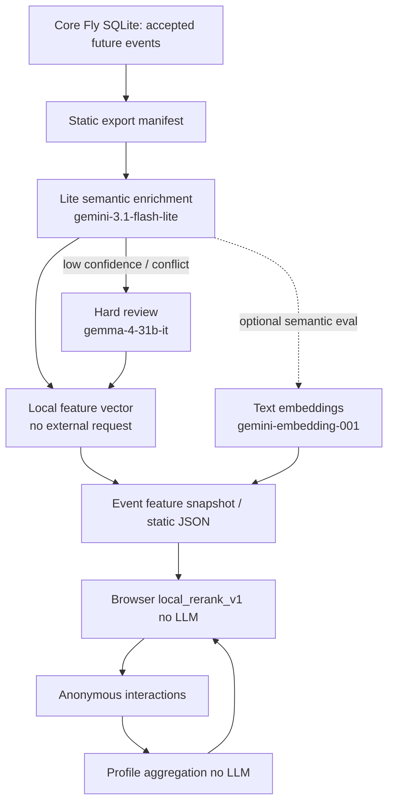

# Personalization Model Selection

Date: 2026-06-25

Source analysis: `docs/features/unsigned-personalization/alanytics.md`.

Goal: pick the smallest stable model/tooling set for static-site personalization:
offline event enrichment, embeddings/similarity, eval/review, and no LLM in the
online page-view/feed hot path.

2026-06-29 addendum: authorized one-line search (`/poisk/`) is an explicit
logged-in user action, not the passive page-view/feed hot path. It uses pgvector
retrieval plus an LLM verifier over a bounded candidate window. For that
interactive verifier, Gemma 4 26B is primary and `gemini-3.1-flash-lite` is only
a protected fallback/rescue lane; see `authorized-event-search.md`.

## Executive decision

Use a **non-LLM online recommender**:

1. Browser/server feed request uses static manifest + local/profile signals +
   deterministic scoring/reranking.
2. LLMs run only offline/batch for event-feature enrichment and quality eval.
3. Local feature vectors are MVP; external semantic embeddings are optional offline eval/upgrade; vector search is optional after eval, not MVP.

Selected minimal set:

| Job | Selected model/tool | Why this, not heavier | Runtime status |
| --- | --- | --- | --- |
| Online ranking | Deterministic formula `local_related_rerank_v1` for MVP-0 `event_detail_related`; later broader `local_rerank_v1`/CatBoost only after logs | Cheapest, explainable, no provider latency/quota risk; matches source analytics MVP recommendation | Reference JS + Playwright contract exist; no provider call |
| Event semantic enrichment | `gemini-3.1-flash-lite` as primary; `gemma-4-31b-it` only as quality fallback/review for ambiguous rows | Source analytics asked for younger/simple models; Lite is the cheapest stable managed candidate with a limiter row; 31B is reserved for hard cases | Live provider + Supabase limiter smoke passed |
| Authorized search verifier | `gemma-4-26b-a4b-it` primary; `gemini-3.1-flash-lite` protected fallback only | Search must conserve Lite’s `500 RPD` pool for critical processes, while Gemma 4 26B has `1500 RPD`; high-match search can fail closed if all attempts fail | Implemented in Edge Function as `fast_onboarding_fallback` / `gemma_priority_late_fallback` |
| Event vectors / similarity baseline | Local deterministic feature vectors first; `gemini-embedding-001` only as optional semantic embedding eval/upgrade | Normalized tags/categories/audience/price/time/venue from enrichment can be vectorized locally; external embeddings cost extra requests and are not required for MVP | Local vector needs no provider; Google embedding live-smoked if we later enable it |
| Local/open embedding option | `EmbeddingGemma` is accepted as future offline/local candidate, not selected for immediate MVP | It fits the source analytics idea (small 308M multilingual embedding model), but current repo env lacks HF token and local `torch`/`sentence-transformers`; Google API does not expose it as a simple managed model here | Not available in current local access path |
| Eval/reviewer / prompt audit | `gemini-3.1-flash-lite` first; `gemma-4-31b-it` for hard Google-side review; no OpenAI in MVP | Keeps the MVP on available/free-tier Google models with AI Studio limits; avoids assuming GPT-5.x complimentary-token eligibility | Google live + limiter smoke passed; OpenAI GPT-5.x removed from selected MVP set |
| Legacy/public writer fallback | Existing project `gpt-4o` / `gpt-4o-mini` remains for existing Smart Update/OCR paths, not personalization hot path | Already guarded by daily token cap; do not add it to online personalization | Live smoke passed; existing budget guard documented |

## Processing chain and data contract

No model is called from the page-view hot path. The model chain is offline/batch:



| Stage | Data in | Model/tool | Data out | Limit source for planned model |
| --- | --- | --- | --- | --- |
| Static export | `event_id`, title, date/time, venue, city, price/free, age, short digest, source URL | No LLM | compact manifest rows | none |
| Semantic enrichment | public event fields + source/search digest only; no visitor profile | `gemini-3.1-flash-lite` | controlled tags, audience hints, mood/format, `audience_exclusion_tags`, confidence, warnings, `embedding_text` | **Supabase limiter:** `13 RPM / 240000 TPM / 450 RPD` |
| Hard review | only rows with low confidence/conflicts + Lite output | `gemma-4-31b-it` with `thinking_level=MINIMAL`, `include_thoughts=false` | corrected enrichment + warnings; no canonical fact overwrite without guardrails | **Supabase limiter:** `15 RPM / unlimited TPM / 1500 RPD` |
| Local vectorization | normalized enrichment features: tags/category/audience/mood/price/time/venue/city | deterministic sparse/hashed vector builder | `feature_vector` + schema version | no provider limit; no external request |
| Online feed/rank | static feature snapshot + local anonymous profile/action weights + viewport/layout | `local_rerank_v1` deterministic JS/SQL scoring | ranked list; mobile feed and desktop grid/list can use different layout triggers | none |
| Optional semantic embedding eval | `embedding_text` from enrichment | `gemini-embedding-001` | semantic embedding + model version | AI Studio provider limit: `100 RPM / 30000 TPM / 1000 RPD`; create limiter before bulk |
| Eval/reviewer | synthetic personas + top-k outputs + telemetry aggregates, not raw identity | `gemini-3.1-flash-lite`; `gemma-4-31b-it` for hard samples | pass/fail reasons, prompt/schema defects, top-k quality report | same limiter rows as above |

Responsive requirement: “feed” is the **mobile** discovery pattern. Desktop should use a native, expected desktop layout (grid/list/modules) with the same profile signals but different presentation/rerank triggers such as density, visible date groups, hover/detail open, and broader category exploration.

## Source analytics proposals: status

| Proposal from `alanytics.md` | Decision | Evidence / reason |
| --- | --- | --- |
| Do not send latest views + hundreds of events to Gemma 31B on every request | Accepted | Online hot path is explicitly no-LLM; static/local rerank stays usable without providers. |
| Store event features: tags, category, venue, price/time, embedding | Accepted for design | DB/design docs contain `event_feature_snapshot`; canonical event facts remain in Fly SQLite. |
| Store behavior with action type, dwell, source, position, device | Accepted | Personalization telemetry design records layout/device/context and weighted actions after consent. |
| Maintain session/short/mid/long interest profiles with time decay | Accepted, staged | MVP starts with local short/session profile; Supabase profile snapshots can add mid/long horizons later. |
| Keep negative interests separately | Accepted | Reference ranker handles hidden events and `negative_interest_tags` separately from positive affinity. |
| MVP: embedding/vector representation + weighted user profile + vector/search/scoring formula | Accepted with a narrower first step | Use local feature vectors + deterministic scoring first; external semantic embeddings are evaluated offline before adding pgvector/vector DB. |
| Candidate generation / scoring / reranking pipeline | Accepted conceptually | MVP collapses this into filter + score + diversity/freshness/exploration; full ANN retrieval is later. |
| CatBoost/LightGBM/XGBoost ranker after logs | Deferred | No training data yet; packages are not in current requirements/base env. Add after telemetry volume exists. |
| Two-tower retrieval | Deferred | Too early without interaction data; use as maturity target, not MVP. |
| FAISS/ScaNN/Milvus/Qdrant/OpenSearch vector search | Deferred | Current catalog is small enough for manifest/local scoring; personalization Supabase has no `pgvector` enabled. |
| PostgreSQL/ClickHouse for logs/events | Partially accepted | Core events stay in Fly SQLite; personalization telemetry/profile goes to separate Supabase/Postgres. ClickHouse not needed at MVP scale. |
| EmbeddingGemma / similar small embedding model | Accepted as future local/offline candidate, not immediate selected model | Official docs: 308M multilingual, 768/512/256/128 dims, local/offline capable; current env lacks HF token and local ML stack. |
| Gemma E2B/E4B/12B for extraction | Not selected now | These are open-weight Gemma family options from the source analytics, not the only “small model” family. Current Google AI API model list for our key exposes many Gemini models plus Gemma 4 `26b-a4b-it` and `31b-it`, but not managed E2B/E4B/12B IDs; HF/local route lacks token/tooling. For simple managed models, use Gemini Flash-Lite instead. |
| Gemma 31B only for complex understanding/offline | Accepted | `gemma-4-31b-it` is available, but reserved for fallback/review, not primary bulk enrichment. |
| LLM-updated human-readable profile from compact JSON | Deferred/limited | Can be used for eval/debug/explanations, but profile authority remains numeric vectors + affinity maps. |

## Analytics recommendations: implementation staging

The source analytics document is **not rejected**. It describes the target
recommendation architecture. The MVP decision narrows the launch order so we do
not install heavy infrastructure before the site has catalog snapshots,
interaction logs, and labels.

| Analytics recommendation | Applies? | Implementation stage | How it is installed/implemented here | Why not more/less now |
| --- | --- | --- | --- | --- |
| Event tags/category/entities/price/time/venue features | Yes | MVP | Taxonomy/schema first, then offline enrichment over future accepted events using `gemini-3.1-flash-lite`; persist into `event_feature_snapshot` / static manifest | Needed before any recommender can work; LLM tags are not trusted until normalized/quarantined |
| Event vectors / embeddings | Yes | MVP/eval | MVP builds local vectors from normalized tags/features; early offline eval compares this baseline with `gemini-embedding-001` and local/Kaggle embedding candidates before final weights | Directly matches analytics without forcing an online provider request |
| Weighted action signals: valid impression, detail, dwell, ticket click, hide | Yes | MVP | Browser local update after consent + compact session summary + served-list summary in personalization Supabase | This is the core of anonymous personalization and future ranker labels |
| Session/short/mid/long profiles with decay | Yes | MVP staged | Local session/short profile first; Supabase snapshots can aggregate mid/long horizons nightly | Long-term profile has no value until return-user data exists |
| Negative interests separate from positive | Yes | MVP | Keep `negative_interest_tags`/hidden events separate from event `audience_exclusion_tags`; scoring penalizes them and hard-filters explicit hides | Prevents noisy vector subtraction |
| Candidate generation → scoring → reranking | Yes | MVP simplified | Filter eligible events → score all current static candidates → diversity/freshness/exploration rerank | Catalog is small enough initially; no ANN service required on day one |
| Vector search / ANN: FAISS, ScaNN, Milvus, Qdrant, OpenSearch | Applicable later | Scale stage | Install `pgvector` or FAISS/Qdrant only after event count/latency proves local/static scoring is insufficient | It is easy to install, but unnecessary operational surface for a small event catalog |
| `pgvector` in Supabase/Postgres | Applicable later | After embedding eval | `create extension if not exists vector;` + vector table/RPC; use only personalization DB, not core SQLite | Current Supabase does not have pgvector enabled and MVP can ship without DB ANN |
| CatBoost/LightGBM/XGBoost ranker | Applicable later | After telemetry | Install `catboost`/`lightgbm`/`scikit-learn`; train on `user_event` rows with labels such as click/save/ticket/hide | Without logs/labels it would be fake ML; use formula until data exists |
| Two-tower retrieval / TensorFlow Recommenders | Applicable later | Mature stage | Install TensorFlow/TFRS in ML/Kaggle/offline training environment; export user/item towers or embeddings | Needs many interactions and stable labels; overkill before MVP telemetry |
| EmbeddingGemma / local embedding model | Applicable later | Cost/offline optimization | Install `torch`, `transformers`/`sentence-transformers`, get HF/Kaggle access, run batch embedding offline | Not managed in current Google API list; current managed `gemini-embedding-001` has known `100 RPM / 30k TPM / 1000 RPD` |
| Gemma E2B/E4B/12B for extraction | Applicable only via local/HF/Kaggle route | Research/cost optimization | Same local/open-weight path as above; not a Google AI managed model in current project | Not impossible; just not available as simple API model here |
| Gemma 31B / large LLM for every request | No | Never for hot path | Only offline hard review via `gemma-4-31b-it` | Analytics explicitly warns this is slow/expensive/unscalable |
| LLM-updated human-readable user profile | Limited | Debug/explainability later | Feed compact profile JSON to LLM only for explanations/audits, not ranking authority | Numeric/vector/profile maps remain source of truth |
| Social/friend features | Not in anonymous MVP | Future auth/social stage | Add only if there is consented social graph or aggregated cohorts | MVP has no auth and should not imply friend-level personalization |

So “not selected now” means **not in the first production dependency set**, not
“cannot be installed” or “not applicable”. Most analytics recommendations become
the roadmap after the static pages and anonymous telemetry start producing real
data.

## Access / availability evidence

Live probes were run on 2026-06-25. Artifact:
`artifacts/codex/model-probes/live_model_probe_2026-06-25.json`.
Full Google API model list artifact:
`artifacts/codex/model-probes/google_model_list_2026-06-25.json`.
A same-day refresh of `client.models.list()` is saved at
`artifacts/codex/model-probes/google_model_list_refresh_2026-06-25.json` and
again returned `55` models. The distilled junior-model decision artifact is
`artifacts/codex/model-probes/google_junior_personalization_inventory_2026-06-25.json`.
The project-specific Google AI Studio rate-limit snapshot provided by the user
is recorded as
`artifacts/codex/model-probes/google_ai_studio_limits_user_snapshot_2026-06-25.json`.

Available through current credentials:

- Google AI API:
  - `client.models.list()` with `GOOGLE_API_KEY2` returned `55` models, including
    stable/simple text models `gemini-2.5-flash-lite`, `gemini-2.5-flash`,
    `gemini-3.1-flash-lite`, `gemini-3.5-flash`, Pro variants, image/audio/live
    models, embeddings, and Gemma 4.
  - `models/gemma-4-31b-it` via `GOOGLE_API_KEY`, `GOOGLE_API_KEY2`, `GOOGLE_API_KEY3`.
  - `models/gemma-4-26b-a4b-it` appears in model list but was not selected because prior project evidence warns about instability for long Russian structured posts; can be a later canary only.
  - Lower-cost/simple model smoke via `GOOGLE_API_KEY2` also saved to
    `artifacts/codex/model-probes/google_lower_models_smoke_2026-06-25.json`:
    - OK: `gemini-2.5-flash`, `gemini-2.5-flash-lite`,
      `gemini-3-flash-preview`, `gemini-3.1-flash-lite`,
      `gemini-3.1-flash-lite-preview`, `gemini-flash-lite-latest`,
      `gemma-4-26b-a4b-it`, `gemma-4-31b-it`.
    - Not usable today: `gemini-2.0-flash*` and `gemini-2.0-flash-lite*`
      returned `429` with effective free quota `0`; `gemini-3.5-flash` and
      `gemini-flash-latest` returned `503 high demand` in the smoke.
  - `gemini-embedding-001`, `gemini-embedding-2`.
  - Public Google docs state active RPM/TPM/RPD must be viewed in AI Studio and
    can change by project/tier; exact per-project active rate-limit data is not
    returned by `client.models.list()`.
- Supabase LLM limiter:
  - `google_ai_reserve`, `google_ai_mark_sent`, `google_ai_finalize` routes are available.
  - Full `reserve -> provider -> finalize` passed for `gemma-4-31b-it` and `gemini-3.1-flash-lite`.
  - Current quota registry rows:
    - `gemma-4-31b`: `15 RPM / 2147483647 TPM / 1500 RPD`
      (`2147483647` is the registry representation of effectively unlimited TPM).
    - `gemma-4-26b-a4b`: `15 RPM / 2147483647 TPM / 1500 RPD`.
    - `gemini-3.1-flash-lite`: `13 RPM / 240000 TPM / 450 RPD`.
    - `gemma-3-27b`: `30 RPM / 15000 TPM / 14400 RPD` kept for legacy context,
      not selected for personalization.
- OpenAI:
  - Chat Completions: `gpt-4o-mini`, `gpt-4o`.
  - Responses smoke showed `gpt-5.4-mini`, `gpt-5.4-nano`, `gpt-5.5` are callable
    with the current key, but this is **not** enough to treat them as free/selected.
  - Embeddings: `text-embedding-3-small` live-called; `text-embedding-3-large` present in model list but not live-called in the low-cost smoke.
  - Existing project guard for `gpt-4o`: `FOUR_O_GPT4O_DAILY_TOKEN_LIMIT`
    defaults to `950000` tokens/day and falls back to `gpt-4o-mini`; this guard
    does not automatically cover GPT-5 eval calls.
  - OpenAI complimentary-token eligibility is an account/data-sharing setting,
    not guaranteed by model availability. Do not use GPT-5.x for personalization
    eval unless the dashboard confirms the offer/enrollment and a separate
    project budget guard is implemented.

Not available / not ready in current repo environment:

- Hugging Face token for gated/local Gemma/EmbeddingGemma route: missing.
- Local ML stack for EmbeddingGemma/rankers: `torch`, `transformers`,
  `sentence-transformers`, `catboost`, `lightgbm`, `xgboost`, `sklearn` are not
  in the base env/requirements.
- Personalization Supabase `pgvector`: not enabled; keep vectors out of DB until
  eval chooses dimensions/provider and storage need is proven.

## Lower-cost Google model inventory checked

Coverage definition for this task: **junior/lower-cost Google models** means
managed Gemini/Gemma models that can plausibly process public event text cheaply
or create embeddings for recommendation similarity. I intentionally separate
these from Pro, Deep Research, Antigravity, Robotics, image-generation, TTS, and
Live audio models: those appear in the same `client.models.list()` output, but
do not solve text event enrichment/ranking for anonymous personalization.

Official pricing confirms free-tier input/output for the relevant Gemini/Gemma
candidates, but Google does **not** publish a stable public table of active
standard API RPM/TPM/RPD for every project. Official rate-limit docs say active
limits are RPM/TPM/RPD, are applied **per project, not per API key**, reset RPD
at midnight Pacific time, and must be viewed in AI Studio; actual capacity may
vary. The user provided the actual Google AI Studio dashboard snapshot for this
project, so the decisive limit source below is now **AI Studio project limit**;
public/forum limits remain only a secondary cross-check and are superseded when they conflict with AI Studio.

### Text generation candidates from current Google model list

| Model(s) | Lifecycle / task fit | Official price/lifecycle facts | Project limit evidence | Our limiter row | Live smoke | Decision |
| --- | --- | --- | --- | --- | --- | --- |
| `gemini-3.1-flash-lite` | Stable low-latency/cost-effective multimodal text model; ideal for high-volume simple data extraction/classification | Official model page: stable, 1,048,576 input / 65,536 output tokens, structured outputs supported. Pricing: free-tier input/output free; paid $0.25 input / $1.50 output per 1M text/image/video tokens. | **AI Studio actual:** `15 RPM / 250k TPM / 500 RPD`; peak in last 28 days: `12 RPM / 32.07k TPM / 450 RPD` | `13 RPM / 240k TPM / 450 RPD` | OK, ~1.0s in smoke | **Primary enrichment/eval model** |
| `gemini-2.5-flash-lite` | Stable cheap 2.5 Lite, but quota in this project is too small for routine batch enrichment | Official model page: most cost-efficient, fastest for high-frequency lightweight tasks; structured outputs supported. Pricing: free-tier input/output free; paid $0.10 input / $0.40 output per 1M text/image/video tokens. | **AI Studio actual:** `10 RPM / 250k TPM / 20 RPD`; peak `1 RPM / 340 TPM / 3 RPD` | none | OK, ~6.5s in smoke | Lab/canary only; **not** backup for production enrichment because `20 RPD` is too low |
| `gemini-2.5-flash` | Stable mid-size price/performance model, but not cheap enough under this project's free quota | Official model page: stable, price-performance, large-scale/low-latency tasks; structured outputs supported. Pricing: free-tier input/output free; paid $0.30 input / $2.50 output per 1M text/image/video tokens. | **AI Studio actual:** `5 RPM / 250k TPM / 20 RPD` | none | OK, ~0.9s in smoke | Not MVP: `20 RPD` and higher paid price than Lite |
| `gemini-3-flash-preview` | Preview Flash; not stable enough for production MVP | Official pricing has free-tier input/output for Standard/Priority, but preview models have more restrictive limits and deprecation risk | **AI Studio actual:** `5 RPM / 250k TPM / 20 RPD` | none | OK | Lab only, not MVP |
| `gemini-3.5-flash` | More intelligent Flash; not “junior” for this task because price and quota are worse | Pricing: free-tier input/output free; paid $1.50 input / $9.00 output per 1M tokens. | **AI Studio actual:** `5 RPM / 250k TPM / 20 RPD` | none | `503 high demand` | Do not use for MVP |
| `gemini-flash-lite-latest` | Moving alias to latest Flash-Lite | Official model naming docs: latest aliases can hot-swap with notice | alias-specific limits not stable | none | OK | Do not use in production; pin `gemini-3.1-flash-lite` |
| `gemini-flash-latest` | Moving alias to latest Flash | Same latest-alias risk | alias-specific limits not stable | none | `503 high demand` | Do not use |
| `gemini-3.1-flash-lite-preview` | Preview predecessor | Official model page says it was shut down on 2026-05-25 and migrate to stable `gemini-3.1-flash-lite` | obsolete | none | One smoke OK despite docs | Do not use; docs trump accidental availability |
| `gemini-2.0-flash`, `gemini-2.0-flash-001`, `gemini-2.0-flash-lite`, `gemini-2.0-flash-lite-001` | Previous/legacy models | Official models page lists Gemini 2.0 Flash and Flash-Lite under previous models / shut down; migrate to newer models | **AI Studio actual:** `0 RPM / 0 TPM / 0 RPD`; smoke also showed free quota `0` | none | `429` quota limit `0` | Do not use |

### Gemma and embedding candidates

| Model(s) | Lifecycle / task fit | Official facts | Project limit evidence | Our limiter row | Live smoke | Decision |
| --- | --- | --- | --- | --- | --- | --- |
| `gemma-4-26b-a4b-it` | Hosted open model, cheaper/lighter Gemma candidate | Official Gemma-on-Gemini API docs: Gemini API supports only `gemma-4-31b-it` and `gemma-4-26b-a4b-it`; Gemma 4 pricing free input/output, paid tier unavailable | **AI Studio actual:** `15 RPM / unlimited TPM / 1500 RPD` | `15 RPM / unlimited TPM / 1500 RPD` | OK, ~0.6s; can return transient `5xx/timeout` on some structured prompts | **Primary for authorized search verifier with retries/backoff; not primary for bulk enrichment writer** |
| `gemma-4-31b-it` | Hard review/fallback for ambiguous enrichment, not bulk | Same official hosted Gemma support; requires thinking config in this repo path | **AI Studio actual:** `15 RPM / unlimited TPM / 1500 RPD`; peak last 28 days `15 RPM / 41.33k TPM / 344 RPD` | `15 RPM / unlimited TPM / 1500 RPD` | OK, ~2.7s | **Fallback/review only** |
| Gemma 4 E2B/E4B/12B | Local/open weights, not managed Gemini API candidates for current key | Official Gemma docs list E2B/E4B/12B sizes, but hosted Gemini API supports only 26B A4B and 31B | no Gemini API quota because not hosted here | none | not callable via Gemini API | Future HF/Kaggle/local route only, not current MVP |
| `gemini-embedding-001` | Text embeddings for event similarity/recommendations | Official model page: stable, text input, flexible output dims 128-3072; pricing page: free-tier input free, paid $0.15/1M tokens | **AI Studio actual:** `100 RPM / 30k TPM / 1000 RPD` | none yet | OK | Optional semantic embedding candidate; add limiter before bulk |
| `gemini-embedding-2` | Multimodal embedding, overkill for text-only MVP | Official pricing: free-tier text/image/audio/video input free; text paid $0.20/1M; model maps multimodal inputs into one space | **AI Studio actual:** `100 RPM / 30k TPM / 1000 RPD` | none yet | OK | Later only if multimodal/PDF/poster similarity is needed |
| `gemini-embedding-2-preview` | Preview multimodal embedding | Preview/deprecation risk; same task shape as stable `gemini-embedding-2` | dashboard groups Embedding 2 as `100 RPM / 30k TPM / 1000 RPD`; preview not needed | none | listed, not selected | Do not use over stable `gemini-embedding-2` |

### Current model-list entries explicitly excluded from this task

These are not “missed” junior text-personalization candidates; they are wrong
surface for the requested product problem:

- `gemini-2.5-flash-preview-tts`, `gemini-2.5-pro-preview-tts`,
  `gemini-3.1-flash-tts-preview`: TTS/audio generation, not event tagging/ranking.
- `gemini-2.5-flash-native-audio-*`, `gemini-3.1-flash-live-preview`,
  `gemini-3.5-live-translate-preview`: Live/audio streaming, not static-site
  offline enrichment.
- `gemini-2.5-flash-image`, `gemini-3.1-flash-image*`, `gemini-3-pro-image*`,
  `nano-banana-pro-preview`, `imagen-4.0-*`: image generation/editing, not text personalization.
- `gemini-2.5-pro`, `gemini-3-pro-preview`, `gemini-3.1-pro-preview*`,
  `gemini-pro-latest`: senior/Pro models, intentionally out of MVP.
- `gemini-2.5-computer-use-preview-10-2025`, `deep-research-*`,
  `antigravity-preview-*`, `gemini-robotics-er-*`, `lyria-*`, `aqa`: agent,
  computer-use, research, robotics, music, or legacy answer surfaces, not the
  cheap structured event enrichment path.
- `veo-2.0-*`, `veo-3.0-*`, `veo-3.1-*`: video generation, irrelevant for
  anonymous text/feed personalization.

### Planned model limits for implementation

| Planned model | Pipeline role | RPM | TPM | RPD | Source of limit | Production rule |
| --- | --- | ---: | ---: | ---: | --- | --- |
| `gemini-3.1-flash-lite` | Primary event semantic enrichment; cheap eval/reviewer | 15 provider / 13 repo | 250000 provider / 240000 repo | 500 provider / 450 repo | AI Studio project limit + current Supabase limiter | Can run now through limiter with safety margin |
| `gemma-4-31b-it` | Hard review/fallback only | 15 | unlimited | 1500 | AI Studio project limit + current Supabase limiter (`2147483647` sentinel for TPM) | Can run now through limiter with mandatory thinking config |
| `gemini-embedding-001` | Optional semantic embedding eval/upgrade | 100 provider / no repo row yet | 30000 provider / no repo row yet | 1000 provider / no repo row yet | AI Studio project limit | Not required for MVP; **do not bulk-run until limiter row is created** |

Dashboard-proven non-MVP limits: `gemini-2.5-flash-lite` = `10 RPM / 250k TPM / 20 RPD`; `gemini-2.5-flash` = `5 RPM / 250k TPM / 20 RPD`; `gemini-3-flash-preview` = `5 RPM / 250k TPM / 20 RPD`; `gemini-3.5-flash` = `5 RPM / 250k TPM / 20 RPD`. These are too RPD-constrained for routine enrichment and should stay lab/canary-only unless paid tier changes the economics.

## Free-tier / limit findings

### Google

Official Google docs:

- rate limits are RPM/TPM/RPD, applied per project, not per API key;
- exact active limits vary by project/tier and are now taken from the provided AI Studio snapshot;
- public docs expose pricing/free-tier availability and batch enqueued-token
  limits, but not a complete public table of every active per-project RPM/TPM/RPD.

Relevant free-tier pricing facts for this MVP:

- `gemini-3.1-flash-lite`: Standard/Batch/Flex/Priority input and output are
  “Free of charge” on Free Tier; official description says it is cost-efficient
  and optimized for high-volume/simple data processing.
- `gemini-2.5-flash-lite`: Free Tier input/output are “Free of charge” and it
  is cheap per token, but this project's AI Studio limit is only
  `10 RPM / 250k TPM / 20 RPD`; it is not a production enrichment backup on the
  free tier.
- `gemini-2.5-flash`, `gemini-3-flash-preview`, and `gemini-3.5-flash` have
  actual AI Studio limits of `5 RPM / 250k TPM / 20 RPD`; `gemini-3.5-flash`
  also returned `503 high demand` in smoke. They are not MVP models.
- `gemini-embedding-001` and `gemini-embedding-2`: Free Tier embedding input is
  “Free of charge”; both live-smoked successfully.
- `Gemma 4`: official pricing page lists Free Tier input/output as “Free of
  charge” and paid tier as “Not available”; current API list exposes only Gemma 4
  `26b-a4b-it` and `31b-it` for these credentials.

Because active per-project RPM/TPM/RPD are not returned by the model list API,
the authoritative provider quota for this project is the user-provided AI Studio
snapshot. The runnable application source remains the Supabase
`google_ai_model_limits` registry; reconcile it with AI Studio when adding
`gemini-embedding-001` or promoting any backup model.

**Multiple API keys are not quota multiplication.** Google AI Studio limits apply
per project, not per API key. `GOOGLE_API_KEY`, `GOOGLE_API_KEY2`, and
`GOOGLE_API_KEY3` must go through one shared limiter and must not be used to
work around RPM/TPM/RPD.

### OpenAI

OpenAI model availability is not the same as “free”. A live call proving
`gpt-5.4-*` or `gpt-5.5` responds only proves the key can call it; it does not
prove that usage is covered by the complimentary-token program.

Official OpenAI docs say complimentary tokens require eligibility + opting in to
share traffic; if the dashboard does not show the offer/enrollment, the org is
not eligible. Fine-tuned models, fine-tuning training, evals, and tool use are
not included. Therefore GPT-5.x is **not** selected for personalization MVP.

## Gemma 4 runtime constraint

Live check found a concrete runtime constraint: for `models/gemma-4-31b-it`, a
simple call without thinking config can return only `thought=true` parts / empty
normal text. Production/staged structured calls must include:

```json
{
  "thinking_config": {
    "include_thoughts": false,
    "thinking_level": "MINIMAL"
  }
}
```

Do **not** set `thinking_budget=0`: the provider rejected it with
`400 INVALID_ARGUMENT`.

## Model eval gates before production choice

Before committing embeddings/ranker beyond MVP:

1. Build a 200-500 event eval set from production future/recent events.
2. Use 8-12 personas from the source analytics: jazz, theatre, kids-negative,
   tourist, free-events, weekend, exhibitions, nightlife, desktop grid vs mobile
   feed.
3. Compare:
   - local controlled feature-vector baseline from normalized taxonomy features;
   - Google `gemini-embedding-001` as managed text-embedding comparison;
   - local/Kaggle open embedding candidates such as EmbeddingGemma-style models,
     multilingual MiniLM-style models, or BGE-style models only after the local
     ML/Kaggle route is approved;
   - Google `gemini-embedding-2` only if multimodal/PDF/image similarity becomes a requirement;
   - OpenAI embeddings only in a separately approved paid/complimentary-token track.
4. Metrics: persona top-k pass rate, must-not-show violations, diversity,
   latency, storage size, provider cost, JSON/schema validity for enrichment, and
   tag-drift / unmapped-tag rate.
5. Acceptance evidence must include deterministic assertions and human/golden
   personas. LLM review is optional reviewer evidence, not the final oracle.
6. Only if deterministic + embeddings are insufficient, add ranker training after
   enough served-list labels exist.

## Final recommendation for MVP

- **Online:** no LLM; deterministic score/rerank with consent-aware local profile.
- **Offline enrichment primary:** `gemini-3.1-flash-lite`.
- **Offline enrichment fallback/review:** `gemma-4-31b-it` with required thinking config.
- **Event vectors:** MVP uses local feature vectors from controlled taxonomy fields, with no external embedding request in the online path.
- **Semantic embedding eval:** run early offline comparison on the small future-event catalog. Compare Google `gemini-embedding-001` and approved local/Kaggle embedding candidates against the local-vector baseline; provider limit for `gemini-embedding-001` is `100 RPM / 30000 TPM / 1000 RPD`. Add a Supabase limiter row before any bulk embedding run.
- **Eval/reviewer:** Google-first only for MVP: `gemini-3.1-flash-lite` for cheap
  eval, `gemma-4-31b-it` for hard review. OpenAI is out of the MVP model set
  unless separately approved with budget/complimentary-token evidence.
- **Do not select now:** `gemini-2.5-flash-lite` / `gemini-2.5-flash` /
  `gemini-3-flash-preview` / `gemini-3.5-flash` for routine enrichment because
  this project's AI Studio RPD is only `20`; Gemma E2B/E4B/12B, EmbeddingGemma
  local, CatBoost/LightGBM, two-tower, pgvector/ANN — all are valid later
  stages, not current stable MVP.

## External references used

- Google EmbeddingGemma overview: <https://ai.google.dev/gemma/docs/embeddinggemma>
- Google Gemma 4 model card: <https://ai.google.dev/gemma/docs/core/model_card_4>
- Google Gemma thinking mode: <https://ai.google.dev/gemma/docs/capabilities/thinking>
- Google Gemini API rate limits: <https://ai.google.dev/gemini-api/docs/rate-limits>
- Google Gemini API pricing: <https://ai.google.dev/gemini-api/docs/pricing>
- Google Gemini 3.1 Flash-Lite model page: <https://ai.google.dev/gemini-api/docs/models/gemini-3.1-flash-lite>
- Google Gemini 2.5 Flash-Lite model page: <https://ai.google.dev/gemini-api/docs/models/gemini-2.5-flash-lite>
- Google Gemini 2.5 Flash model page: <https://ai.google.dev/gemini-api/docs/models/gemini-2.5-flash>
- Google Gemini Embedding 001 model page: <https://ai.google.dev/gemini-api/docs/models/gemini-embedding-001>
- Google Gemini API model lifecycle/types: <https://ai.google.dev/gemini-api/docs/models>
- Google Gemma on Gemini API supported models: <https://ai.google.dev/gemma/docs/core/gemma_on_gemini_api>
- Google AI Developers Forum, `gemini-3.1-flash-lite` dashboard quota example: <https://discuss.ai.google.dev/t/gemini-api-generatecontent-returns-403-while-models-counttokens-and-quotas-work/171688>
- Google AI Developers Forum, `gemini-2.5-flash-lite` free-tier quota citation: <https://discuss.ai.google.dev/t/clarification-on-gemini-api-free-tier-vs-paid-tier-after-billing-activation/96995>
- Google AI Developers Forum, `gemini-embedding-001` free-tier quota answer: <https://discuss.ai.google.dev/t/gemini-embedding-free-tier-documentation/112553>
- Qiita community quota table used only as secondary cross-check: <https://qiita.com/sea_news_yass/items/71f372f4147e7bb1cf05>
- OpenAI complimentary token program: <https://help.openai.com/en/articles/10306912-sharing-feedback-evals-and-api-data-with-openai>
