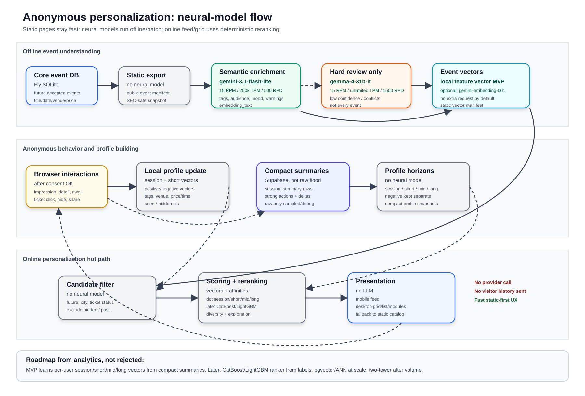
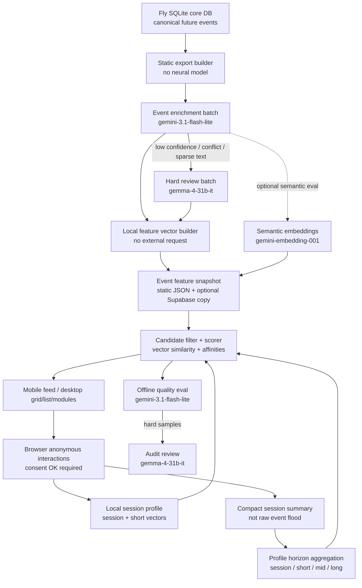

# Neural personalization flow for static event pages

Date: 2026-06-25  
Status: design target + MVP implementation order  
Scope: anonymous personalization for `kenigevents.ru`, events only, no auth.

This is the readable result document for the personalization/neural-network flow.
It answers: **which data is processed at which stage, which model/tool processes
it, what is stored, and why the first implementation uses this subset of the
analytics roadmap.**

Related docs:

- source analytics: `docs/features/unsigned-personalization/alanytics.md`;
- model/limit evidence: `docs/features/unsigned-personalization/model-selection.md`;
- product/system design: `docs/features/unsigned-personalization/README.md`;
- DB/RLS draft: `docs/features/unsigned-personalization/database.md`.

## 1. Main decision

Do **not** call an LLM on every visitor/feed request.

Also do **not** put personalization work inside the critical canonical event
import transaction. Event import/Smart Update keeps producing canonical facts in
Fly SQLite. Personalization enrichment/vectorization is a post-import/static
build side job over already accepted future events, so a model outage cannot
block importing or publishing an event.

Use neural models only in offline/batch or evaluation stages:

1. `gemini-3.1-flash-lite` enriches public event content into structured
   recommendation features.
2. A local feature-vector builder turns normalized tags/categories/price/time
   features into vectors without an external request.
3. `gemini-embedding-001` is an optional semantic embedding eval/upgrade, not a
   mandatory MVP dependency.
4. `gemma-4-31b-it` is a hard-review fallback for ambiguous enrichment rows, not
   the primary model.
5. Online personalization uses event vectors + anonymous interest horizons:
   session, short, mid, long, plus negative interests.
6. The first scorer is formula-based only until labels exist; then CatBoost /
   LightGBM becomes the learned ranking model over the same features.
7. CatBoost/LightGBM/two-tower/ANN are **not rejected**; they are later stages
   once compact telemetry/profile snapshots and labels exist.

This means the “intelligence” is split deliberately:

- LLM/Gemma/Gemini: understand public event text and audit quality offline.
- Visitor profile learner: continuously updates session/short/mid/long time
  horizons plus a separate negative-interest axis from compact summaries.
- Online scorer: uses those learned profile vectors against event vectors.
- First trained ranker: CatBoost/LightGBM replaces the formula only after real
  labels exist. Until then, a neural-looking ranker would be fake ML because it
  would have nothing trustworthy to train on.

Why this is the optimal first cut:

- anonymous MVP has no historical labeled data yet;
- current event catalog is small enough for static/local scoring;
- Google AI Studio project limits make `gemini-3.1-flash-lite` the only good
  routine text-enrichment model on the free tier;
- `gemini-2.5-flash-lite`, `gemini-2.5-flash`, `gemini-3-flash-preview`, and
  `gemini-3.5-flash` are all only `20 RPD` in this project, so they are lab-only
  rather than production enrichment models.

## 2. End-to-end flow


Separate image file for IDE/browser viewing:





## 3. Stage-by-stage contract

| Stage | Input data | Model/tool | Output data | Storage | Online dependency? |
| --- | --- | --- | --- | --- | --- |
| 0. Canonical event source | accepted future events, title, dates, venue, city, price, ticket URL, source facts | no neural model | source rows for static build | Fly SQLite | no |
| 1. Static export | public event fields only | no neural model | compact event manifest | static JSON/object storage | yes, but static only |
| 2. Semantic enrichment | `event_id`, title, description/search digest, venue, city, dates, price/free, age, source type | `gemini-3.1-flash-lite` | normalized category/tags, audience hints, mood/format, negative tags, confidence, warnings, `embedding_text` | `event_feature_snapshot` + static manifest | no |
| 3. Hard review | only low-confidence/conflicting rows + Lite output | `gemma-4-31b-it` | corrected/confirmed enrichment, warnings | same feature snapshot, with model version | no |
| 4. Event vectorization | normalized tags/category/audience/mood/price/time/venue features | local deterministic vector builder; optional `gemini-embedding-001` eval | local `feature_vector`; optional semantic embedding + model version | static vector manifest first; later Supabase/pgvector if needed | no |
| 5. Browser interaction buffer | impressions, detail views, dwell checkpoints, ticket clicks, hide/not interested, share/copy | no neural model | local ring buffer, immediate session deltas | localStorage/sessionStorage | yes, local only |
| 6. Compact session summary upload | bounded action counts, top tag deltas, strong actions, hidden ids, layout/device context | no neural model | one compact `session_summary`, not every raw event | Supabase append-only summary table | yes, after consent |
| 7. Profile horizon update | compact session summary + event feature vectors | no neural model; weighted update + decay | session, short, mid, long vectors/maps plus separate negative axis | localStorage + private Supabase snapshots | yes for local, nightly/server for Supabase |
| 8. Candidate generation | future eligible events + profile horizons | no neural model in MVP | candidate set | runtime memory/static manifest | yes |
| 9. Scoring | event vector + session/short/mid/long profile vectors + negative vector/maps + affinity maps | formula `local_rerank_v1`; later CatBoost/LightGBM ranker | raw score per event with score parts | client/server runtime; optional compact debug | yes |
| 10. Reranking | scored candidates | no neural model; diversity/freshness/exploration rules | final ordered list | response/debug | yes |
| 11. Offline eval / training dataset | compact summaries, profile snapshots, top-K results, labels from strong actions | eval: `gemini-3.1-flash-lite`; ranker later: CatBoost/LightGBM; hard audit: `gemma-4-31b-it` | quality report, training rows, ranker model candidate | artifacts/model registry | no |

## 4. Planned model limits

These are **project-specific** limits from the Google AI Studio snapshot provided
by the user, plus current repo limiter state.

| Model | Role | Provider RPM | Provider TPM | Provider RPD | Repo limiter | Decision |
| --- | --- | ---: | ---: | ---: | --- | --- |
| `gemini-3.1-flash-lite` | primary event enrichment + cheap eval | 15 | 250000 | 500 | `13 RPM / 240000 TPM / 450 RPD` | use now |
| `gemma-4-31b-it` | hard review/fallback only | 15 | unlimited | 1500 | `15 RPM / unlimited TPM / 1500 RPD` | use only on hard rows |
| `gemini-embedding-001` | optional semantic embedding eval/upgrade | 100 | 30000 | 1000 | not yet created | not required for MVP; add limiter only before semantic embedding bulk |

### Why the MVP vector does not require an external embedding request

There are two different operations that are easy to confuse:

1. **Build a vector** from known features. This can be done locally: tags,
   categories, audience, price band, venue, weekday/time bucket, city, and
   negative tags become a sparse or hashed numeric vector. Similarity can then
   be computed by ordinary functions: cosine/dot product/weighted sums in JS,
   Python, SQL, or later pgvector.
2. **Infer semantic meaning from raw text**. A vector function cannot know that
   “камерный джаз”, “live music”, and “instrumental concert” are related unless
   those semantics have already been extracted by an LLM or embedding model.

For MVP, `gemini-3.1-flash-lite` already normalizes the event into controlled
features. Therefore the first event vector can be built locally with no extra
provider call. `gemini-embedding-001` remains useful as an eval/upgrade path for
more nuanced semantic similarity, but it is not mandatory for the first working
flow.

Non-MVP text models under current free-tier limits:

| Model | Provider limit | Reason not selected |
| --- | --- | --- |
| `gemini-2.5-flash-lite` | `10 RPM / 250000 TPM / 20 RPD` | cheap per token but too few daily requests for routine enrichment |
| `gemini-2.5-flash` | `5 RPM / 250000 TPM / 20 RPD` | too few daily requests and higher paid price than Lite |
| `gemini-3-flash-preview` | `5 RPM / 250000 TPM / 20 RPD` | preview + too few daily requests |
| `gemini-3.5-flash` | `5 RPM / 250000 TPM / 20 RPD` | too few daily requests, higher price, smoke had `503 high demand` |
| Gemini 2.0 Flash / Flash-Lite | `0 RPM / 0 TPM / 0 RPD` | unavailable in this project/free tier |

## 5. What exactly `gemini-3.1-flash-lite` produces

Input shape per event:

```json
{
  "event_id": 123,
  "title": "Вечер камерного джаза",
  "description_or_search_digest": "...",
  "venue": "Дом искусств",
  "city": "Калининград",
  "date_start": "2026-07-12T19:00:00+02:00",
  "price_min": 800,
  "price_max": 2500,
  "is_free": false,
  "age_rating": "12+",
  "source_type": "telegram|vk|site|parser"
}
```

Output shape:

```json
{
  "event_id": 123,
  "category": "music",
  "subcategories": ["jazz", "live_music", "instrumental"],
  "tags": ["джаз", "концерт", "вечер", "камерный формат"],
  "negative_tags": ["kids"],
  "audience": ["adults", "music_lovers"],
  "mood": ["calm", "evening", "intellectual"],
  "format": ["indoor", "seated"],
  "tourist_fit": 0.55,
  "local_fit": 0.8,
  "price_band": "mid",
  "time_bucket": "evening",
  "confidence": 0.88,
  "warnings": [],
  "embedding_text": "music jazz live_music instrumental Дом искусств evening mid Калининград ..."
}
```

Important boundary: this enrichment does **not** overwrite canonical facts such
as event date, venue, ticket URL, or title without existing Smart Update/fact
checks. It creates recommendation features.

## 6. Telemetry storage policy: compact snapshots, not raw-event flood

Supabase must **not** become an unbounded raw telemetry sink. Free tier is too
small for “every impression forever”. The default design is:

1. Browser keeps a local in-session ring buffer.
2. Browser updates the session/short profile immediately in localStorage.
3. Browser uploads a compact `session_summary` after consent, periodically or on
   session end.
4. Raw event rows are optional debug/sampling only, with short retention.
5. Backend/nightly jobs merge summaries into profile snapshots and aggregates.

Compact `session_summary` example:

```json
{
  "anon_id": "opaque-id",
  "session_id": "opaque-session",
  "started_at": "2026-06-25T10:00:00Z",
  "ended_at": "2026-06-25T10:08:00Z",
  "viewport_class": "mobile",
  "layout_mode": "feed",
  "algorithm_id": "local_rerank_v1",
  "event_counts": {
    "impression": 28,
    "detail_view": 3,
    "ticket_click": 1,
    "hide_event": 2
  },
  "positive_tag_delta": {"jazz": 0.42, "concert": 0.31},
  "negative_tag_delta": {"kids": 0.66},
  "strong_event_ids": {"ticket_click": [123], "hide": [789]},
  "seen_event_ids_sample": [123, 456, 789],
  "profile_delta_vector": [0.02, -0.01, 0.07],
  "client_summary_version": "profile-v1"
}
```

This gives enough signal to train/evaluate recommendations without storing every
scroll event. Raw impressions can be sampled or retained for a few days only when
debugging position bias.

## 7. How the anonymous profile is updated

The profile is not an LLM paragraph. It is a compact set of vectors and affinity
maps over several interest horizons.

Interest time horizons from `alanytics.md`:

| Horizon | Meaning | Update path | TTL / decay | Used in ranking |
| --- | --- | --- | --- | --- |
| `session` | what the visitor is doing right now | browser local updates on every action | minutes/hours; reset or heavily decay per session | strongest on mobile feed top-N |
| `short` | recent intent from last days | browser + compact Supabase summaries | about 1-7 days; 24-72h decay for very recent intent | strong weight for recommendations |
| `mid` | repeated patterns from recent weeks | nightly aggregate from summaries | about 8-30/45 days | balances session spikes |
| `long` | stable interests over months | slow nightly aggregate | about 180-365 days | fallback for returning visitors and desktop modules |
Negative interests are **not** a fifth time period. They are a separate axis kept
next to the positive profile so explicit `hide/not_interested` and repeated
skips do not pollute the positive vectors. MVP can keep one compact negative
vector/map, and a later version may keep negative vectors per time horizon if
the data shows this is useful.

Minimum browser/local profile:

```json
{
  "anon_id": "opaque-id",
  "session_vector": [0.01, -0.02],
  "short_vector": [0.04, 0.11],
  "mid_vector": [0.03, 0.05],
  "long_vector": [0.02, 0.04],
  "negative_vector": [-0.01, 0.08],
  "positive_tags": {"jazz": 0.7, "concert": 0.5},
  "negative_tags": {"kids": 0.8},
  "venue_affinity": {"dom_iskusstv": 0.3},
  "price_preference": {"median_clicked": 1200},
  "time_preference": {"friday_evening": 0.4},
  "seen_event_ids": [123, 456],
  "hidden_event_ids": [789]
}
```

Action weights for MVP start:

| Action | Weight |
| --- | ---: |
| impression | `0.05` |
| quick skip | `-0.3` |
| card click | `0.7` |
| detail view | `1.0` |
| long dwell | `2.0` |
| share/copy | `3.0` |
| ticket click | `5.0` |
| hide/not interested | `-8.0` |

Vector update example:

```text
session_vector = normalize(0.70 * old_session_vector + 0.30 * action_weight * event_vector)
short_vector   = normalize(0.90 * old_short_vector   + 0.10 * action_weight * event_vector)
mid_vector     = normalize(0.97 * old_mid_vector + 0.03 * weighted session summary)   # 14-45 days
long_vector    = normalize(0.995 * old_long_vector + 0.005 * weighted strong actions) # 90-365 days
negative_vector = separate update from hide/not_interested/repeated quick-skip
```

Negative interests are stored separately and used as penalties/hard filters, not
just subtracted from a single positive vector.

## 8. Online ranking formula for MVP

For each eligible candidate event:

```text
raw_score =
  0.22 * dot_session_event
+ 0.18 * dot_short_event
+ 0.14 * dot_mid_event
+ 0.12 * dot_long_event
+ 0.12 * tag_affinity_score
+ 0.08 * category_affinity_score
+ 0.05 * date/time match
+ 0.04 * city/venue match
+ 0.03 * price match
+ 0.02 * freshness/popularity baseline
- 0.35 * negative_tag_or_vector_score
- 0.25 * already_seen_penalty
- 1.00 * explicit_hide_filter
```

Then rerank:

- do not show too many events of the same subtype in a row;
- limit repeated venue dominance;
- keep 10-20% exploration;
- preserve explicit user filters;
- mobile feed can reorder top-N more aggressively;
- desktop grid/list should be more stable and explainable.

### Where the “learning model” starts

The analytics document is right that the system should eventually learn from
behavior. That does **not** mean training a private neural net for every
anonymous visitor. The practical split is:

1. **Per-visitor learning:** update session/short/mid/long profile vectors and
   affinity maps continuously from that visitor's compact summaries. This is
   personalization from day one.
2. **Global learned ranker:** after enough compact summaries and labels exist,
   train CatBoost/LightGBM on pair features such as:
   - `dot_session_event`, `dot_short_event`, `dot_mid_event`, `dot_long_event`;
   - `negative_similarity`;
   - tag/category/venue affinity;
   - price/time/city match;
   - position/layout/device context;
   - labels: click, long dwell, ticket click, hide.
3. **Two-tower retrieval:** later, if interaction volume is high enough, train
   user/item towers offline and export vectors/scores back into the same serving
   pipeline.

So the formula scorer is not the final intelligence. It is the safe bootstrap
that creates logs/labels for the first learned ranker.

## 9. How analytics recommendations map to stages

The analytics document's target architecture is preserved:

| Analytics idea | Current status | Stage in this plan | Difference from source proposal |
| --- | --- | --- | --- |
| Event normalized features: category, tags, venue, price/time, audience/entities | Accepted | MVP | `gemini-3.1-flash-lite` is selected for managed offline enrichment; canonical facts still stay in Fly SQLite. |
| Event embeddings/vectors | Accepted with cheaper MVP implementation | MVP + eval | Source proposal names embedding models/EmbeddingGemma. MVP first builds local feature vectors from normalized fields; `gemini-embedding-001` or local EmbeddingGemma are eval/upgrade paths. |
| Weighted action signals: impression, quick skip, detail, dwell, save/share, ticket click, hide | Accepted | MVP | Stored first as local ring buffer + compact session summaries, not unbounded raw-event rows. |
| Session / short / mid / long periods | Accepted | MVP staged | Time horizons are explicit. Current TTLs align to session, ~1-7d short, ~30d mid, ~180-365d long. |
| Negative interests stored separately | Accepted | MVP | Negative is not a time period; it is a separate axis used for penalties/hard filters. |
| Explicit affinity maps: tags/category/venue/price/time | Accepted | MVP | Kept alongside vectors for explainability and business control. |
| Candidate generation → scoring → reranking | Accepted, simplified for initial catalog size | MVP | MVP can score the current static candidate pool directly; ANN/vector DB candidate generation waits for scale evidence. |
| Vector search / ANN: FAISS, ScaNN, Milvus, Qdrant, OpenSearch, pgvector | Deferred, not rejected | Scale | Enable only after catalog/latency or semantic eval proves local/static scoring is insufficient. |
| CatBoost/LightGBM/XGBoost learning-to-rank | Deferred until labels exist | First ML ranker | Without compact summaries and labels, training would be fake ML. Formula scorer creates the first training data. |
| Two-tower retrieval / TensorFlow Recommenders | Deferred | Mature stage | Needs much more interaction volume and stable labels. |
| LLM for compact profile update | Limited | Debug/explainability/eval | Source says this can be done but should not be primary. Plan keeps numeric vectors/maps as authority. |
| Gemma 31B | Accepted as hard fallback only | Offline review | Never online hot path; source explicitly warns against per-request large LLM ranking. |
| Social/friend/cohort signals | Not in anonymous MVP | Future auth/cohort stage | Requires consented social/auth model or safe aggregates; not valid for no-auth MVP. |
| Metrics: Recall@K/NDCG/AUC + CTR/save/ticket/hide/return | Partially reflected | Eval stage | Product metrics exist in README; neural-flow still needs a fuller eval-metrics subsection before implementation. |

## 10. Installation / implementation order

### MVP implementation

1. Implement offline enrichment job:
   - select future accepted events from Fly SQLite/static export;
   - call `gemini-3.1-flash-lite` through limiter;
   - store feature snapshot and `embedding_text`.
3. Implement local feature-vector builder:
   - build sparse/hashed vectors from normalized tags, category, audience,
     price/time/venue/city features;
   - store vector manifest with feature schema version;
   - no external embedding request is required for MVP.
4. Optional semantic embedding eval:
   - add `gemini-embedding-001` to Supabase limiter only before bulk semantic
     embedding;
   - provider limit: `100 RPM / 30000 TPM / 1000 RPD`;
   - recommended repo row: `90 RPM / 30000 TPM / 900 RPD` for margin.
5. Implement local browser profile/ranker:
   - no neural model in request path;
   - use static manifest + session/short/mid/long profiles plus negative axis.
6. Add compact session-summary table/RLS in personalization Supabase:
   - do not upload every raw impression;
   - keep raw event debug sampling optional and short-retention only.
7. Add profile horizon aggregation:
   - local immediate session/short updates;
   - nightly Supabase short/mid/long compact snapshots.
8. Add offline eval report over personas/top-K.
9. After enough labels, train CatBoost/LightGBM ranker over the same features.

### Scale stage

- Enable `pgvector` in personalization Supabase only if static/local scoring is
  too slow or if server-side vector RPC is needed.
- Alternative ANN services: FAISS for local/offline; Qdrant/Milvus/OpenSearch if
  catalog grows enough to justify extra infra.

### ML ranker stage

- Install/train CatBoost or LightGBM after telemetry creates labeled examples.
- Labels come from click, dwell, ticket click, hide, return visits.
- The first trained model should replace only the scoring function, not the whole
  data pipeline.

### Two-tower stage

- Use TensorFlow Recommenders / equivalent only after the product has enough
  repeated anonymous or authenticated interactions to learn user/item towers.
- Training runs offline; online path still receives exported vectors/scores.

### Local/open model optimization

- EmbeddingGemma/local Gemma requires a separate environment with `torch`,
  `transformers`/`sentence-transformers`, and HF/Kaggle access.
- This is installable, but not the fastest path while local feature vectors can
  be built from normalized event features and `gemini-embedding-001` remains an
  optional managed semantic baseline.

## 11. Acceptance checklist for the design

The flow is ready to implement when:

- every static event has enrichment fields or a fallback default;
- every enriched event has normalized features and local vector schema version;
- optional semantic embedding batch has a limiter row before calling `gemini-embedding-001`;
- browser can rank from static data with Supabase unavailable;
- Supabase stores compact session summaries/profile snapshots, not unbounded raw telemetry;
- session/short/mid/long horizons and the separate negative axis are visible in profile snapshots;
- vectors are actually used in scoring: `dot_*_event` and negative similarity;
- mobile feed and desktop grid/list have separate telemetry context;
- explicit `hide/not interested` is respected;
- eval personas show no obvious must-not-show violations;
- no user history or visitor identity is sent to LLM providers in the online path.
