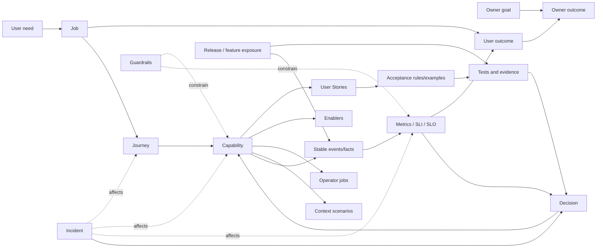

# Методология продуктовой модели и доказательной готовности

> **Статус:** принятое методологическое решение, версия `1.0`.  
> **Дата:** 7 августа 2026 года.  
> **Область:** пользовательские потребности, Jobs, outcomes, journeys, capabilities, User Stories, enablers, acceptance, release readiness, production evidence, метрики и решения владельца продукта.  
> **Исследовательская база:** [`docs/research/user-stories/`](../research/user-stories/README.md).  
> **Связанные контуры:** [аналитика и продуктовая статистика](../features/static-site-pages/analytics/README.md), [release plan](../features/static-site-pages/release-plan.md), [acceptance inventory](../features/static-site-pages/test-scenarios.md), [incident management](../operations/incident-management.md).  
> **Не является:** готовым реестром всех Jobs и stories, визуальной дизайн-системой, новым backlog или доказательством production-готовности.

## 1. Назначение

Эта методология определяет, как управлять продуктом через связь между:

```text
потребностью пользователя
→ Job и пользовательским outcome
→ сквозным journey
→ capabilities сервиса
→ User Stories и technical enablers
→ acceptance-сценариями
→ реализацией и релизом
→ production-фактами и метриками
→ результатом владельца
→ решением
```

Цель — перестать смешивать четыре разных утверждения:

1. функция задумана;
2. функция реализована;
3. функция работает на production;
4. функция действительно помогает пользователю и владельцу сервиса.

Release-checklist, User Stories, тесты, статистика и инциденты остаются разными сущностями, но связываются стабильными идентификаторами и evidence.

## 2. Основные решения

### 2.1. User Story не является центром продуктовой модели

User Story — изменяемая единица планирования небольшого вертикального среза. Она может быть разделена, объединена, переписана или отменена.

Более устойчивыми сущностями считаются:

- `user_need`;
- `job`;
- `user_outcome`;
- `journey`;
- `capability`;
- стабильные domain events и metric contracts.

Поэтому raw telemetry не должна зависеть от текущей структуры backlog и содержать изменчивые `story_id` как основной смысл события.

### 2.2. История описывает результат, а не интерфейсный или технический элемент

Карточка истории должна отвечать:

- кто и в каком контексте получает результат;
- что станет возможно завершить;
- какое препятствие исчезнет;
- где находится граница текущего среза;
- каким наблюдаемым поведением результат подтверждается.

Кнопка, страница, API, таблица, миграция или модель данных сами по себе историей не являются.

### 2.3. Не вся работа является User Story

Допустимые типы продуктовых записей:

- `user_story` — полезный вертикальный срез для конечного пользователя;
- `operator_story` или `operator_job` — реальная задача редактора, владельца или оператора;
- `technical_enabler` — техническая или организационная способность;
- `guardrail` — ограничение безопасности, качества, доступности, приватности или стоимости;
- `research` — работа по снятию продуктовой или технической неопределённости;
- `incident_repair` — устранение production-воздействия и его причины;
- `release_deliverable` — юридический, операционный или коммуникационный gate.

Запрещено придумывать ложного пользователя только для синтаксиса «Как пользователь, я хочу миграцию».

### 2.4. Пользовательские и владельческие outcomes ведутся раздельно

Для значимой capability фиксируются:

```text
user outcome
+
owner outcome
+
guardrails
```

Пример:

```text
User outcome:
человек быстро нашёл подходящее событие и получил достаточно сведений для решения.

Owner outcome:
сервис стал регулярно используемым каналом выбора событий,
а доля пустых сессий снизилась.

Guardrails:
нет обязательной авторизации для базовой афиши;
не ухудшены diversity, accessibility, performance, privacy и resource budget.
```

Интерес владельца к изменению положения продукта — `owner_outcome`, а не вымышленная User Story. Настоящая задача владельца по принятию решения может быть оформлена как `operator_job`.

### 2.5. Один статус `done` запрещён

Для истории, capability, journey и Job используются независимые оси доказательства. Выпуск кода не равен работоспособности, usage не равен task completion, а completion не равен внешнему outcome.

## 3. Сущности

| Сущность | Рабочее определение | Не следует путать с |
|---|---|---|
| `user_need` | Неудовлетворённость, ограничение или желаемое изменение положения пользователя | Запросом конкретной функции |
| `job` | Устойчивый прогресс, которого пользователь пытается добиться в определённом контексте | Экраном или одной операцией API |
| `job_story` | Краткая формулировка контекста, мотивации и желаемого прогресса | Полной моделью Job |
| `user_outcome` | Наблюдаемое улучшение положения пользователя | Выпуском функции или кликом |
| `journey` | Один возможный путь выполнения Job через состояния, каналы и точки контакта | Самим Job |
| `capability` | Устойчивая способность сервиса поддерживать часть пользовательского или операторского поведения | Конкретной реализацией |
| `user_story` | Малый вертикальный срез capability, пригодный для разговора, поставки и проверки | Доказательством потребности или ценности |
| `scenario` | Конкретный контекст проверки: устройство, auth, сеть, accessibility, состояние данных, recovery | Отдельной story по умолчанию |
| `operator_job` | Задача владельца, редактора или оператора, нужная для исполнения, контроля или восстановления сервиса | Внутренней технической задачей |
| `technical_enabler` | Способность, создающая условия для capabilities: observability, identity merge, outbox, atomic release | Самостоятельной пользовательской ценностью |
| `owner_outcome` | Изменение для владельца: миссия, удержание, охват, стоимость, риск, скорость решений | Пользовательской активностью как таковой |
| `guardrail` | Условие, которое нельзя нарушить при оптимизации | Основной целевой метрикой |
| `acceptance_rule` | Обязательное правило принятия конкретного результата | Полным набором тестов |
| `acceptance_scenario` | Конкретный пример поведения и контекста | Автоматически пройденным тестом |
| `event` | Стабильный семантический факт | Метрикой или причиной |
| `metric` | Формальное агрегирование событий, фактов, наблюдений или исследований | Сырым счётчиком |
| `SLI` | Реализованный индикатор качества сервиса | Целевым значением |
| `SLO` | Цель для SLI на заданном окне и популяции | SLA или обещанием без policy |
| `incident` | Ограниченный эпизод существенного пользовательского или операционного воздействия | Любым дефектом |
| `decision` | Решение с evidence, допущениями и уровнем причинной уверенности | Dashboard или отчётом |

## 4. Граф продуктовой модели



## 5. Источники истины и умная склейка требований

Методология запрещает выбирать целый документ только потому, что он новее.

### 5.1. Приоритет по типу утверждения

| Утверждение | Источник истины |
|---|---|
| Продуктовый intent | Последнее явное решение владельца в затронутой части |
| Каноническое требование | Актуальный feature/requirements-документ в `main` |
| Реализация | Фактический код в актуальном `origin/main` или явно обозначенная незамерженная ветка |
| Тестирование | Исполняемый тест и terminal evidence на указанной версии |
| Deployment | Exact SHA/build/release/feature exposure |
| Текущее здоровье | Свежий production probe, SLI/SLO и incident evidence |
| Фактический outcome | Валидированная метрика, исследование или эксперимент на определённой популяции |

### 5.2. Правила хронологической смысловой склейки

1. Позднее явное решение владельца заменяет раннее требование только в той части, которую оно изменяет.
2. Совместимые части старого документа сохраняются.
3. Более новый технический документ не отменяет продуктовый intent без явного решения.
4. Open PR может содержать актуальное решение, но не доказывает реализацию или production.
5. Дата изменения файла — только сигнал, а не доказательство актуальности каждого положения.
6. При неразрешимом конфликте создаётся conflict record:
   - старое положение;
   - новое положение;
   - фактическое поведение;
   - предполагаемая актуальная версия;
   - confidence;
   - требуемое решение или исправление.
7. Исходные исследования не переписываются задним числом; принятые выводы фиксируются в канонических документах.

## 6. Формирование продуктовой работы

### 6.1. Discovery: до появления story

Рабочая цепочка:

```text
свидетельства
→ user need
→ Job и context
→ желаемый user outcome
→ owner outcome и guardrails
→ journeys
→ required capabilities
```

Свидетельства могут включать:

- интервью и наблюдения;
- статистику;
- focus feedback;
- обращения и операторские наблюдения;
- usability tests;
- production incidents;
- конкурентные или нормативные ограничения.

Факты, интерпретации и гипотезы записываются раздельно.

### 6.2. Shaping: от capability к небольшому срезу

```text
capability
→ место в story map / journey
→ минимальный полезный вертикальный срез
→ user_story или честный enabler
→ acceptance rules и examples
→ measurement question
```

История должна проходить через необходимые технические слои. Деление на «таблица → API → UI → тесты» является планом реализации, а не четырьмя пользовательскими историями.

Допустимые оси вертикального разбиения:

- основной путь → альтернативы → recovery;
- базовое правило → исключения;
- основной тип данных → остальные;
- основная роль → дополнительные права;
- основной канал → следующие каналы;
- один объект → массовая операция;
- один провайдер → дополнительные;
- ручной работающий процесс → автоматизация;
- известный срез → spike для неопределённости.

### 6.3. Card–Conversation–Confirmation

Карточка — индекс разговора, не полный requirements document.

Минимальная карточка содержит:

```text
ID и заголовок результата
user_need / Job / journey / capability
получатель и context
наблюдаемый результат
ценность
границы: входит / не входит
ключевые acceptance rules и examples
связанные scenario IDs
measurement question / metric IDs
открытые вопросы
```

Повторяемые accessibility, security, privacy, reliability и design-system правила хранятся в общих стандартах и Definition of Done; в карточке остаются только специфические риски.

### 6.4. Acceptance и тесты

Иерархия:

```text
Story — какой результат становится возможен.
Acceptance rule — какое обязательное правило должно выполняться.
Concrete example — как правило проявляется на конкретных данных.
Test scenario — точная процедура, среда и ожидаемый результат.
```

Критические ошибки и recovery включаются в тот же срез, если без них основной результат создаёт false success, потерю данных, повторный side effect или непонятный исход.

## 7. Вектор доказательств

Для каждой значимой capability и связанных stories ведутся независимые состояния.

| Ось | Вопрос |
|---|---|
| `definition` | Потребность, Job, результат и границы определены? |
| `decision` | Продуктовое решение принято? |
| `design` | Пользовательский путь и состояния спроектированы? |
| `delivery` | Реализация существует? |
| `verification` | Какие acceptance-сценарии прошли и на какой версии? |
| `deployment` | Где и какой популяции capability доступна? |
| `runtime_health` | Работает ли путь сейчас? |
| `adoption` | Есть ли валидные попытки использования? |
| `task_completion` | Завершается ли Job допустимым terminal state? |
| `user_outcome` | Получает ли пользователь внешнее полезное изменение? |
| `owner_outcome` | Получает ли владелец ожидаемую ценность? |
| `observability` | Достаточно ли качественных данных? |
| `causality` | Доказано ли влияние изменения или видна только корреляция? |

Пример сломанной production capability:

```yaml
delivery: implemented
verification: candidate_pass
deployment: production
runtime_health: broken
current_incidents: [INC-...]
adoption: observed
task_completion: below_target
```

Она не возвращается в `not_implemented`, а прежнее evidence не стирается.

### 7.1. Минимальные достаточные утверждения

| Утверждение | Требуемое evidence |
|---|---|
| Реализовано | Код/config + capability version |
| Протестировано | Определённые сценарии прошли на exact version |
| Выпущено | Deployment и exposure подтверждены |
| Сейчас работает | Production SLI удовлетворяет SLO на актуальном окне |
| Используется | Есть валидные attempts целевой популяции |
| Задача завершена | Attempt достиг заранее определённого terminal state |
| User outcome достигнут | Измерено внешнее пользовательское постусловие |
| Owner value подтверждена | Owner metric изменилась без нарушения guardrails |
| Изменение вызвало эффект | Эксперимент или другой допустимый causal design |

## 8. Измерение Job всем сервисом

### 8.1. Единица измерения — `job_attempt`

Job, исполняемый несколькими capabilities и каналами, измеряется через экземпляр попытки пользователя достичь результата.

Базовый автомат:

```text
eligible
→ started
→ in_progress
→ completed_strict
→ completed_acceptable
→ rejected_domain
→ cancelled_by_user
→ failed_technical
→ expired_or_unknown

failed_technical
→ recovery_started
→ recovered
→ in_progress
```

Начало Job фиксируется только когда:

1. намерение достаточно специфично;
2. сервис принял ответственность за исполнение;
3. событие не является случайным просмотром.

Page view сам по себе обычно не является стартом Job.

### 8.2. Terminal taxonomy

- `completed_strict` — основной результат получен полностью;
- `completed_acceptable` — заранее согласованная приемлемая альтернатива;
- `rejected_domain` — сервис корректно ответил, но предметное условие не выполнено;
- `cancelled_by_user` — осознанная отмена;
- `failed_technical` — нарушение исполнения сервисом;
- `expired_or_unknown` — нет доказуемого terminal state в установленное окно.

Отсутствие предложения, отмена пользователя, HTTP 500 и потерянное событие нельзя объединять в общий `failure`.

### 8.3. Базовые метрики

```text
Strict Job Completion Rate
Acceptable Job Completion Rate
Technical Failure Rate
Domain Rejection Rate
User Cancellation Rate
Unknown / Expiry Rate
Recovery Success Rate
p50 / p95 Time to Completion
Repeat Effort Rate
User Outcome Rate
```

Формулы и denominators определяются в versioned metric contract. Для заявления «работает» Job получает user-relevant SLI/SLO, а не только health отдельных backend-компонентов.

## 9. Неполное покрытие Job

Job может работать на desktop, но ломаться на iPhone; работать после входа, но терять anonymous intent; быть доступным при нормальной сети, но выдавать false success при timeout.

Поэтому поддерживается конечный набор обязательных context-сценариев:

```text
Job
× journey variant
× device/client/app mode
× authentication state
× network state
× accessibility need
× locale/region
× account/profile/data state
× recovery path
```

Полный декартов продукт не строится. Выбираются:

- наиболее частые сценарии;
- критические P0;
- юридически обязательные;
- accessibility;
- high-risk и recovery.

У каждой ячейки независимые признаки:

```text
implemented
tested
released
live_verified
observed_with_sufficient_data
```

Рекомендуемые состояния:

| Состояние | Значение |
|---|---|
| `unsupported` | Сценарий явно не поддерживается |
| `implemented_unverified` | Реализован, но нет достаточного test evidence |
| `tested_not_released` | Прошёл тесты, но недоступен целевой популяции |
| `released_unhealthy` | Выпущен, но нарушает Job SLI/SLO |
| `released_unobserved` | Выпущен, но данных недостаточно |
| `degraded_recoverable` | Основной путь нарушен, допустимый recovery работает |
| `healthy` | Подтверждён в целевом контексте |
| `unknown` | Недостаточно evidence; не считается PASS |

Критический floor rule:

```text
любой обязательный P0-сценарий broken
→ Job не может быть green независимо от среднего покрытия
```

## 10. Связь с аналитикой

### 10.1. Уровни разделены

```text
Product model:
goals / outcomes / Jobs / journeys / capabilities / stories

Measurement model:
questions / metrics / SLI / SLO / targets / guardrails

Telemetry model:
stable events / authoritative receipts / observations / operational facts
```

### 10.2. Story IDs не являются семантикой raw events

Неправильно:

```yaml
card_visible:
  story_id: US-143
```

Правильно:

```text
story
→ capability_version
→ journey scenario
→ metric contract
→ stable events and authoritative facts
→ aggregate / evidence
```

Событие хранит устойчивый смысл:

```text
event_type / schema_version
occurred_at
entity / actor / session or job_attempt
journey_stage / outcome_code
surface / device / auth / network class
release / page / content / feature version
trace or idempotency identity
```

Связь со stories выполняется отдельной traceability-моделью.

### 10.3. Metric contract

Каждая метрика обязана содержать:

- semantic question;
- formula, numerator, denominator и unit;
- eligible population и exclusions;
- Job start и terminal rules, если применимо;
- source events/facts и их версии;
- dimensions;
- freshness/window;
- target или decision threshold;
- minimum sample;
- owner;
- decision use;
- known blind spots;
- data-quality state.

Метрика без решения, которое изменится при её движении, является кандидатом на удаление.

## 11. Роли существующих проектных контуров

### Feature/requirements-документы

Владеют конкретным product intent, пользовательским поведением, границами и feature-specific правилами.

### `test-scenarios.md`

Владеет стабильным acceptance inventory. Scenario ID не означает, что функция реализована, автоматизирована или принята в production.

### Release-checklist

Владеет deliverables и gates конкретного релиза. Он включает stories, enablers, юридические документы, инфраструктуру, QA, коммуникации и owner decisions; поэтому не заменяется story registry.

### Unified Statistics Runtime

Владеет безопасной, компактной и надёжной доставкой семантических фактов до агрегатов. Product model определяет, какие вопросы и outcomes должны измеряться; runtime определяет, как факты собираются и хранятся.

### Incident records

Владеют хронологией production-воздействия, mitigation, recovery и root-cause closure. Закрытие incident не стирает его связь с затронутыми Jobs, capabilities и scenarios.

### Research

Хранит evidence и внешнюю методологическую базу, но не является автоматически принятым требованием.

## 12. Рабочий процесс

### 12.1. Discovery review

Проверяются:

- evidence и confidence;
- user need и контекст;
- Job и user outcome;
- owner outcome и guardrails;
- текущие обходные пути;
- journeys и gaps.

Результат: `continue`, `research`, `merge`, `defer` или `stop`.

### 12.2. Shaping / Three Amigos

Product, design, engineering и QA определяют:

- минимальный вертикальный срез;
- границы;
- acceptance rules/examples;
- critical scenarios;
- enablers;
- measurement question;
- rollback/recovery, если есть side effects.

### 12.3. Ready for delivery

История достаточно готова, если:

- известны потребность и получатель результата;
- она связана с Job/journey/capability;
- описывает один полезный результат;
- может быть закончена и проверена коротким циклом;
- определены границы и critical recovery;
- есть acceptance examples;
- понятны measurement question и event gaps;
- неизвестные вынесены в research/enabler.

### 12.4. Delivery и candidate

Фиксируются:

- capability version;
- implementation refs;
- test refs;
- exact SHA/build/candidate;
- scenario evidence;
- known gaps.

### 12.5. Production

Проверяются отдельно:

- exposure;
- runtime SLI/SLO;
- валидные job attempts;
- task completion;
- user outcome;
- owner outcome;
- guardrails;
- data quality.

### 12.6. Decision record

Допустимые решения:

```text
retain
iterate
narrow
rollback
stop
insufficient_evidence
```

Decision record указывает:

- hypothesis;
- release и population;
- evidence snapshot;
- observed association или causal evidence;
- guardrails;
- оставшиеся неизвестные;
- следующий пересмотр.

## 13. Управление реестром и версиями

Полный machine-readable registry будет создан следующей итерацией после исследования визуализации.

Обязательные будущие правила:

1. Stable IDs не переиспользуются.
2. Переименование не меняет ID.
3. Split/merge сохраняют `supersedes` и `derived_from`.
4. Generated views не редактируются вручную.
5. Unknown references и orphan entities fail closed в CI.
6. Нельзя автоматически ставить `done` по merge или green CI.
7. Evidence привязано к exact release identity и может устареть.
8. Исторические snapshots сохраняются для D0/D+ и ретроспектив.
9. GitHub Project может быть только синхронизированным представлением, а не вторым ручным source of truth.

## 14. Требования к будущей визуализации

Визуальная методология ещё не выбрана. До её исследования зафиксированы только обязательные принципы.

### 14.1. Один граф — несколько представлений

Нельзя пытаться показать цели, Jobs, journeys, stories, delivery, метрики и incidents одной гигантской схемой.

Требуется набор согласованных views из одного source model:

- product vision / outcomes;
- Job и journey map;
- capability и story map;
- service blueprint;
- coverage/health matrix;
- release/readiness и evidence;
- owner outcome scorecard.

Итоговое количество и состав views должно определить отдельное исследование.

### 14.2. Progressive disclosure

Каждое представление должно поддерживать:

```text
overview
→ выявление проблемы
→ drill-down до Job/capability/scenario
→ exact evidence и source
```

### 14.3. План, факт и здоровье не смешиваются

Визуально различаются:

- target model;
- delivery state;
- release exposure;
- current runtime health;
- observed outcome;
- confidence/unknown.

### 14.4. `unknown` не маскируется под нейтральное или успешное

Цвет и иконка не должны быть единственным носителем смысла. Обязательны текстовые labels, доступный контраст, patterns/shapes и screen-reader representation.

### 14.5. Совместимость с будущей дизайн-системой

Визуальные компоненты продуктовой модели должны использовать те же:

- semantic status tokens;
- typography;
- spacing/grid;
- iconography;
- accessibility rules;
- responsive principles;
- screenshot/reference/evidence mechanics,

что и общая дизайн-система бренда и цифрового продукта.

Исследование визуализации определяет информационную архитектуру и visual grammar; дизайн-система позднее определяет их конкретное визуальное воплощение. Они должны сходиться, а не создавать две параллельные системы.

## 15. Порядок итераций

### Итерация 1 — текущая

- [x] сохранить исходные исследования;
- [x] зафиксировать эту методологию;
- [ ] провести глубокое исследование визуализации продуктового видения;
- [ ] дождаться результатов дизайн-системы и методологии её визуализации;
- [ ] согласовать общую visual grammar и semantic status language.

### Итерация 2 — отложена, но обязательна

- создать пилотный machine-readable product registry;
- восстановить 6–7 ключевых Jobs;
- связать Jobs, outcomes, journeys, capabilities, stories, scenarios, checklist IDs, metrics и incidents;
- определить measurement contracts и event gaps;
- актуализировать release-checklist;
- согласовать его с Unified Statistics Runtime;
- сгенерировать первые `JOB-HEALTH`, `USER-STORIES`, `FOCUS-GROUP-STORIES`, `OWNER-OUTCOMES` и `TRACEABILITY` views.

### Итерация 3

- расширить модель на весь статический сайт и фокус-группу;
- включить регулярный production evidence refresh;
- добавить decision cadence и snapshots;
- автоматизировать синхронизированные GitHub views без второго source of truth.

## 16. Критерии принятия методологии

Методология применяется корректно, если:

- story не создаётся без связи с потребностью или явно обозначенной гипотезой;
- Job и outcome не смешиваются с feature или page;
- owner outcome и guardrails видимы отдельно;
- enablers называются честно;
- acceptance inventory не превращается автоматически в story list;
- release-checklist не подменяется product registry;
- production health не выводится из merge/CI;
- usage не называется task success;
- completion не называется внешним outcome без evidence;
- story IDs не становятся долговечной семантикой raw telemetry;
- `unknown` не считается PASS;
- критический сломанный scenario не скрывается средним процентом;
- любое утверждение можно проследить до source, version и evidence.

## 17. Следующий документ

Полный prompt внешнего исследования визуализации сохранён рядом:

[`product-vision-visualization-deep-research-prompt.md`](product-vision-visualization-deep-research-prompt.md).
