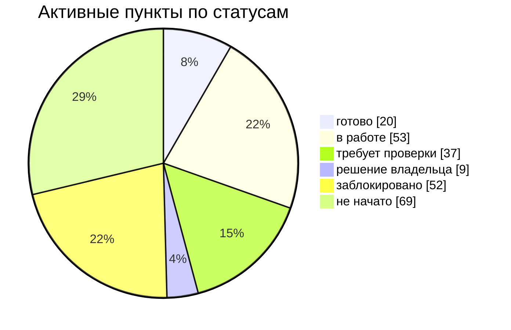
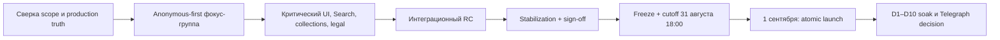

<!-- GENERATED: edit checklist.toml, not this file. -->
# Запуск «Полюбить Калининград · Анонсы» — сводный readiness dashboard

> **Срез:** 2026-08-04 · **до 1 сентября:** 28 дней · **следующее обновление:** 2026-08-07  
> **Фокус-группа:** cutoff 2026-08-31T18:00:00+02:00  
> **Release verdict:** **NO-GO** — Есть незакрытые P0-блокеры в anonymous-first фокус-группе, юридическом контуре, Search, публикации и production evidence.

[Детальный checklist](CHECKLIST.md) · [Kanban](KANBAN.md) · [Как обновлять](UPDATE.md) · [Источник данных](checklist.toml)

## Общая картина

| Показатель | Текущий срез |
|---|---:|
| P0 закрыто | **18 / 184** |
| P0 явно заблокировано | **45** |
| P0 требует hosted/live проверки | **35** |
| Решений владельца | **9** |
| P0 с E4/E5 evidence (готово или verify) | **20** |
| Всего детальных пунктов | **242** |

Процент здесь намеренно не «взвешивает» исследования, код и production: пункт считается закрытым только в статусе `DONE`. `VERIFY` означает, что код или прежнее evidence есть, но актуальный target ещё не доказан.

## Критический путь

- [ ] [`CORE-02`](CHECKLIST.md#core-02) **⛔ заблокировано · P0 · production/live · E2** — Аудит здоровья Smart Update/StaticSiteBuilder за последние 24 часа. **Далее:** Добавить краткоживущий FLY_API_TOKEN, выполнить read-only probe и удалить временный инструмент.
- [ ] [`GOV-01`](CHECKLIST.md#gov-01) **🛠 в работе · P0 · решение · E1** — Зафиксировать единый scope публичного релиза 1 сентября. **Далее:** Утвердить must-have, допустимые default-off контуры и post-launch backlog.
- [ ] [`UI-02`](CHECKLIST.md#ui-02) **🧭 решение владельца · P0 · дизайн · E4** — Утвердить визуальный вариант публичной заглушки до запуска. **Далее:** Выбрать один кандидат и зафиксировать эталонные screenshots.
- [ ] [`FG-04`](CHECKLIST.md#fg-04) **⛔ заблокировано · P0 · разработка · E1** — Тихая анонимная Supabase-сессия после приглашения. **Далее:** Реализовать ensureFocusAnonymousSession() и явные состояния auth runtime.
- [ ] [`FG-06`](CHECKLIST.md#fg-06) **⛔ заблокировано · P0 · разработка · E1** — Оценка страницы, текст и скриншот доступны анонимному участнику. **Далее:** Убрать login wall requireSession(); использовать anonymous auth.uid().
- [ ] [`FG-27`](CHECKLIST.md#fg-27) **⛔ заблокировано · P0 · разработка · E1** — Зафиксировать cutoff 31 августа в 18:00 по Калининграду. **Далее:** Удалить rolling 30 days и добавить timezone/cutoff tests.
- [ ] [`FG-28`](CHECKLIST.md#fg-28) **⛔ заблокировано · P0 · разработка · E0** — Неизменяемый eligible snapshot, розыгрыш и резерв. **Далее:** Собрать защищённый workflow, audit receipt и rehearsal.
- [ ] [`COL-01`](CHECKLIST.md#col-01) **⛔ заблокировано · P0 · разработка · E1** — Полный единый реестр всех канонических подборок. **Далее:** Создать readiness projection v2 со статусами route/data/navigation/sitemap.
- [ ] [`SEARCH-02`](CHECKLIST.md#search-02) **⛔ заблокировано · P0 · production/live · E1** — Доказать причину сбоя и восстановить production-поиск. **Далее:** Выполнить коррелированный live recovery run с exact static/Edge/corpus identities.
- [ ] [`P13N-04`](CHECKLIST.md#p13n-04) **⛔ заблокировано · P0 · разработка · E1** — Долговечная материализация анонимного профиля и связывание identity. **Далее:** Связать с focus anonymous subject и политикой merge профиля.
- [ ] [`MAIL-07`](CHECKLIST.md#mail-07) **⛔ заблокировано · P0 · production/live · E1** — Ротировать раскрытый API-ключ NotiSend. **Далее:** Запросить revoke/reissue, обновить Lockbox, проверить недействительность старого ключа.
- [ ] [`LEGAL-03`](CHECKLIST.md#legal-03) **⛔ заблокировано · P0 · дизайн · E1** — Отдельные согласия на обработку персональных данных по целям. **Далее:** Подготовить самостоятельные тексты согласий и versioned evidence; не встраивать их в пользовательское соглашение.
- [ ] [`LEGAL-08`](CHECKLIST.md#legal-08) **⛔ заблокировано · P0 · дизайн · E1** — Публичные правила розыгрыша для участников фокус-группы. **Далее:** Указать организатора, eligibility, приз, даты, метод выбора, резерв, получение и публикацию результата.
- [ ] [`LEGAL-11`](CHECKLIST.md#legal-11) **⛔ заблокировано · P0 · исследование · E1** — Аудит локализации и потоков данных по 152-ФЗ для Supabase/Auth/email/profile. **Далее:** Определить допустимый production flow либо необходимые изменения primary storage в РФ.
- [ ] [`CORE-06`](CHECKLIST.md#core-06) **🛠 в работе · P0 · интеграция · E2** — Атомарная публикация root и проверенный rollback. **Далее:** Закрыть inventory buckets/ALB/DNS, apply rehearsal и last-good rollback.
- [ ] [`CORE-09`](CHECKLIST.md#core-09) **⛔ заблокировано · P0 · разработка · E1** — Telegraph dual-run и переход D0–D10. **Далее:** Реализовать resolver, режимы, запреты create/recreate и soak metrics.
- [ ] [`QA-06`](CHECKLIST.md#qa-06) **○ не начато · P0 · тестирование · E0** — Аудит доступности и исправление критических дефектов. **Далее:** Проверить клавиатуру, focus, семантику, контраст, reduced motion и screen reader.
- [ ] [`OPS-02`](CHECKLIST.md#ops-02) **⛔ заблокировано · P0 · тестирование · E1** — Hosted-сценарий отказа обоих маршрутов без потери данных. **Далее:** Доказать отсутствие false success, bounded queue и exactly-once reconnect.

## План фаз

> Окна до D0 — рабочее предложение. Они становятся обязательством только после owner-решения `GOV-03`; дата публичного запуска 1 сентября зафиксирована.

| Фаза | Окно | Результат | Статус |
|---|---|---|---|
| `M0` | 4–7 августа | Сверка scope, production audit, owner decisions | `PROPOSED` |
| `M1` | 5–12 августа | Anonymous-first MVP фокус-группы и публичные условия | `PROPOSED` |
| `M2` | 8–18 августа | Критические UI/implementation: Search, collections truth, auth/linking, legal copy | `PROPOSED` |
| `M3` | 19–24 августа | Интеграционный RC, mobile/PWA/accessibility/security, full catalog candidate | `PROPOSED` |
| `M4` | 25–28 августа | Стабилизация, rehearsal, legal/owner sign-off, коммуникации | `PROPOSED` |
| `M5` | 29–31 августа | Freeze, final evidence, focus cutoff 31 августа 18:00, draw rehearsal | `PROPOSED` |
| `D0` | 1 сентября | Atomic launch, smoke, launch mail and communications | `FIXED_DATE` |
| `D1–D10` | 2–11 сентября | Soak, KPI review, Telegraph coexistence/cutover decision | `PROPOSED` |

## Укрупнённый checklist

| Контур | Состояние | P0 закрыто | Blocked | Verify | Owner gate |
|---|---|---:|---:|---:|---:|
| [Управление релизом](CHECKLIST.md#stream-01) | 🟠 OPEN | 2/7 | 0 | 1 | 1 |
| [Исследования и продуктовые решения](CHECKLIST.md#stream-02) | 🔵 IN PROGRESS | 2/5 | 0 | 0 | 2 |
| [UI/UX и визуальная готовность](CHECKLIST.md#stream-03) | 🔴 BLOCKED | 0/17 | 5 | 5 | 1 |
| [Фокус-группа](CHECKLIST.md#stream-04) | 🔴 BLOCKED | 1/30 | 18 | 8 | 0 |
| [Статический сайт и публикация](CHECKLIST.md#stream-05) | 🔴 BLOCKED | 2/14 | 4 | 5 | 1 |
| [Подборки и каталоги](CHECKLIST.md#stream-06) | 🔴 BLOCKED | 0/8 | 7 | 1 | 1 |
| [Умный поиск](CHECKLIST.md#stream-07) | 🔴 BLOCKED | 1/8 | 2 | 2 | 0 |
| [Персонализация и «Для меня»](CHECKLIST.md#stream-08) | 🔴 BLOCKED | 1/8 | 1 | 1 | 0 |
| [Авторизация и identity](CHECKLIST.md#stream-09) | 🔴 BLOCKED | 2/9 | 2 | 3 | 0 |
| [Почта, ящики и шаблоны](CHECKLIST.md#stream-10) | 🔴 BLOCKED | 4/16 | 2 | 3 | 0 |
| [Юридические и публичные документы](CHECKLIST.md#stream-11) | 🔴 BLOCKED | 0/17 | 5 | 1 | 1 |
| [QA, безопасность и аналитика](CHECKLIST.md#stream-12) | 🔴 BLOCKED | 3/15 | 2 | 3 | 0 |
| [Инфраструктура и эксплуатация](CHECKLIST.md#stream-13) | 🔴 BLOCKED | 0/9 | 4 | 3 | 1 |
| [Коммуникации запуска](CHECKLIST.md#stream-14) | 🟠 OPEN | 0/6 | 0 | 1 | 1 |
| [D0 — 1 сентября](CHECKLIST.md#stream-15) | 🟠 OPEN | 0/12 | 0 | 0 | 0 |
| [После запуска](CHECKLIST.md#stream-16) | 🟠 OPEN | 0/3 | 0 | 0 | 0 |

## Где находится работа по стадиям

| Стадия | Открыто | Что означает |
|---|---:|---|
| исследование | 8 | Незакрытые пункты текущей стадии |
| решение | 28 | Незакрытые пункты текущей стадии |
| дизайн | 40 | Незакрытые пункты текущей стадии |
| разработка | 24 | Незакрытые пункты текущей стадии |
| интеграция | 30 | Незакрытые пункты текущей стадии |
| тестирование | 62 | Незакрытые пункты текущей стадии |
| production/live | 28 | Незакрытые пункты текущей стадии |

## Визуальный срез

## Канонические источники

- [План production-релиза](../../features/static-site-pages/release-plan.md)
- [Release autotest gates](../../features/static-site-pages/release-autotest-gates.md)
- [Фокус-группа: продуктовый контракт](../../features/static-site-pages/focus-group.md)
- [Фокус-группа: актуальный статус](../../features/static-site-pages/focus-group-release/status.md)
- [Data ownership и 152-ФЗ gap](../../architecture/personalization-data-ownership.md)
- [Email infrastructure](../../operations/email-delivery.md)
- [Yandex dependency resilience](../../operations/yandex-dependency-resilience.md)
- [Сводный follow-up audit — PR #323](https://github.com/onedayonemasterpiece/events-bot-new/pull/323)
- [Prelaunch landing — PR #296](https://github.com/onedayonemasterpiece/events-bot-new/pull/296)

## Правила правды

1. `DONE` — только когда требуемый уровень evidence действительно достигнут.
2. Документ, исследование или открытый PR не закрывают development/live пункт.
3. Исторический candidate не закрывает проверку актуального `main` и target.
4. Юридический пункт закрывается только фактическим публичным документом, реализацией соответствующего flow и правовой проверкой.
5. Любой P0 `BLOCKED`, `NOT_STARTED`, `OWNER_GATE` или `VERIFY` сохраняет общий verdict `NO_GO`, если owner явно не изменил scope.
