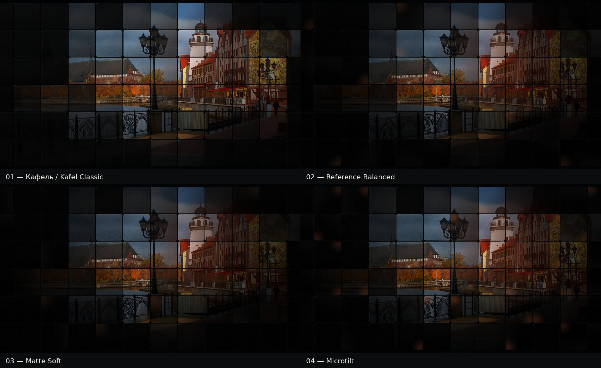
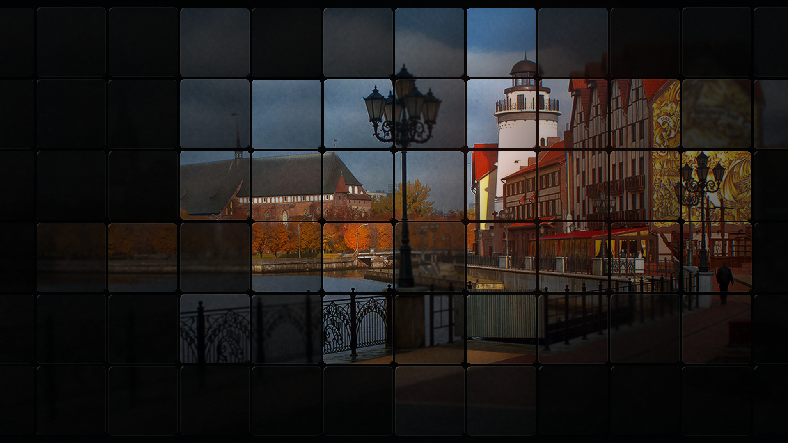
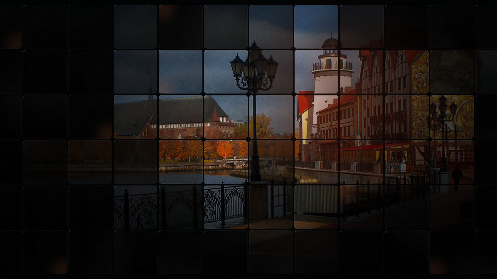
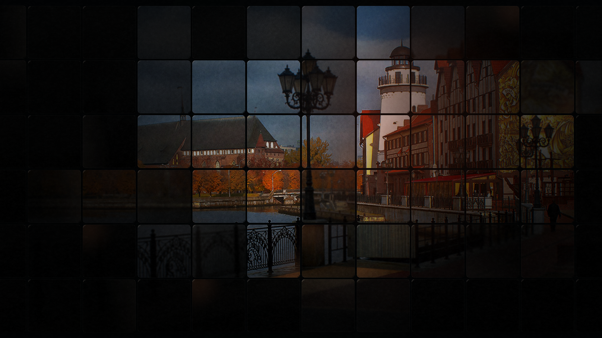
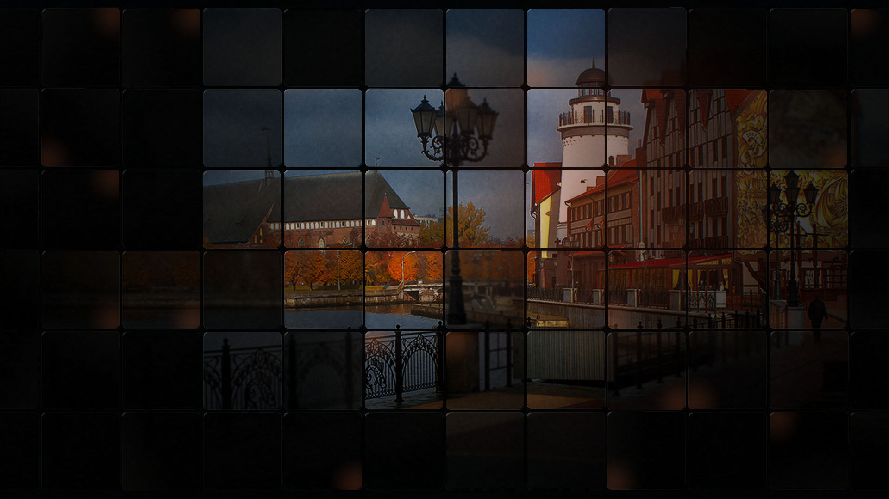

# Tile Mosaic Material Lab — review package v1

**Publication contract:** этот каталог заполняется только workflow
`Tile mosaic material lab` после exact SHA gates. Исходный accepted результат
никогда не перезаписывается другим профилем.

## 01. Кафель / Kafel Classic

Замороженный предварительно принятый baseline. Это визуальный golden contract и
rollback specimen:

- render SHA-256: `f30f78c0b585de4022ca35758a89bc7d643cf224212fd3a67b47170611ea71e7`;
- seed: `20260901`;
- focal point: `0.58 / 0.44`;
- source SHA-256: `cd4dd11f40599a6109494a49bfd33a1b9a4f62f4e7e7518d5808e5dc77e5f1e8`;
- frozen plan: [`kafel-classic-v1.png.plan.json`](kafel-classic-v1.png.plan.json).

## 02. Reference Balanced

Рекомендуемый кандидат следующей итерации: немного больше matte response,
selective blur, sparse warm corner light и сдержанный microtilt.

## 03. Matte Soft

Материальное исследование: более сухая поверхность и чуть более частый мягкий
blur при минимальной геометрической неровности.

## 04. Microtilt

Геометрическое исследование: более заметная, но всё ещё sub-degree вариативность
углов, глубины, contact shadow и отдельных подсвеченных углов.

## Recommendation

Для следующего визуального просмотра использовать **Reference Balanced v1** как
основной challenger, а `Kafel Classic` сохранить без изменений. `Matte Soft` и
`Microtilt` задают безопасные границы параметрического пространства, а не
предлагаются как production-решения.

## Evidence

- exact expected hashes: [`golden-sha256.txt`](golden-sha256.txt);
- package provenance: [`lab-manifest.json`](lab-manifest.json);
- per-render material decisions: `*.manifest.json`;
- structural validation: `*.validation.json`;
- Blender physical specimen: workflow artifact `tile-mosaic-blender-<SHA>`.

Исходный landing-page reference остаётся owner-provided visual target; он не
используется как машинный texture input и не нужен для воспроизводимости golden
outputs. Его признаки формализованы в каноническом документе генератора.
